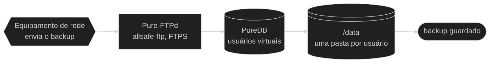
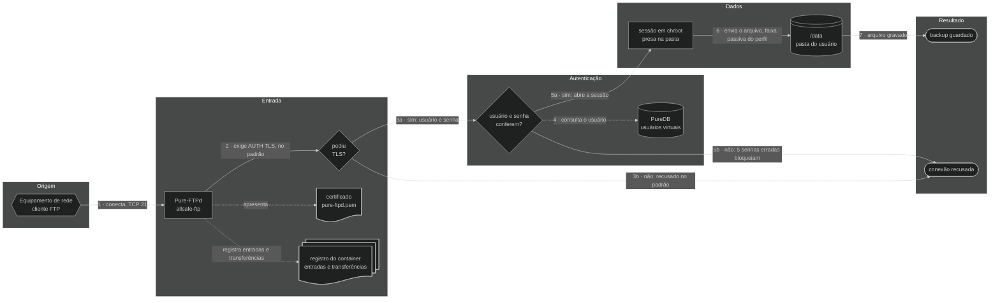
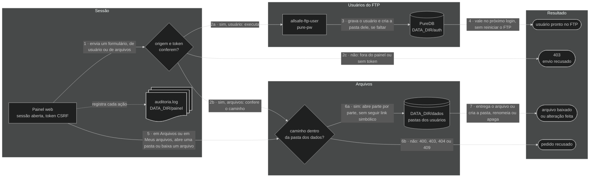

<div align="center">

<a href="web/marca/logo-320.png"></a>

# 📁 allsafe-ftp-stack

**Servidor FTP dedicado (Pure-FTPd) com FTPS obrigatório por padrão, usuários virtuais, chroot e painel web seguro atrás do nginx, para backup de equipamentos em rede privada.**

Desenvolvido pela [allsafe.inf.br](https://allsafe.inf.br) · [github.com/allsafe-inf](https://github.com/allsafe-inf)


[](LICENSE)


<a href="doc/imagens/painel-principal.png"></a>

<sub><b>v0.30.0</b> · painel web, aba Visão geral · captura de 2026-10-10</sub>

<!-- diagrama: doc/diagramas/visao-geral-diagrama.mmd -->


<sub>Nível 1 · Diagrama · [fonte](doc/diagramas/)</sub>

<sub><b>v0.29.0</b> · visão geral da stack · 2026-10-09</sub>

</div>

**Sequência:** Equipamento de rede ➜ Pure-FTPd (`allsafe-ftp`) ➜ PureDB ➜ `/data` ➜ backup guardado

> 🧱 **Uso só em rede privada.** Por padrão, esta stack é para rede interna: escuta **apenas em IP privado** (`10.0.0.0/8`, `172.16.0.0/12`, `192.168.0.0/16` ou `127.0.0.1`), **atrás de firewall**, e não deve ser publicada na internet nem receber redirecionamento de porta da borda. Endereço público só entra por escolha de quem instala, com `REDE_PERMITIR_IP_PUBLICO=sim` e firewall no servidor: leia antes o [alerta](doc/seguranca.md#ip-publico). Detalhes em [doc/seguranca.md](doc/seguranca.md#rede-privada).

> 📌 **Repositório oficial:** [github.com/allsafe-inf/allsafe-ftp-stack](https://github.com/allsafe-inf/allsafe-ftp-stack). As versões saem nele primeiro, e é nele que issues e pull requests são recebidos. A cópia em `github.com/CarlosSuporteISP/allsafe-ftp-stack` é um espelho, atualizado depois.

---

<details>
<summary>Sumário — clique para expandir</summary>

[O que é](#o-que-e) · [Destaques](#destaques) · [Imagens](#imagens) · [Instalação rápida](#instalacao) · [Como funciona](#como-funciona) · [Arquitetura](#arquitetura) · [Tecnologias](#tecnologias) · [Portas e binds](#portas) · [Configuração](#configuracao) · [Segurança](#seguranca) · [Testes](#testes) · [Estrutura de arquivos](#arquivos) · [Documentação](#documentacao) · [Plano](#plano) · [Versão](#versao) · [Projetos relacionados](#relacionados) · [Créditos](#creditos) · [Licença](#licenca)

</details>

---

<a name="o-que-e"></a>

## 💡 O que é

Um servidor de arquivos para onde roteadores, switches, OLTs e outros equipamentos de rede mandam a cópia de segurança da própria configuração. Cada equipamento entra com usuário e senha, só enxerga a própria pasta e, no padrão, só consegue entrar por conexão criptografada. As contas dos equipamentos são criadas pelo navegador, em um **painel web seguro**, ou pela linha de comando. No mesmo painel, os backups recebidos são consultados e **baixados pelo navegador**, por quem administra e pelo dono dos arquivos, que entra com o usuário e a senha do FTP e vê só a própria pasta. Cada equipamento pode ter a pasta escolhida por quem administra.

São **três containers**: o servidor FTP, o painel e o **nginx**, a única porta de entrada do painel. O FTP usa o banco local **PureDB** em vez de PostgreSQL: menos memória, menos superfície de ataque e autenticação sem latência de rede. O painel é pequeno de propósito: administradores com usuário e senha, sem JavaScript, sem acesso ao Docker e sem porta de rede própria; quem fala HTTPS com o navegador é o nginx, que confere a rede de origem e o volume de pedidos antes de repassar. Nos três, o sistema de arquivos raiz é somente leitura, as `capabilities` são mínimas e os segredos ficam fora da imagem e do Git.

| | |
|---|---|
| **Para quê** | Receber por FTPS o backup de configuração de equipamentos de rede |
| **Tecnologias** | Docker Compose · Debian 13 · Pure-FTPd · PureDB · OpenSSL · nginx · Bash · Python |
| **Acesso** | Cliente FTP com **TLS explícito** (`AUTH TLS`) na porta `21/tcp`, modo passivo na faixa do perfil (`30000-30049/tcp` no `small`) · painel em `https://<IP privado>:8443`, pelo nginx |
| **Requisitos** | Docker Engine com Docker Compose v2 ou mais novo · CPU e memória do perfil escolhido (2 vCPU e 2 GB no `small`) · um IP **privado** dedicado · firewall no host liberando só a rede interna |

> **Painel web:** só em rede interna, atrás de firewall, como o resto da stack. Ele recusa por código o endereço que não for privado. Como usar: [doc/painel.md](doc/painel.md).

> ⚠️ **Equipamento antigo sem TLS:** para o equipamento que não tem suporte a TLS existe a opção `FTP_TLS_MODE=0` (ou `1`). Com ela, **senha e arquivos trafegam em texto puro**: use só em rede interna isolada, e a stack avisa disso no `deploy.sh`, no registro do container e no painel. Veja [doc/seguranca.md](doc/seguranca.md#ftp-sem-tls).
>
> Para dispensar do TLS **só os usuários dos equipamentos antigos**, mantendo os demais obrigados, o administrador marca cada um na aba Usuários do painel, ao criar o usuário ou depois: [TLS por usuário](doc/seguranca.md#tls-por-usuario).

---

<a name="destaques"></a>

## ✨ Destaques

| Destaque | Na prática |
|---|---|
| **FTPS explícito obrigatório por padrão** | Sem `AUTH TLS` não há login: usuário e senha não passam em texto puro. O modo sem TLS, para equipamento antigo, é uma escolha explícita e avisada |
| **Usuários virtuais em PureDB** | Não são contas do sistema; cada um fica preso (`chroot`) na própria pasta |
| **Bloqueio por tentativa no FTP** | Cinco senhas erradas do mesmo endereço bloqueiam o usuário para ele por 15 minutos; o administrador ajusta o limite de cada usuário e desbloqueia pelo painel |
| **Bind local por padrão** | Sobe em `127.0.0.1`; você abre só um IP **privado** dedicado, com firewall no host |
| **Rede privada por padrão** | Feita para rede interna, atrás de firewall; endereço público só por uma opção explícita, com alerta |
| **Só o painel publicado, se quiser** | O painel pode ser aberto por um proxy ou túnel do próprio servidor, com o FTP fechado na rede privada; o endereço do cliente só é aceito do proxy declarado |
| **Painel web seguro** | Cria, troca a senha e remove usuários pelo navegador: só HTTPS, sessão de 15 minutos, bloqueio depois de cinco senhas erradas e registro de cada ação |
| **Saúde do servidor no painel** | A aba Servidor mostra os três containers da stack, cada um com o que usa de processador, memória e processos contra o que foi alocado a ele, e o processador, a memória, o disco e a rede do FTP do servidor, com o histórico dos últimos minutos |
| **nginx na frente do painel** | Só o nginx publica a porta do painel: TLS 1.2 e 1.3, HTTP/2, lista de redes permitidas, limite de pedidos e de conexões por endereço; o painel fica sem porta de rede |
| **Containers endurecidos** | `read_only`, `cap_drop: ALL`, `no-new-privileges`, limites de CPU, memória e PIDs; o nginx roda sem `root` e sem nenhuma `capability` |
| **Segredos em arquivo** | As senhas ficam em `.secrets/`, nunca na imagem nem no `compose.yaml`; a do painel, só como hash |
| **Cópia de segurança cifrada** | Um comando grava a cópia já cifrada; só a chave privada de `.secrets/` a abre, e cópia alterada ou cortada não restaura |
| **Registro do container** | Uma linha por entrada, senha errada, bloqueio, envio, download, arquivo renomeado e arquivo apagado no FTP, com o usuário e o endereço; rotacionado pelo Docker (10 MB × 3) |
| **Cinco perfis de capacidade** | `--size small`, `medium`, `large`, `xlarge` ou `extended` ajusta sessões, faixa passiva e recursos; o `deploy.sh` confere se o servidor tem a CPU e a memória do perfil |

---

<a name="imagens"></a>

## 📸 Imagens

O painel web, aba por aba. A aba Visão geral é a imagem do topo desta página, os administradores ficam na aba Usuários, junto com as contas do FTP, e a tela Meus arquivos é a do usuário do FTP, que entra com o nome e a senha do FTP.

| | |
|---|---|
| <a href="doc/imagens/aba-usuarios.png"></a> | <a href="doc/imagens/aba-arquivos.png"></a> |
| **Usuários** — cria a conta de cada equipamento, escolhe o perfil, troca a senha, a pasta e os limites, desbloqueia e remove | **Arquivos** — navega nas pastas dos usuários, baixa os backups, cria pasta, renomeia e apaga |
| <a href="doc/imagens/aba-servidor.png"></a> | <a href="doc/imagens/aba-seguranca.png"></a> |
| **Servidor** — o uso e o limite de processador, memória e processos de cada container, e os recursos do servidor | **Segurança** — confere rede, TLS, certificados, bloqueios, senhas e contato de segurança |
| <a href="doc/imagens/aba-bloqueios.png"></a> | <a href="doc/imagens/aba-atividade.png"></a> |
| **Bloqueios** — os endereços bloqueados por erro de usuário e senha, com desbloqueio e troca do prazo | **Atividade** — quem entrou, de onde, o que baixou e o que foi alterado |
| <a href="doc/imagens/aba-administradores.png"></a> | <a href="doc/imagens/aba-meus-arquivos.png"></a> |
| **Administradores** — ficam na aba Usuários, cada pessoa com o próprio nome e a própria senha | **Meus arquivos** — o usuário do FTP vê a própria pasta e faz nela o que o perfil dele deixa |

<sub><b>v0.30.0</b> · painel web, uma foto por aba · capturas de 2026-10-10</sub>

Todas as telas, menu por menu, com a explicação de cada uma: [fotos da aplicação](doc/aplicacao/README.md).

---

<a name="instalacao"></a>

## 🚀 Instalação rápida

```bash
git clone https://github.com/allsafe-inf/allsafe-ftp-stack.git
cd allsafe-ftp-stack
sudo install -d -o "$USER" /srv/allsafe-ftp-stack   # pasta dos dados, das cópias e dos temporários; como root, pule
./deploy.sh        # cria o .env, gera as senhas, sobe o FTP, o painel e o nginx e espera ficarem healthy
```

**Um comando, sem perguntas.** Sem `.env`, o `deploy.sh` cria um a partir do exemplo, com tudo em `127.0.0.1`: só o próprio servidor acessa, e os dados ficam em `/srv/allsafe-ftp-stack` (para usar outro lugar, troque `DATA_DIR`, `BACKUP_DIR` e `TEMP_DIR` no `.env`). Antes de agir ele confere o Docker, o Compose, se o servidor tem a CPU e a memória do perfil e se as portas estão livres. Pode ser rodado quantas vezes for preciso: o que já existe (senhas, dados, containers iguais) fica como está.

<details>
<summary>Senhas geradas e ajuste para a rede interna — clique para expandir</summary>

O `deploy.sh` **gera uma senha forte** em `.secrets/ftp-usuario-inicial-senha.txt` (`0600`) se o arquivo estiver vazio: guarde-a para o cliente FTP. Para usar uma senha própria, grave-a nesse arquivo antes de rodar.

No fim, o script mostra os endereços do FTP e do painel (`Painel: https://<IP>:8443`) e **em que arquivo** está cada senha, sem mostrá-las. O painel abre com o usuário de `PAINEL_ADMIN_USER` (`admin`, se não for trocado) e a senha inicial de `.secrets/painel-admin-inicial-senha.txt`; troque-a depois do primeiro acesso, na aba Usuários.

Para atender a rede interna, ajuste no `.env` (modelo em [`.env.example`](.env.example)) e rode `./deploy.sh` de novo:

| Variável | Troque para |
|---|---|
| `FTP_BIND_IP` | o IP **privado** do servidor na rede interna (`0.0.0.0` é sempre recusado; IP público, só com a [opção própria](doc/seguranca.md#ip-publico)) |
| `FTP_PASSIVE_IP` | o IP privado que o equipamento enxerga (normalmente o mesmo) |
| `FTP_CERT_CN` | o hostname (ou IP) que vai no certificado |
| `PAINEL_BIND_IP` | o IP **privado** por onde o painel será aberto; com `127.0.0.1` ele só abre no próprio servidor |

</details>

| Quero | Comando |
|---|---|
| Subir com outro porte | `./deploy.sh --size medium` (ou `large`, `xlarge`, `extended`); o porte fica gravado no `.env` |
| Só validar, sem subir nada | `./deploy.sh --check-only` |
| Atualizar os pacotes das imagens | `./deploy.sh --atualizar` |
| Abrir o painel | `https://<PAINEL_BIND_IP>:8443` no navegador, com o usuário de `PAINEL_ADMIN_USER` e a senha de `.secrets/painel-admin-inicial-senha.txt` |
| Trocar o usuário ou a senha do painel | pelo painel, aba Usuários, na linha do administrador |
| Criar outro administrador do painel | pelo painel, aba Usuários, **Novo usuário** com o perfil Administrador |
| Recuperar o acesso ao painel | `./scripts/painel-senha.sh --gerar` (outro administrador: `--usuario NOME`) |
| Criar um usuário | pelo painel, aba Usuários, ou `./manage-user.sh add backup-olt` |
| Limitar o que um usuário faz (envia sem apagar, só envia sem ver os backups, ou só baixa) | pelo painel, aba Usuários, **Editar**, cartão **Perfil**, ou `./manage-user.sh perfil backup-olt envio`: veja [Perfis](doc/painel.md#perfis) |
| Baixar um backup recebido | pelo painel, aba Arquivos, botão **Baixar** na linha do arquivo |
| Deixar o dono dos arquivos baixar os dele | ele abre o painel com o usuário e a senha do FTP e vê só a própria pasta; para o painel aceitar só administradores, `PAINEL_ACESSO_USUARIOS_FTP=nao` no `.env` e `./deploy.sh` |
| Criar uma pasta e prender um usuário a ela | pelo painel, aba Arquivos, **Nova pasta** e **Novo usuário nesta pasta**, ou `./manage-user.sh add olt01 clientes/olt-01` |
| Guardar uma cópia de segurança | `./scripts/backup.sh`, que a grava cifrada; para voltar a ela, `./scripts/restaurar.sh <cópia>`. Guarde `.secrets/backup-chave-privada.txt` fora do servidor |
| Ver o estado | `docker compose ps` |
| Remover, mantendo os dados | `./deploy.sh --remover` |
| Remover e apagar os dados | `./deploy.sh --remover --apagar-dados` (pede para digitar `apagar`) |

Passo a passo comentado em [doc/instalacao.md](doc/instalacao.md).

---

<a name="como-funciona"></a>

## 🔄 Como funciona

O equipamento conecta na porta `21/tcp`, pede TLS, entra com usuário e senha, fica preso na própria pasta e envia o arquivo pelo modo passivo. O desenho da abertura mostra esse caminho; o fluxograma completo, com as recusas, e o do painel estão nos menus abaixo.

<details>
<summary>Fluxograma completo do FTP, com a sequência escrita — clique para expandir</summary>

<!-- diagrama: doc/diagramas/funcionamento-fluxograma.mmd -->


<sub>Nível 2 · Fluxograma · [fonte](doc/diagramas/)</sub>

| Nº | De ➜ Para | O que acontece |
|---|---|---|
| 1 | Equipamento de rede ➜ Pure-FTPd | O equipamento abre a conexão de controle na porta `21/tcp` do host, entregue ao container em `2121/tcp` |
| 2 | Pure-FTPd ➜ pediu TLS? | No padrão (`FTP_TLS_MODE=2`), o servidor só aceita seguir se o cliente pedir `AUTH TLS`; o certificado `pure-ftpd.pem` é apresentado |
| 3a | pediu TLS? ➜ usuário e senha conferem? | Sim: o cliente envia usuário e senha, já criptografados |
| 3b | pediu TLS? ➜ conexão recusada | Não: no padrão, sessão em texto puro é recusada. Só entra sem TLS o usuário dispensado por um administrador no painel, ou quem estiver em uma instalação com `FTP_TLS_MODE=0` ou `1`, opções para [equipamento antigo](doc/seguranca.md#ftp-sem-tls) |
| 4 | usuário e senha conferem? ➜ PureDB | A conta é procurada no banco de usuários virtuais (`/auth/pureftpd.pdb`) |
| 5a | usuário e senha conferem? ➜ sessão em chroot | Sim: a sessão abre presa na pasta do usuário |
| 5b | usuário e senha conferem? ➜ conexão recusada | Não: `530 Login authentication failed`. No padrão, 5 senhas erradas do mesmo endereço em 15 minutos bloqueiam o usuário para aquele endereço por 15 minutos; o limite de cada usuário é ajustado no painel: [bloqueio por tentativa](doc/seguranca.md#bloqueio-por-tentativa). O endereço que passa de 5 erros em 24 horas, com qualquer usuário, fica 120 dias sem entrar no FTP e no painel: [bloqueio por endereço](doc/seguranca.md#bloqueio-por-endereco) |
| 6 | sessão em chroot ➜ `/data` | O arquivo sobe pelo canal de dados em modo passivo, na faixa do perfil (`30000-30049/tcp` no `small`) |
| 7 | `/data` ➜ backup guardado | O arquivo fica gravado na pasta do usuário, dentro do volume |

**Apoio**

| Quem | Usa | Como |
|---|---|---|
| Pure-FTPd | certificado `pure-ftpd.pem` | apresenta ao cliente na negociação TLS |
| Pure-FTPd | registro do container | registra cada entrada e cada transferência, com o usuário e o endereço |

</details>

### Painel web

Como o nginx e o painel decidem se atendem um pedido, em dois fluxogramas: da abertura da página até a sessão, e o que acontece com cada pedido da sessão, até o usuário pronto no FTP.

<details>
<summary>Fluxogramas do painel web, com a sequência escrita — clique para expandir</summary>

<!-- diagrama: doc/diagramas/painel-fluxograma.mmd -->
```mermaid
%%{init: {"theme": "dark"}}%%
flowchart LR
    subgraph QUEM["Quem usa"]
        usuario@{ shape: person, label: "Usuário<br>navegador na rede interna" }
    end
    subgraph FRENTE["Frente web"]
        nginx@{ shape: rect, label: "nginx<br>allsafe-ftp-nginx, HTTPS" }
        rede@{ shape: diam, label: "rede permitida<br>e dentro do limite?" }
    end
    subgraph ENTRADA["Entrada"]
        painel@{ shape: rect, label: "Painel web<br>allsafe-ftp-painel, soquete Unix" }
        senha@{ shape: diam, label: "usuário e senha<br>conferem?" }
        hash@{ shape: doc, label: "administradores<br>nome e hash da senha" }
        ftp@{ shape: rect, label: "Pure-FTPd<br>allsafe-ftp, rede interna" }
    end
    subgraph SESSAO["Sessão"]
        sessao@{ shape: rect, label: "sessão de 15 min<br>cookie e token CSRF" }
        pedidos@{ shape: subproc, label: "pedidos da sessão<br>fluxograma dos pedidos" }
    end
    subgraph RESULTADO["Resultado"]
        atendido@{ shape: stadium, label: "pedido atendido" }
        recusa@{ shape: stadium, label: "pedido recusado" }
    end

    usuario -- "1 · abre https, TCP 8443" --> nginx
    nginx -- "2 · confere a origem e a taxa de pedidos" --> rede
    rede -- "3a · sim: repassa pelo soquete Unix" --> painel
    rede -- "3b · não: 403 ou 429" --> recusa
    painel -- "4 · pede usuário e senha e confere" --> senha
    senha -- "5a · sim: abre a sessão do administrador ou do usuário do FTP" --> sessao
    senha -- "5b · não: 5 erros bloqueiam o endereço" --> recusa
    sessao -- "6 · cada pedido passa pelas conferências" --> pedidos
    pedidos -- "7a · aceito" --> atendido
    pedidos -- "7b · recusado" --> recusa
    painel -. "administrador: compara com o hash" .-> hash
    painel -. "outro nome: o servidor FTP confere a senha" .-> ftp
```

<sub>Nível 2 · Fluxograma · [fonte](doc/diagramas/)</sub>

| Nº | De ➜ Para | O que acontece |
|---|---|---|
| 1 | Usuário ➜ nginx | O navegador abre `https://<endereço>:8443`; só HTTPS, com TLS 1.2 ou 1.3, em HTTP/2 quando o navegador aceita |
| 2 | nginx ➜ rede permitida e dentro do limite? | O endereço de origem é comparado com `PAINEL_REDES_PERMITIDAS`, e o pedido, com os limites de taxa, de conexões e de tamanho |
| 3a | rede permitida e dentro do limite? ➜ Painel web | Sim: o nginx repassa o pedido pelo soquete Unix, com o endereço do cliente |
| 3b | rede permitida e dentro do limite? ➜ pedido recusado | Não: `403` para rede de fora, `429` para pedidos demais; o painel nem recebe o pedido |
| 4 | Painel web ➜ usuário e senha conferem? | O painel confere de novo a rede e o nome de host, mostra a tela de entrada, que pede usuário e senha, e confere o que foi digitado |
| 5a | usuário e senha conferem? ➜ sessão de 15 min | Sim: abre a sessão, com cookie e token CSRF. A do administrador alcança todas as abas; a do usuário do FTP, só a tela Meus arquivos |
| 5b | usuário e senha conferem? ➜ pedido recusado | Não: `401`, sem dizer qual dos dois errou; cinco erros em 15 minutos bloqueiam o endereço (`429`) |
| 6 | sessão de 15 min ➜ pedidos da sessão | Cada pedido feito com a sessão aberta passa pelas conferências do fluxograma dos pedidos, logo abaixo |
| 7a | pedidos da sessão ➜ pedido atendido | Aceito: o usuário fica pronto no FTP, o arquivo é baixado ou a alteração é feita |
| 7b | pedidos da sessão ➜ pedido recusado | Recusado: nada muda, e a recusa fica na auditoria |

**Apoio**

| Quem | Usa | Como |
|---|---|---|
| Painel web | administradores (`DATA_DIR/painel/administradores`) | compara a senha digitada com o hash `scrypt` do administrador, a cada entrada; nome que não existe passa pela mesma conta |
| Painel web | Pure-FTPd (`allsafe-ftp`, rede interna da stack) | não é administrador com essa senha e a entrada dos usuários do FTP está ligada: entra no servidor FTP com o nome e a senha e sai em seguida, em TLS com o certificado conferido; quem diz se a senha vale é o servidor |

**Pedidos da sessão**

O que o painel faz com cada pedido depois da entrada: o formulário que cria, edita ou remove um usuário, e a pasta ou o arquivo pedido na aba Arquivos ou na tela Meus arquivos.

<!-- diagrama: doc/diagramas/painel-pedidos-fluxograma.mmd -->


<sub>Nível 2 · Fluxograma · [fonte](doc/diagramas/)</sub>

| Nº | De ➜ Para | O que acontece |
|---|---|---|
| 1 | Painel web ➜ origem e token conferem? | Todo formulário enviado é conferido duas vezes: a origem tem de ser o próprio painel e o token CSRF tem de ser o da sessão. Só o administrador tem formulário de usuário e de arquivos; na sessão do usuário do FTP, o único formulário é o de sair |
| 2a | origem e token conferem? ➜ `allsafe-ftp-user` | Sim, formulário de usuário: o painel chama o comando, com a senha pela entrada padrão |
| 2b | origem e token conferem? ➜ caminho dentro da pasta dos dados? | Sim, formulário da aba Arquivos (criar pasta, renomear ou apagar): segue para a conferência do caminho |
| 2c | origem e token conferem? ➜ 403 | Não: `403`, sem alterar nada, para o envio que não partiu do painel ou que veio sem o token da sessão |
| 3 | `allsafe-ftp-user` ➜ PureDB | A conta é gravada em `DATA_DIR/auth`, com trava para uma alteração por vez, e a pasta do usuário novo é criada em `DATA_DIR/dados`, se ainda não existe; a dispensa do TLS de um usuário fica na `sem-tls.lista`, na mesma pasta do banco |
| 4 | PureDB ➜ usuário pronto no FTP | O FTP lê o banco a cada login: vale na hora, sem reiniciar |
| 5 | Painel web ➜ caminho dentro da pasta dos dados? | Na aba Arquivos, o administrador abre uma pasta ou baixa um arquivo; na tela Meus arquivos, o usuário do FTP faz o mesmo, só na pasta dele. Esses pedidos não levam formulário, e o caminho é conferido do mesmo jeito |
| 6a | caminho dentro da pasta dos dados? ➜ `DATA_DIR/dados` | Sim: o painel abre cada parte do caminho sem seguir link simbólico, a partir da pasta dos dados, para o administrador, e a partir da pasta do cadastro, para o usuário do FTP |
| 6b | caminho dentro da pasta dos dados? ➜ pedido recusado | Não: `400` para caminho ou nome que tenta sair da pasta, `403` para link simbólico, `404` para o que não existe, `409` para nome já usado |
| 7 | `DATA_DIR/dados` ➜ arquivo baixado ou alteração feita | O arquivo sai como anexo, em blocos; a pasta nova nasce vazia, do usuário `ftpdata`; o arquivo ou a pasta escolhida é renomeada ou apagada |

**Apoio**

| Quem | Usa | Como |
|---|---|---|
| Painel web | `auditoria.log` (`DATA_DIR/painel`) | registra cada entrada, recusa, download e alteração |

</details>

---

<a name="arquitetura"></a>

## 🏗️ Arquitetura

Três containers em uma rede própria: `ftp` (Pure-FTPd), `painel` (Python) e `nginx`, a única porta de entrada do painel. Os dados ficam no host, em `DATA_DIR`, e as senhas em `.secrets/`.

<!-- diagrama: doc/diagramas/arquitetura-mapa.mmd -->
```mermaid
%%{init: {"theme": "dark"}}%%
flowchart LR
    subgraph USO["Quem usa"]
        operador@{ shape: person, label: "Usuário<br>opera a stack" }
        equip@{ shape: hex, label: "Equipamento de rede<br>cliente FTP" }
    end
    subgraph HOST["Host"]
        scripts@{ shape: console, label: "deploy.sh<br>manage-user.sh" }
    end
    subgraph CONTAINERS["Containers · rede allsafe-ftp-network"]
        nginx@{ shape: rect, label: "nginx<br>allsafe-ftp-nginx, 8443/tcp" }
        painel@{ shape: rect, label: "Painel web<br>allsafe-ftp-painel, soquete Unix" }
        ftp@{ shape: rect, label: "Pure-FTPd<br>allsafe-ftp, 2121/tcp" }
    end
    subgraph VOLUMES["Volumes"]
        vnginx@{ shape: lin-cyl, label: "DATA_DIR/nginx<br>soquete e cópia do certificado" }
        vpainel@{ shape: lin-cyl, label: "DATA_DIR/painel<br>administradores e auditoria" }
        vauth@{ shape: cyl, label: "DATA_DIR/auth<br>PureDB" }
        vdata@{ shape: lin-cyl, label: "DATA_DIR/dados<br>arquivos enviados" }
        vcerts@{ shape: lin-cyl, label: "DATA_DIR/certs<br>certificado do FTP" }
    end
    subgraph RESULTADO["Resultado"]
        fim@{ shape: stadium, label: "backup guardado" }
    end

    operador -- "1 · ./deploy.sh" --> scripts
    scripts -- "2 · docker compose build e up -d --wait" --> nginx
    operador -- "3 · HTTPS, TCP 8443" --> nginx
    nginx -- "4 · repassa pelo soquete Unix" --> painel
    painel -- "5 · cria, edita ou remove o usuário" --> vauth
    equip -- "6 · FTPS, TCP 21 para 2121" --> ftp
    ftp -- "7 · grava o arquivo" --> vdata
    vdata -- "8 · arquivo no volume" --> fim
    nginx -. "lê, só leitura" .-> vnginx
    painel -. "cria o soquete" .-> vnginx
    painel -. "grava" .-> vpainel
    painel -. "gerencia e lê" .-> vdata
    painel -. "confere a senha do FTP" ..-> ftp
    ftp -. "consulta" .-> vauth
    ftp -. "lê o certificado" .-> vcerts
```

<sub>Nível 2 · Mapa · [fonte](doc/diagramas/)</sub>

| Nº | De ➜ Para | O que acontece |
|---|---|---|
| 1 | Usuário ➜ `deploy.sh` | O usuário executa `./deploy.sh` no host |
| 2 | `deploy.sh` ➜ nginx | O script valida a configuração, constrói as imagens (`docker compose build`) e sobe os três containers (`up -d --wait`), na ordem `ftp`, `painel` e `nginx`: cada um espera o anterior ficar `healthy`, e o nginx, a porta de entrada do painel, é o último |
| 3 | Usuário ➜ nginx | O usuário abre o painel por HTTPS em `8443/tcp`: quem atende é o nginx, que confere a rede de origem e a taxa de pedidos |
| 4 | nginx ➜ Painel web | O pedido aceito é repassado ao painel pelo soquete Unix, com o endereço do cliente |
| 5 | Painel web ➜ `DATA_DIR/auth` | O painel cria, edita ou remove o usuário no PureDB |
| 6 | Equipamento de rede ➜ Pure-FTPd | O cliente conecta por FTPS em `21/tcp`, mapeada para `2121/tcp` |
| 7 | Pure-FTPd ➜ `DATA_DIR/dados` | O arquivo é gravado pelo canal passivo, na faixa do perfil (`30000-30049/tcp` no `small`) |
| 8 | `DATA_DIR/dados` ➜ backup guardado | O arquivo fica na pasta do usuário, no host |

**Apoio**

| Quem | Usa | Como |
|---|---|---|
| nginx | `DATA_DIR/nginx` | lê o soquete e o certificado, somente leitura |
| Painel web | `DATA_DIR/nginx` | cria o soquete e copia o certificado, a cada subida |
| Painel web | `DATA_DIR/painel` | grava o certificado, os administradores e a auditoria |
| Painel web | `DATA_DIR/dados` | cria pasta, renomeia, apaga e lê os arquivos para o download |
| Painel web | Pure-FTPd | confere a senha do usuário do FTP que entra no painel, pela rede interna da stack |
| Pure-FTPd | `DATA_DIR/auth` (PureDB) | consulta os usuários |
| Pure-FTPd | `DATA_DIR/certs` | lê o certificado |

**Configuração, segredos e registro**

O mapa mostra as peças e os volumes. A configuração, os segredos e o registro ficam nesta tabela:

| Quem | Usa | Como |
|---|---|---|
| `deploy.sh` e `manage-user.sh` | `.env` | cria, lê e grava o perfil |
| Pure-FTPd | `.secrets` (`ftp-usuario-inicial-senha.txt`) | lê a senha na subida, somente leitura |
| Painel web | `.secrets` (`painel-admin-inicial-senha-hash.txt`) | lê o hash inicial na subida, somente leitura |
| Pure-FTPd | registro do container | registra cada entrada e cada transferência, com o usuário e o endereço |

<details>
<summary>Peças, portas, pastas, imagens e entrypoints — clique para expandir</summary>

| Peça | Papel | Porta | Dados em |
|---|---|---|---|
| Container `allsafe-ftp` (serviço `ftp`) | Pure-FTPd com FTPS, `chroot` e limites | `21/tcp` ➜ `2121/tcp` e a faixa passiva do perfil (`30000-30049/tcp` no `small`) | — |
| Container `allsafe-ftp-painel` (serviço `painel`) | Painel web que administra os usuários do FTP; atende só o nginx, por soquete Unix | nenhuma | — |
| Container `allsafe-ftp-nginx` (serviço `nginx`) | Frente web do painel: HTTPS, redes permitidas, limite de pedidos e arquivos estáticos | `8443/tcp` ➜ `8443/tcp` | — |
| Pasta `DATA_DIR/auth` | Banco PureDB dos usuários virtuais, dividido pelo FTP e pelo painel | — | `/auth` |
| Pasta `DATA_DIR/dados` | Arquivos enviados, uma pasta por usuário | — | `/data` |
| Pasta `DATA_DIR/certs` | Chave e certificado TLS do FTP (`pure-ftpd.pem`) | — | `/etc/ssl/private` |
| Pasta `DATA_DIR/painel` | Certificado do painel, administradores (nome e hash da senha), `auditoria.log` e o idioma escolhido por cada conta (`idiomas`) | — | `/painel` |
| Pasta `DATA_DIR/nginx` | Soquete do painel e cópia do certificado, refeitos a cada subida; o nginx só lê | — | `/nginx` |
| Segredo `ftp_usuario_inicial_senha` | Senha do usuário inicial (`.secrets/ftp-usuario-inicial-senha.txt`), somente leitura | — | `/run/secrets/ftp_usuario_inicial_senha` |
| Segredo `painel_admin_inicial_senha_hash` | Hash da senha inicial do primeiro administrador do painel (`.secrets/painel-admin-inicial-senha-hash.txt`), somente leitura | — | `/run/secrets/painel_admin_inicial_senha_hash` |
| Rede `allsafe-ftp-network` | Bridge dedicada, sub-rede `172.29.1.0/29` | — | — |

- **Imagens:** [`Dockerfile`](Dockerfile) com três alvos sobre o mesmo `debian:trixie-slim` (Debian 13), fixado por digest: `ftp` (`pure-ftpd` e o usuário `ftpdata`, uid e gid **10000**), `painel` (o mesmo, com `python3`) e `nginx` (só `nginx` e `openssl`, com o usuário `frente`, uid e gid **10001**). As três levam o `LICENSE` e o `NOTICE` do projeto em `/usr/share/doc/allsafe-ftp-stack/`.
- **Entrypoint do FTP:** [`ftp/entrypoint.sh`](ftp/entrypoint.sh) cria o usuário inicial uma vez e aplica a senha do segredo quando ela muda, gera o certificado autoassinado na primeira subida e executa o `pure-ftpd`.
- **Entrypoint do painel:** [`painel/entrypoint.sh`](painel/entrypoint.sh) confere a rede privada, gera o certificado do painel, prepara a pasta do nginx e executa o [`painel/servidor.py`](painel/servidor.py), o ponto de entrada dos módulos do painel.
- **Entrypoint do nginx:** [`nginx/entrypoint.sh`](nginx/entrypoint.sh) recusa rodar como `root`, confere a rede privada, monta a configuração a partir de [`nginx/nginx.conf.modelo`](nginx/nginx.conf.modelo) e executa o `nginx`, que também entrega os arquivos estáticos de [`web/`](web/): a folha de estilo e a marca.

</details>

Detalhe completo, com o modelo da subida, em [doc/arquitetura.md](doc/arquitetura.md).

---

<a name="tecnologias"></a>

## 🛠️ Tecnologias

Docker Compose, Debian 13, Pure-FTPd, OpenSSL, nginx, Python e Bash, com a versão real conferida no host onde a stack foi validada.

<details>
<summary>Tecnologias, com nome e versão — clique para expandir</summary>

| Tecnologia | Versão | Papel |
|---|---|---|
| Docker Engine | 29.8.2 | Executa os containers (versão do host onde a stack foi validada) |
| Docker Compose | 5.5.1 | Sobe os serviços, os volumes e a rede a partir do [`compose.yaml`](compose.yaml) |
| Debian | 13 (trixie-slim, fixada por digest) | Imagem base |
| Pure-FTPd | 1.0.50 (pacote Debian `1.0.50-2.2`) | Servidor FTP com TLS, `chroot` e usuários virtuais |
| PureDB | embutido no Pure-FTPd 1.0.50 | Banco local dos usuários virtuais |
| OpenSSL | 3.5.7 (série 3.5 do Debian 13) | Gera os certificados autoassinados e fornece o TLS |
| nginx | 1.26.3 (pacote Debian `nginx`) | Frente web do painel: HTTPS, redes permitidas, limite de pedidos e arquivos estáticos |
| Python | 3.13.5 (pacote Debian `python3`) | Painel web, só com a biblioteca padrão |
| tini | 0.19.0 (`docker-init` do Docker Engine) | Processo 1 de cada container (`init: true`) |
| Bash | 5.2 | Scripts do host e dos containers |

</details>

<details>
<summary>Peso das linguagens e dos serviços, medido — clique para expandir</summary>

Medido em 2026-10-05, na versão `0.20.1`, com os três containers em repouso, no porte `small`:

| Serviço | Linguagem ou programa | Memória em uso | Limite do porte | Imagem |
|---|---|---|---|---|
| `ftp` | Pure-FTPd, em C, com entrada em Bash | 2,7 MiB | 256 MiB | 208 MB |
| `painel` | Python, só com a biblioteca padrão | 12,9 MiB | 192 MiB | 258 MB |
| `nginx` | nginx, em C | 3,2 MiB | 64 MiB | 145 MB |

- **Total em repouso:** cerca de 19 MiB de memória e processador perto de zero.
- **Resposta do painel:** a tela de entrada, com uma conexão HTTPS nova a cada pedido, respondeu em 2,8 ms na mediana de 30 pedidos (de 2,4 ms a 3,8 ms).
- **Frente web, medida em 2026-10-07, na versão `0.26.1`:** a tela de entrada inteira (página, estilo e três imagens) chegou em 8,8 ms por uma conexão só, em HTTP/2; antes eram 11,0 ms em cinco conexões. O estilo passou de 6957 para 2175 bytes na rede. O clique feito depois de 20 e de 45 segundos parado levou 0,8 ms, pela mesma conexão; antes, 2,0 ms, com conexão nova. A memória do nginx ficou em 3,5 MiB.
- **Sem dependência de terceiros:** o painel não instala pacote do PyPI e não tem JavaScript; o que há para atualizar é a imagem base e os pacotes do Debian.
- **Tamanho do código, na versão `0.30.0`:** 7302 linhas de Python em 30 módulos, das quais 1750 são o catálogo dos textos em inglês, 1073 de CSS, 7710 de Bash e 708 de Perl, contando a bateria de testes.
- **De onde vem o peso das imagens:** da base `debian:13-slim`, com 119 MB, comum às três.
- **Imagem do FTP, medida em 2026-10-09, na versão `0.29.0`:** passou de 208 MB para 218 MB com o `age`, que cifra a cópia de segurança. As outras duas não mudaram, e nada novo é instalado no host.
- **Painel com centenas de usuários, medido em 2026-10-09, na versão `0.29.2`:** com 501 usuários no cadastro, a aba Usuários (297 KB de página) responde em 8,5 ms e a Visão geral em 5,1 ms, na mediana de 30 pedidos; antes eram 33,2 ms e 17,0 ms, porque a pasta de cada usuário era comparada com a de todos os outros. A leitura do cadastro leva 1,2 ms e continua sendo feita a cada pedido.
- **Painel redesenhado, medido em 2026-10-10, na versão `0.30.0`:** com 10 usuários, as sete telas do administrador respondem de 2,3 ms a 3,7 ms na mediana de 30 pedidos. Com 501 usuários, a aba Usuários (491 KB de página) responde em 10,8 ms, a aba Arquivos (355 KB) em 7,8 ms e a Visão geral em 6,2 ms; em inglês, a diferença fica em até 0,4 ms. Em repouso, os três serviços somam cerca de 27 MiB de memória, e as imagens continuam com 218 MB, 258 MB e 145 MB.

</details>

---

<a name="portas"></a>

## 🔌 Portas e binds

FTP em `21/tcp` mais a faixa passiva do perfil; painel em `8443/tcp`, pelo nginx. Tudo em `127.0.0.1` até o `.env` indicar um IP privado.

<details>
<summary>Tabela de portas e binds — clique para expandir</summary>

| Porta (host) | Protocolo | Bind padrão | Para que serve |
|---|---|---|---|
| `${FTP_PORT:-21}` | TCP | `${FTP_BIND_IP:-127.0.0.1}` | canal de controle FTP (mapeada para `:2121` no container) |
| `30000-30049` | TCP | `${FTP_BIND_IP:-127.0.0.1}` | canal de dados em **modo passivo**; faixa do perfil `small` (50 portas = 50 clientes), até `30000-31599` no `extended` |
| `${PAINEL_PORT:-8443}` | TCP | `${PAINEL_BIND_IP:-127.0.0.1}` | painel web, HTTPS; quem publica é o nginx (mapeada para `:8443` no container `allsafe-ftp-nginx`) |

A faixa passiva é 1:1 entre host e container. Ao mudar `FTP_PASSIVE_PORT_*`, alinhe a quantidade de portas ao `FTP_MAX_CLIENTS`. O container do painel não publica porta: fala só com o nginx, por um soquete Unix.

</details>

---

<a name="configuracao"></a>

## ⚙️ Configuração

Toda a configuração vem do `.env`, criado a partir do [`.env.example`](.env.example). O `./deploy.sh --size <perfil>` **grava no `.env`** os valores de `profiles/<perfil>.env` e o nome do perfil em `FTP_PROFILE`, trocando só o dimensionamento (limites de sessão, faixa passiva, CPU, memória, PIDs e `nofile`).

<details>
<summary>Os cinco perfis de capacidade — clique para expandir</summary>

| Perfil | Host de referência | Sessões simultâneas | Quando usar |
|---|---|---|---|
| [`small`](profiles/small.env) | 2 vCPU · 2 GB | ~50 | padrão: cobre a maioria dos provedores |
| [`medium`](profiles/medium.env) | 4 vCPU · 4 GB | ~120 | coleta noturna em lote (~50 a 200 equipamentos) |
| [`large`](profiles/large.env) | 8 vCPU · 8 GB | ~300 | mais de 200 equipamentos ou vários coletores concorrentes |
| [`xlarge`](profiles/xlarge.env) | 16 vCPU · 16 GB | ~600 | operação grande, com várias regiões ou vários coletores no mesmo servidor |
| [`extended`](profiles/extended.env) | 32 vCPU · 32 GB | ~1200 | o maior porte: servidor dedicado, milhares de equipamentos em janelas curtas |

</details>

Cada perfil amplia a faixa passiva junto com `FTP_MAX_CLIENTS`: ajuste o firewall do host ao trocar. O `deploy.sh` recusa o perfil que pede mais CPU ou memória do que o servidor tem. Todas as variáveis em [doc/configuracao.md](doc/configuracao.md); a tabela completa dos perfis em [doc/perfis.md](doc/perfis.md).

---

<a name="seguranca"></a>

## 🔐 Segurança

- **Rede privada por padrão:** IP privado, atrás de firewall, sem redirecionamento de porta da internet. Veja [rede privada e firewall](doc/seguranca.md#rede-privada).
- **IP público só por escolha:** `REDE_PERMITIR_IP_PUBLICO=sim` aceita endereço público e exige TLS obrigatório; a stack alerta disso no `deploy.sh`, no registro dos containers e no painel. Só com firewall no servidor. Veja [IP público](doc/seguranca.md#ip-publico).
- **Só o painel publicado, sem expor o FTP:** `PAINEL_PROXY_CONFIAVEL` declara o proxy ou o túnel que roda no próprio servidor. O painel passa a contar a senha errada e a sessão pelo endereço do cliente que ele informa, e o endereço escrito em cabeçalho por qualquer outro é ignorado. Veja [painel por proxy ou túnel](doc/seguranca.md#painel-por-proxy).
<details>
<summary>Proteções aplicadas, uma a uma — clique para expandir</summary>

- Bind em `127.0.0.1` por padrão: abra só um IP privado dedicado e libere no firewall do host apenas as redes que enviam backup.
- TLS **obrigatório** para entrar no padrão (`FTP_TLS_MODE=2`), `chroot` em todos, sem usuário anônimo, sem DNS reverso.
- **Bloqueio por tentativa no FTP:** o endereço que erra a senha de um usuário cinco vezes em 15 minutos fica bloqueado para aquele usuário pelo mesmo tempo; o limite e o tempo são ajustados por usuário, e o administrador desbloqueia pelo painel. Veja [bloqueio por tentativa](doc/seguranca.md#bloqueio-por-tentativa).
- **Bloqueio por endereço, no FTP e no painel:** o endereço que passa de cinco erros de usuário e senha em 24 horas, com qualquer nome de usuário, fica 120 dias sem entrar nos dois, com conta nenhuma. A aba Bloqueios do painel lista os endereços, e o administrador libera ou muda o prazo. Veja [bloqueio por endereço](doc/seguranca.md#bloqueio-por-endereco).
- **Sem TLS só para quem o administrador dispensar:** no painel, ao criar o usuário ou em Editar, o administrador marca os usuários dos equipamentos antigos, um a um; os demais continuam obrigados a usar TLS, e sem nenhum dispensado a sessão sem TLS é recusada antes da senha. Veja [TLS por usuário](doc/seguranca.md#tls-por-usuario).
- **Sem TLS para todos só por escolha:** `FTP_TLS_MODE=0` ou `1` existe para equipamento antigo que não fala TLS. Senha e arquivos passam em texto puro, e a stack avisa disso no `deploy.sh`, no registro do container e no painel. Só em rede interna isolada. Veja [equipamento sem TLS](doc/seguranca.md#ftp-sem-tls).
- `read_only` no sistema de arquivos raiz, `cap_drop: ALL` (só as estritamente necessárias voltam), `no-new-privileges`, limites de CPU, memória, PIDs e `nofile`.
- Senha em `.secrets/ftp-usuario-inicial-senha.txt` (mínimo de 12 caracteres, `0600`), fora da imagem e ignorada pelo Git. Veja [doc/segredos.md](doc/segredos.md).
- **Cópia de segurança cifrada:** o `scripts/backup.sh` cifra com a chave pública de `.secrets/` e nada sem cifra chega ao disco; só a chave privada abre a cópia. Veja [a chave da cópia](doc/backup.md#chave).
- nginx na frente do painel: é a única porta publicada, roda sem `root` e sem `capability`, aceita só as redes de `PAINEL_REDES_PERMITIDAS` e limita pedidos e conexões por endereço.
- **Normas seguidas:** FTP sobre TLS, TLS 1.2 e 1.3, HTTP, cookie, download, `security.txt` e `robots.txt` conferidos contra as RFCs, com a situação de cada uma. Veja [conformidade com as RFCs](doc/seguranca.md#conformidade-rfc).
- Painel só por HTTPS e só de rede privada: senha guardada como hash `scrypt`, sessão de 15 minutos, bloqueio depois de cinco senhas erradas, proteção contra CSRF, sem JavaScript, sem acesso ao Docker e com registro de cada ação. Veja [doc/painel.md](doc/painel.md#protecoes).
- Logs rotacionados (`max-size: 10m`, `max-file: 3`).

</details>

O caminho mais seguro para cada decisão de quem instala, em fluxograma, está em [boas práticas antes de produção](doc/seguranca.md#boas-praticas); o que é atacado a cada versão, em [testes executados](doc/seguranca.md#testes-executados). Modelo de ameaça e o endurecimento linha a linha em [doc/seguranca.md](doc/seguranca.md).

---

<a name="testes"></a>

## 🧪 Testes

| Quero | Comando | Resultado esperado |
|---|---|---|
| Conferir sintaxe e Compose, sem subir nada | `./scripts/validate.sh` | `painel OK: <n> módulos Python`, `idioma OK: <n> textos do painel com tradução em inglês, <n> mensagens do comando de usuários`, `marca OK: 6 arquivos em web/marca/`, `política de segurança OK: SECURITY.md aponta para SEGURANCA_CONTATO_EMAIL, sem endereço fixo`, `licença OK: LICENSE (Apache-2.0), NOTICE, MARCA.md e a linha SPDX em <n> arquivos de código`, `compose OK com <perfil>.env` para os cinco perfis e `Validacao FTP concluida.` |
| Conferir a instalação no ar | `./scripts/validate.sh --runtime` | o mesmo, mais `servico ftp: running, healthy`, igual para `painel` e `nginx`, e o usuário inicial no PureDB ou removido pelo administrador |
| Rodar a bateria completa: funcional, segurança e rede | `./tests/testar.sh` | uma linha por caso e, no fim, `Bateria aprovada: nenhum desvio.` |

A bateria sobe uma instância de teste separada, em `127.0.0.2`, e a remove ao terminar: a instalação em uso não é tocada. São 65 casos funcionais, 114 de segurança e 14 de rede, e nenhuma versão é publicada com desvio. O que a bateria de segurança tenta, alvo por alvo, está em [testes executados](doc/seguranca.md#testes-executados); as opções do script, em [Scripts](doc/scripts.md#testar).

---

<a name="arquivos"></a>

## 🗂️ Estrutura de arquivos

Na raiz ficam o `compose.yaml`, o `Dockerfile` e os comandos do dia a dia (`deploy.sh`, `manage-user.sh`). Cada serviço tem a pasta dele, com o que vai dentro da imagem: `ftp/`, `painel/` e `nginx/`; `web/` guarda os arquivos estáticos que o nginx entrega, com a logo e o ícone em `web/marca/`; `scripts/` tem o que roda fora dos containers; `tests/` tem a bateria de testes. O `LICENSE`, o `NOTICE` e o `MARCA.md` dizem a licença do código, a autoria e a regra da marca.

<details>
<summary>Arquivo por arquivo — clique para expandir</summary>

| Caminho | O que é |
|---|---|
| [`compose.yaml`](compose.yaml) | Definição dos serviços `ftp`, `painel` e `nginx`, volumes, rede, limites e healthchecks |
| [`Dockerfile`](Dockerfile) | Imagens sobre o Debian 13 slim: alvos `ftp` e `painel`, com Pure-FTPd e o usuário `ftpdata`, e alvo `nginx` |
| [`deploy.sh`](deploy.sh) | Instala, reaplica, atualiza ou remove a stack em um comando |
| [`manage-user.sh`](manage-user.sh) | Atalho do host para `add` (com a pasta e o perfil, se quiser), `passwd`, `pasta`, `perfil`, `del` e `list` de usuários |
| [`ftp/entrypoint.sh`](ftp/entrypoint.sh) | Prepara o usuário inicial e o certificado e executa o `pure-ftpd` |
| [`ftp/saude.sh`](ftp/saude.sh) | Healthcheck do FTP: abre a porta de controle e espera a saudação do servidor |
| [`ftp/usuario.sh`](ftp/usuario.sh) | Gestão de usuários **dentro** dos containers (chamado pelo `manage-user.sh` e pelo painel) |
| [`painel/servidor.py`](painel/servidor.py) | Painel web, em Python só com a biblioteca padrão, atrás do nginx: ponto de entrada, com os modos `--hash` e `--saude` |
| [`painel/`](painel/), demais arquivos `.py` | Os outros módulos do painel, um assunto por arquivo: configuração, senha, sessão, auditoria, estado da stack, atendimento, rotas e uma aba por arquivo. Lista em [Painel web](doc/painel.md#modulos) |
| [`painel/entrypoint.sh`](painel/entrypoint.sh) | Confere a rede privada, gera o certificado do painel e executa o servidor |
| [`nginx/nginx.conf.modelo`](nginx/nginx.conf.modelo) | Modelo da configuração do nginx: HTTPS, HTTP/2, redes permitidas, limites, arquivos estáticos e repasse ao painel |
| [`nginx/cabecalhos.conf`](nginx/cabecalhos.conf) | Cabeçalhos de segurança das respostas que o próprio nginx dá (páginas de erro e arquivos estáticos) |
| [`nginx/erro/`](nginx/erro/) | Páginas de erro do nginx, em texto |
| [`nginx/entrypoint.sh`](nginx/entrypoint.sh) | Confere a rede privada, monta a configuração e executa o nginx |
| [`nginx/saude.sh`](nginx/saude.sh) | Healthcheck do nginx: pede `/saude` por HTTPS, de ponta a ponta |
| [`web/estilo.css`](web/estilo.css) | Aparência do painel, entregue direto pelo nginx |
| [`web/robots.txt`](web/robots.txt) | Aviso aos robôs de busca de que nada do painel é para indexar, entregue direto pelo nginx |
| [`web/marca/`](web/marca/) | Logo e ícone do painel, entregues direto pelo nginx: seis arquivos prontos e, em `fonte/`, as duas artes de origem |
| [`scripts/painel-senha.sh`](scripts/painel-senha.sh) | Recupera o acesso ao painel pelo host: define a senha de um administrador ou cria o administrador, gravando só o hash |
| [`scripts/rede-privada.sh`](scripts/rede-privada.sh) | Funções que recusam IP e rede que não sejam privados e que tratam a opção de IP público |
| [`scripts/ambiente.sh`](scripts/ambiente.sh) | Função que lê uma chave do `.env` sem executar o arquivo |
| [`scripts/backup.sh`](scripts/backup.sh) | Grava a cópia de segurança cifrada dos dados, dos usuários, dos certificados e da auditoria em `BACKUP_DIR` |
| [`scripts/restaurar.sh`](scripts/restaurar.sh) | Devolve a stack ao estado de uma cópia, guardando antes o estado atual |
| [`scripts/validate.sh`](scripts/validate.sh) | Checagem de sintaxe, da marca, da licença e do Compose de todos os perfis e, com `--runtime`, dos três serviços no ar |
| [`scripts/gerar-marca.sh`](scripts/gerar-marca.sh) | Gera os arquivos de `web/marca/` a partir das artes de origem; só roda quando a logo muda |
| [`tests/testar.sh`](tests/testar.sh) | Bateria de testes funcional, de segurança e de rede, em instância de teste própria |
| [`tests/comum.sh`](tests/comum.sh) | Funções da bateria: registro dos casos, auxiliares de FTP e do painel e gravação dos resultados |
| [`tests/etapas/`](tests/etapas/) | Os casos da bateria, um arquivo por etapa, na ordem do nome |
| [`profiles/`](profiles/) | Perfis de capacidade (`--size small\|medium\|large\|xlarge\|extended`) |
| [`.env.example`](.env.example) | Modelo de configuração, copiado para `.env` |
| `.secrets/` | Um arquivo por segredo, com o nome do que guarda, e o `LEIAME.txt` que explica cada um (ignorados pelo Git) |
| [`VERSION`](VERSION) | Versão atual, em um lugar só |
| [`CHANGELOG.md`](CHANGELOG.md) | Histórico de mudanças por versão |
| [`LICENSE`](LICENSE) | Licença Apache 2.0: vale para o código, a configuração, os roteiros, os testes e a documentação |
| [`NOTICE`](NOTICE) | Aviso de autoria, que acompanha toda cópia e toda versão derivada |
| [`MARCA.md`](MARCA.md) | Pedido sobre a logo e o ícone da ALL-SAFE: ficam no uso próprio, saem em contrato ou venda para terceiros |
| [`SECURITY.md`](SECURITY.md) | Política de segurança: para quem avisar de uma falha, o que mandar e quais versões recebem correção |
| [`doc/`](doc/README.md) | Documentação, diagramas e fotos da aplicação |

</details>

---

<a name="documentacao"></a>

## 📚 Documentação

Índice: [doc/README.md](doc/README.md).

| Guia | Assunto |
|---|---|
| [Instalação](doc/instalacao.md) | Pré-requisitos e passo a passo comentado |
| [Configuração](doc/configuracao.md) | Todas as variáveis do `.env` |
| [Perfis](doc/perfis.md) | Perfis `small`, `medium`, `large`, `xlarge` e `extended`: dimensionamento e faixa passiva |
| [Arquitetura](doc/arquitetura.md) | Containers, entrypoints, volumes e opções do Pure-FTPd |
| [Segurança](doc/seguranca.md) | Rede privada, modo sem TLS para equipamento antigo, modelo de ameaça e endurecimento aplicado |
| [Segredos](doc/segredos.md) | O que fica em `.secrets/` e como trocar |
| [Scripts](doc/scripts.md) | O que cada script faz, parâmetros e saída esperada |
| [Operação](doc/operacao.md) | Usuários, certificado real, logs e atualização |
| [Backup e restauração](doc/backup.md) | Cópia de segurança em um comando, restauração e o que guardar à parte |
| [Painel web](doc/painel.md) | Abrir o painel, abas, usuários, download dos arquivos, senha, certificado, auditoria e proteções |
| [Fotos da aplicação](doc/aplicacao/README.md) | Todas as telas do painel, menu por menu, com a explicação de cada uma |
| [Solução de problemas](doc/solucao-de-problemas.md) | Erros comuns e como diagnosticar |

---

<a name="plano"></a>

## 🗺️ Plano

O plano de criação e mudança da stack (fases, testes, evidências e progresso) **não é publicado neste repositório**: fica na pasta local `doc/planos/` e em um repositório privado próprio, só do plano.

---

<a name="versao"></a>

## 🏷️ Versão

**0.30.0**, registrada em [`VERSION`](VERSION). Mudanças por versão em [`CHANGELOG.md`](CHANGELOG.md). Cada versão publicada tem uma tag `vX.Y.Z` e uma Release no [repositório oficial](https://github.com/allsafe-inf/allsafe-ftp-stack/releases), o da empresa; o espelho na conta pessoal recebe a mesma versão em seguida.

A versão avança a cada publicação: `0.x` é a fase de construção, uma versão por fase do plano; **`1.0.0` é a primeira versão pronta para produção** e abre a linha de longo prazo `1.x`. O que mudou em cada versão está no [`CHANGELOG.md`](CHANGELOG.md).

---

<a name="relacionados"></a>

## 🔗 Projetos relacionados

| Projeto | Relação |
|---|---|
| `allsafe-sftp-stack` · `allsafe-scp-stack` · `allsafe-tftp-stack` | Outros servidores de transferência para backup de equipamentos |
| `allsafe-zabbix-isp-stack` | Monitora os containers desta stack |
| `allsafe-ntp-nts-stack` | Mantém o relógio do host correto, do qual o certificado TLS depende |

---

<a name="creditos"></a>

## 🤝 Créditos

| Quem | Pelo quê | Link |
|---|---|---|
| **ALL-SAFE** (allsafe.inf.br) | Desenvolvimento e manutenção do projeto; a logo e o ícone do painel são dela | [allsafe.inf.br](https://allsafe.inf.br) · [github.com/allsafe-inf](https://github.com/allsafe-inf) |
| **Carlos** (@CarlosSuporteISP) | Idealização e direção · projeto inicial, código e Docker (imagem, Compose, scripts e endurecimento), feitos à mão, sem IA | [github.com/CarlosSuporteISP](https://github.com/CarlosSuporteISP) |
| **Claude** (Claude Code, Anthropic) | Evolução do projeto: melhorias, novas funcionalidades, documentação e plano | [claude.com/claude-code](https://claude.com/claude-code) |

<details>
<summary>Projetos oficiais usados — clique para expandir</summary>

| Projeto | Uso aqui | Licença | Origem | Fonte |
|---|---|---|---|---|
| Pure-FTPd | Servidor FTP e banco PureDB | ISC, permissiva no estilo BSD | [pureftpd.org](https://www.pureftpd.org) | [github.com/jedisct1/pure-ftpd](https://github.com/jedisct1/pure-ftpd) |
| Debian | Imagem base `debian:trixie-slim` | Software livre conforme a DFSG; cada pacote mantém a própria licença | [debian.org](https://www.debian.org) | [hub.docker.com/_/debian](https://hub.docker.com/_/debian) |
| OpenSSL | TLS e geração do certificado | Apache-2.0 | [openssl.org](https://www.openssl.org) | [github.com/openssl/openssl](https://github.com/openssl/openssl) |
| nginx | Frente web do painel: fecha o HTTPS, limita taxa e conexões e serve os arquivos fixos | BSD de 2 cláusulas | [nginx.org](https://nginx.org/) | [github.com/nginx/nginx](https://github.com/nginx/nginx) |
| Python | Painel web, só com a biblioteca padrão | PSF License 2.0 | [python.org](https://www.python.org/) | [github.com/python/cpython](https://github.com/python/cpython) |
| Docker Engine | Execução do container | Apache-2.0 | [docs.docker.com/engine](https://docs.docker.com/engine/) | [github.com/moby/moby](https://github.com/moby/moby) |
| Docker Compose | Orquestração do serviço | Apache-2.0 | [docs.docker.com/compose](https://docs.docker.com/compose/) | [github.com/docker/compose](https://github.com/docker/compose) |

</details>

---

<a name="licenca"></a>

## 📄 Licença

O código, a configuração, os roteiros, os testes e a documentação são livres pela [Licença Apache 2.0](LICENSE): qualquer pessoa ou empresa pode usar, copiar, alterar e distribuir, de graça ou cobrando, levando junto o `LICENSE` e o [`NOTICE`](NOTICE).

O nome ALL-SAFE, a logo e o ícone são marca da ALL-SAFE, e sobre eles há um pedido só:

| Situação | Logo e ícone da ALL-SAFE |
|---|---|
| Uso próprio, ou distribuição de graça | Podem ficar |
| Contrato ou venda para terceiros | Saem: são tirados ou trocados pelos de quem entrega |

O pedido completo está em [Marca ALL-SAFE](MARCA.md). A troca da logo e do ícone, em um comando, está em [Marca do painel](doc/painel.md#marca).
