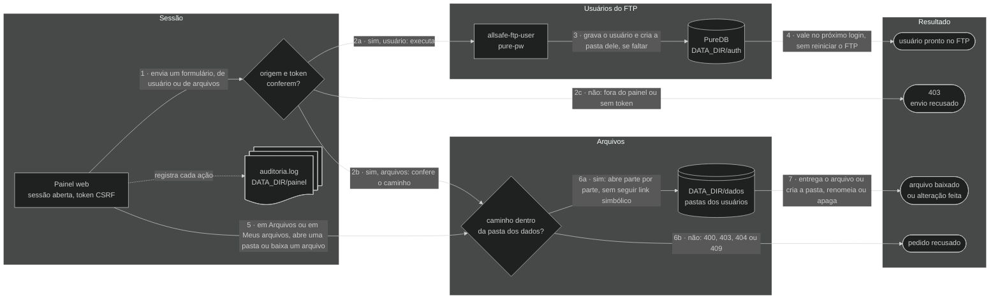

# 🖥️ Painel web — allsafe-ftp-stack

↩ [README do projeto](../README.md) · [Índice da documentação](README.md)

## 💡 Em poucas palavras

O painel é uma página, aberta pelo navegador **de dentro da rede interna**, para criar, trocar a senha e remover os usuários do FTP, escolher a pasta de cada um, criar pastas e baixar os backups recebidos, sem usar a linha de comando. Cada administrador entra com o próprio usuário e a própria senha, só por HTTPS. O dono dos arquivos também entra: cada usuário do FTP usa o nome e a senha do FTP e alcança só a própria pasta, onde faz o que o [perfil](#perfis) dele deixa. Quem atende o navegador é o nginx, a porta de entrada: ele barra quem está fora da rede interna e só então passa o pedido ao painel. O que é feito no painel vale no FTP na hora, sem reiniciar nada.

<!-- diagrama: diagramas/painel-diagrama.mmd -->
```mermaid
%%{init: {"theme": "dark"}}%%
flowchart LR
    usuario@{ shape: person, label: "Usuário<br>navegador na rede interna" }
    nginx@{ shape: rect, label: "nginx<br>allsafe-ftp-nginx, HTTPS" }
    painel@{ shape: rect, label: "Painel web<br>allsafe-ftp-painel" }
    cmd@{ shape: rect, label: "allsafe-ftp-user<br>cria, troca a senha, remove" }
    puredb@{ shape: cyl, label: "PureDB<br>usuários virtuais" }
    fim@{ shape: stadium, label: "usuário pronto no FTP" }

    usuario --> nginx --> painel --> cmd --> puredb --> fim
```

<sub>Nível 1 · Diagrama · [fonte](diagramas/)</sub>

**Sequência:** Usuário (navegador na rede interna) ➜ nginx (`allsafe-ftp-nginx`, HTTPS) ➜ Painel web (`allsafe-ftp-painel`) ➜ `allsafe-ftp-user` ➜ PureDB ➜ usuário pronto no FTP

> 🧱 **Uso só em rede privada, atrás de firewall.** O painel administra as contas que guardam a configuração da sua rede. Por padrão, ele escuta **apenas em IP privado**, recusa cliente de fora das redes internas e não deve ser publicado na internet nem receber redirecionamento de porta da borda. Quem precisa chegar de fora entra por VPN até a rede interna. Veja [rede privada e firewall](seguranca.md#rede-privada); endereço público só com a opção descrita em [IP público](seguranca.md#ip-publico).

---

<details>
<summary>Sumário — clique para expandir</summary>

[Abrir o painel](#abrir) · [O que há em cada aba](#abas) · [Idioma das telas](#idioma) · [Usuários pelo painel](#usuarios) · [Perfis](#perfis) · [Arquivos e download](#arquivos) · [Usuário do FTP no painel](#usuario-ftp) · [Servidor: containers e recursos](#servidor) · [Administradores do painel](#administradores) · [Recuperar o acesso](#senha) · [Certificado do painel](#certificado) · [Abrir para a rede interna](#rede-interna) · [Marca do painel](#marca) · [Como o painel decide](#como-decide) · [Auditoria](#auditoria) · [O que protege o painel](#protecoes)

</details>

---

<a name="abrir"></a>

## 🚪 Abrir o painel

O `./deploy.sh` sobe o painel junto com o FTP e mostra o endereço no fim:

```text
Painel: https://127.0.0.1:8443  (pelo nginx; certificado autoassinado; rede privada, atrás de firewall)
```

1. Abra o endereço no navegador. Na instalação padrão, só o próprio servidor alcança (`127.0.0.1`).
2. O navegador avisa que o certificado é autoassinado: confira a impressão digital (comando abaixo) antes de aceitar.
3. Digite o usuário e a senha de administrador. Na primeira instalação, o usuário é o de `PAINEL_ADMIN_USER` (`admin`, se você não trocou no `.env`) e a senha está em `.secrets/painel-admin-inicial-senha.txt`:

```bash
cat .secrets/painel-admin-inicial-senha.txt
```

**Resultado esperado:** a tela **Visão geral**, com o FTP `No ar` e, no menu, o nome do administrador que entrou.

Impressão digital do certificado do painel, para comparar com a que o navegador mostra:

```bash
docker compose exec painel openssl x509 -in /painel/tls/painel-cert.pem -noout -fingerprint -sha256
```

> ⚠️ Troque a senha inicial depois do primeiro acesso: [Administradores do painel](#administradores). Nunca cole a senha em documento, captura de tela ou mensagem.

---

<a name="abas"></a>

## 🗂️ O que há em cada aba

| Aba | O que mostra | O que dá para fazer |
|---|---|---|
| Visão geral | FTP no ar ou fora, quantidade de usuários, espaço usado e livre, último envio, validade do certificado do FTP, o modo de TLS do FTP, a faixa **Servidor e containers** (processador e memória do servidor e dos containers da stack, cada um com o uso contra o que há ou o que foi alocado), os arquivos recebidos por dia nos últimos 14 dias, o último envio de cada usuário, o espaço de cada pasta, os dados para configurar o equipamento (servidor, porta de controle, portas passivas, protocolo) e os últimos registros da atividade | Só consultar; cada cartão termina no atalho para a aba do detalhe |
| Usuários | Todas as contas em uma lista, cada uma com o **perfil** embaixo do nome. Primeiro os administradores do painel, com a marca **você** na conta de quem está usando o painel e quantas sessões cada um tem abertas; depois os usuários do FTP, um por linha: pasta, com a marca **dividida** quando outro usuário também a alcança, e o nome, com a marca **bloqueado** quando o FTP o está recusando por senhas erradas demais, espaço usado, quantidade de arquivos e último envio; a coluna **TLS** diz se o usuário é obrigado a usar TLS | Criar, escolhendo o perfil (Administrador, Completo, Envio, Só envio ou Leitura), a pasta e, para equipamento sem suporte a TLS, já dispensado do TLS; editar, para trocar o perfil, a pasta e os limites e tirar um bloqueio; trocar a senha; remover, com a pasta dele ou sem ela; abrir a pasta do usuário na aba Arquivos; dispensar um usuário do TLS e voltar a exigir; trocar a senha e o nome de um administrador e removê-lo |
| Arquivos | As pastas dos usuários do FTP e o que há em cada uma: nome, tamanho e data de cada arquivo | Entrar nas pastas, pelo nome ou pelo botão **Abrir**, baixar um arquivo pelo navegador, criar uma pasta e abrir o cadastro de usuário já com a pasta aberta |
| Servidor | Os três containers da stack (servidor FTP, painel e frente web), cada um com o que usa de processador, memória e processos contra o que foi alocado a ele, e, separados, os recursos do servidor em que a stack roda: processador, memória, disco e rede do FTP, com o estado, a medida de agora e o histórico dos últimos minutos | Só consultar; **Atualizar sozinha** refaz a leitura a cada 10 s, sem contar como uso da sessão: veja [Servidor](#servidor) |
| Segurança | Conferência da instalação, com o resumo de quantos itens estão em ordem, pedem atenção ou são conferidos no servidor: se endereço público é aceito, se o painel está publicado por proxy ou túnel, endereços do FTP e do painel, modo TLS, com a exceção por usuário e quem está dispensado, a entrada dos usuários do FTP, a frente web (nginx), validade e impressão digital dos dois certificados, redes que podem abrir o painel, regras da sessão, o custo das senhas do FTP, com os usuários que ainda estão com o custo anterior, o contato de segurança publicado em `/.well-known/security.txt`, isolamento do container e o lembrete do firewall | Só consultar |
| Bloqueios | Os endereços com [bloqueio por endereço](seguranca.md#bloqueio-por-endereco): a regra em vigor, o total e, por endereço, quem bloqueou (o FTP, o painel ou o administrador), com quantos erros, desde quando e até quando. Embaixo, quando há, os usuários com bloqueio por tentativa no FTP | Procurar um endereço, **Mudar prazo**, para bloquear por mais tempo ou encurtar, e **Desbloquear**; abrir o usuário que está com bloqueio por tentativa |
| Atividade | Os últimos 300 registros do painel: entradas, recusas, downloads, pastas criadas e alterações de usuário e de administrador, com data, endereço de origem e quem fez, administrador ou usuário do FTP | Só consultar |

O menu fica à esquerda em tela de 1280 px de largura ou mais: o símbolo e o nome, as abas em dois grupos (**Operação**, com Visão geral, Usuários e Arquivos, e **Sistema**, com Servidor, Segurança, Bloqueios e Atividade), a aba em uso marcada e, embaixo, o botão de [idioma](#idioma) (**PT** e **EN**), o nome e o papel de quem entrou e o botão **Sair**, que encerra a sessão na hora. Em tela mais estreita, o menu vira uma faixa em cima, com as abas numa linha que rola para o lado. Com a instalação publicada (endereço público aceito ou painel por proxy ou túnel), o administrador vê um sinal de alerta ao lado de **Segurança**, em qualquer aba em que estiver. Os gráficos são desenhados pelo próprio painel, sem script, e todo número do desenho está também escrito ao lado dele. No rodapé de todas as telas ficam a versão e a autoria: veja [Marca do painel](#marca).

Cada aba abre com uma faixa no azul da marca, o mesmo do menu e da tela de entrada, nos temas claro e escuro: o ícone da aba, o título, uma linha que diz o que a tela mostra e, à direita, a ação principal. Em tela com mais de 900 px de largura, a faixa leva também a cena do caminho do backup, a da tela de entrada, em miniatura: os pacotes atravessam uma vez, na chegada à tela, e param. Com **Atualizar sozinha** ligada na aba Servidor, ou com o sistema pedindo menos movimento, nada se mexe. Tela de formulário (novo usuário, editar, trocar senha, renomear, apagar) leva a faixa fina, só com o título.

As listas se ajustam à largura da tela, sem rolagem lateral da página:

| Lista | Até 640 px de largura | Tela média | Tela larga |
|---|---|---|---|
| Usuários | Um bloco por conta, com o rótulo de cada dado e as ações embaixo | De 641 a 1095 px, um bloco por conta: nome e perfil em cima, os dados lado a lado e as ações embaixo | A partir de 1096 px, tabela, com as ações duas por linha; a partir de 1600 px, em uma linha |
| Arquivos e Meus arquivos | Um bloco por item, com o tamanho, a data e as ações embaixo do nome | De 641 a 899 px, o nome, o tamanho e a data em uma linha e as ações na linha de baixo | A partir de 900 px, tabela |
| Atividade | Um bloco por registro | De 641 a 959 px, a data, o endereço e o fato em uma linha e o detalhe embaixo | A partir de 960 px, tabela |
| Bloqueios | Um bloco por endereço, com o rótulo de cada dado e as ações embaixo | De 641 a 1095 px, um bloco por endereço, com os dados lado a lado e as ações embaixo | A partir de 1096 px, tabela |
| Conferência da aba Segurança | A marca e o item em cima e a situação embaixo, na largura inteira | Tabela | Tabela |

Lista sem nada para mostrar (pasta vazia, atividade sem registro) diz o que falta e quando passa a aparecer. O texto longo de cada tela, como a explicação dos perfis e das etiquetas da aba Usuários, fica recolhido em uma linha embaixo da lista e abre com um clique.

Quem entra com a conta do FTP não vê nenhuma dessas abas: vê uma tela só, **Meus arquivos**, descrita em [Usuário do FTP no painel](#usuario-ftp).

A foto de cada tela, com a explicação item por item, está em [Fotos da aplicação](aplicacao/README.md).

> ⚠️ Com `FTP_TLS_MODE` em `0` ou `1`, as abas Visão geral e Segurança abrem com um alerta no começo da tela: o FTP está aceitando senha e arquivo em texto puro. O alerta só some quando a variável volta para `2` ou `3`. Veja [Segurança](seguranca.md#ftp-sem-tls).

> ⚠️ Com pelo menos um usuário dispensado do TLS, as mesmas abas abrem com o alerta de quantos e quais usuários entram no FTP sem TLS. Ele some quando o último volta a ser obrigado a usar TLS. Veja [Segurança](seguranca.md#tls-por-usuario).

---

<a name="idioma"></a>

## 🌍 Idioma das telas

O painel fala **português**, que é o padrão, e **inglês**. A troca é pelo botão **PT** e **EN**, que fica no menu, junto do nome de quem entrou, e também na tela de entrada. O idioma em uso aparece marcado.

| Onde o botão é usado | O que muda | Onde a escolha fica |
|---|---|---|
| Na tela de entrada | A tela de entrada daquele navegador | No navegador, por um ano |
| Depois da entrada | As telas da conta: todas as sessões abertas dela e as próximas entradas, em qualquer navegador | No servidor, uma por conta |

Cada conta escolhe o seu, administrador ou usuário do FTP: a escolha de uma não muda a tela de nenhuma outra. A conta que nunca escolheu entra no idioma que o navegador guardou na tela de entrada e, sem isso, em português. Depois da troca, o painel volta para a tela em que o botão foi usado.

Em inglês mudam todas as telas, os avisos, os erros dos formulários e a descrição de cada registro da aba Atividade; a data passa a `ano-mês-dia` e os números usam ponto decimal e vírgula de milhar. Não mudam os nomes de usuário, de pasta e de arquivo, o arquivo de auditoria, as mensagens do FTP e as dos scripts do terminal.

<details>
<summary>Detalhe técnico — como o idioma é guardado e trocado</summary>

- **Por conta:** `DATA_DIR/painel/idiomas` (`/painel/idiomas` no container), `0600`, do `root`, uma linha `admin:<nome>:<pt|en>` ou `usuario:<nome>:<pt|en>` por conta que escolheu. O arquivo é gravado ao lado e trocado de uma vez. A linha acompanha o administrador que troca de nome e sai quando a conta é removida pelo painel. A de usuário removido pelo terminal sai na troca de idioma seguinte, de qualquer conta; até lá, um usuário criado com o mesmo nome entra no idioma do anterior.
- **No navegador:** cookie `__Host-idioma`, com `Secure`, `HttpOnly`, `SameSite=Lax` e validade de um ano, gravado na troca e em toda entrada. Só `pt` e `en` são lidos: outro valor é ignorado. Ele não é sessão e não abre nenhuma tela.
- **Troca:** `POST /idioma`, com o token dos outros formulários da sessão; antes da entrada, com o token do formulário de entrada. Por `GET` não há troca, e idioma fora da lista recebe `400`. A volta sai do caminho da tela de origem e só quando ele é uma tela do papel da sessão: nos outros casos, o começo do painel.
- **Textos:** o texto em português é o que está no código, e o catálogo do inglês é o [`painel/idioma_en.py`](../painel/idioma_en.py). Texto sem tradução sairia em português; o `./scripts/validate.sh` recusa o código em que falta ou sobra tradução.
- **Auditoria:** a troca de idioma não gera registro. As recusas dela são as de qualquer formulário: `recusa_csrf` e `recusa_origem`.

</details>

---

<a name="usuarios"></a>

## 👥 Usuários pelo painel

| Quero | Onde | O que acontece |
|---|---|---|
| Criar um usuário | Usuários ➜ **Novo usuário** | Cria a conta, com o perfil marcado, e a pasta dela: `DATA_DIR/dados/<usuario>` com o campo **Pasta** em branco, ou a pasta escolhida. Com a senha em branco, o painel gera uma senha forte e a mostra **uma única vez** |
| Escolher o que o usuário pode fazer | Usuários ➜ **Novo usuário**, campo **Perfil**; depois, **Editar**, cartão **Perfil** | O usuário passa a ter o perfil escolhido na entrada seguinte dele no FTP: veja [Perfis](#perfis) |
| Criar um usuário para equipamento sem suporte a TLS | Usuários ➜ **Novo usuário**, com a caixa **Equipamento sem suporte a TLS** | O usuário já nasce dispensado do TLS e o equipamento entra em seguida. Sem marcar a caixa, o usuário só entra com TLS |
| Trocar a senha | Usuários ➜ **Trocar senha** | A senha antiga deixa de valer no próximo login |
| Trocar a pasta | Usuários ➜ **Editar** | O usuário passa a entrar na pasta nova na entrada seguinte. **Os arquivos da pasta anterior continuam nela**, sem serem movidos nem apagados |
| Limitar um usuário | Usuários ➜ **Editar**, cartão **Limites** | Sessões ao mesmo tempo, taxa de download e de envio, horário de entrada e downloads ao mesmo tempo pelo painel, só para aquele usuário. Campo em branco: vale o limite da stack. Vale na entrada seguinte dele no FTP |
| Remover um usuário | Usuários ➜ **Remover** | Pede confirmação. A conta some; **os arquivos da pasta são preservados** |
| Remover um usuário e a pasta dele | Usuários ➜ **Remover**, com a caixa **Apagar também a pasta e tudo o que há nela** | Pede também a sua senha atual. A conta some e a pasta é apagada com tudo o que tem dentro, **sem lixeira**. A caixa só aparece quando a pasta é só dele |
| Deixar um usuário entrar sem TLS | Usuários ➜ **Dispensar TLS**, ou a caixa **Equipamento sem suporte a TLS** em **Novo usuário** | Pede confirmação e vale em instantes, sem derrubar quem está conectado; os demais continuam obrigados a usar TLS |
| Voltar a exigir o TLS de um usuário | Usuários ➜ **Exigir TLS**, ou **Editar**, cartão **TLS** | Pede confirmação e vale em instantes, para as entradas seguintes dele. Troque a senha dele, que passou em texto puro |

**Resultado esperado:** o usuário criado entra por FTPS logo em seguida, sem reiniciar o FTP.

Os formulários, as mensagens de recusa e a tela da senha gerada estão em [Fotos da aplicação](aplicacao/README.md#usuarios).

Regras, as mesmas do [`manage-user.sh`](../manage-user.sh):

- Nome com letras minúsculas, números, `_` e `-`, começando por letra ou `_`, até 32 caracteres.
- Senha com no mínimo 12 caracteres.
- Pasta: em branco, é o nome do usuário. Escolhida, fica sempre dentro de `DATA_DIR/dados`, com até 4 níveis separados por `/` (`clientes/olt-01`); cada nível tem letras, números, `_`, `-` e ponto, não começa com ponto e vai até 64 caracteres. A pasta é criada se não existir, e o campo sugere as que já existem no primeiro nível.
- Pasta que passa por link simbólico, ou por um nome que já é de um arquivo, é recusada.
- A pasta é escolhida na criação e trocada depois em **Editar**, com as mesmas regras. A troca não mexe na senha nem nos arquivos: o que estava na pasta anterior continua lá, e a pasta nova é criada se não existir.
- O **usuário inicial** (`FTP_USER`) tem a senha e a pasta trocadas e é removido como os demais. Ele é criado uma vez, pela instalação: removido, não volta nas subidas seguintes do FTP, e para tê-lo de novo basta criar um usuário com o mesmo nome, que fica com a senha informada. A senha trocada pelo painel vale até o arquivo `.secrets/ftp-usuario-inicial-senha.txt` ser alterado: na subida seguinte do FTP, passa a valer a do arquivo. Veja [Segredos](segredos.md#trocar-a-senha).

<a name="perfis"></a>

Perfil de cada conta, escolhido em **Novo usuário** e trocado em **Editar**, cartão **Perfil**. O perfil vale no FTP e na entrada do usuário pelo painel:

| Perfil | No FTP | No painel |
|---|---|---|
| Administrador | Não é conta do FTP | Todas as abas: veja [Administradores do painel](#administradores) |
| Completo | Lista, baixa, envia, cria pasta, renomeia, apaga e grava por cima | Tela Meus arquivos: navega, baixa, cria pasta, troca o nome e apaga |
| Envio | Lista, baixa, envia e cria pasta. Não apaga, não renomeia e não grava por cima do que já chegou | Tela Meus arquivos: navega, baixa e cria pasta |
| Só envio | Envia e cria pasta. Não lista e não baixa nada, nem o que ele mesmo enviou | Tela Envio de arquivos: só os dados para enviar por FTP |
| Leitura | Só lista e baixa | Tela Meus arquivos: navega e baixa |

- Usuário criado antes da `0.30.0`, ou sem perfil informado, é **Completo**: nada muda para quem já usa a stack.
- **Envio guarda o que recebeu.** O arquivo passa a ser do servidor assim que termina de chegar: daí em diante o usuário não o apaga, não o renomeia e não grava por cima. Equipamento que envia sempre com o mesmo nome de arquivo precisa do perfil Completo, ou de um nome com data.
- **Só envio não vê os backups.** A conta entra em uma área de entrada só dela, fora da pasta dos backups, e o servidor leva cada arquivo para a pasta do usuário assim que ele termina de chegar. Quem tem a senha desse equipamento envia, e mais nada: não lista, não baixa, não apaga e não troca o nome de nenhum arquivo já recebido.
- **Leitura não grava nada:** nem arquivo, nem pasta, em nenhum nível da pasta dele.
- **Pasta dividida:** quem tem a mesma pasta, ou uma dentro da outra, alcança os arquivos do outro até onde o próprio perfil deixa. Um Leitura baixa o que o Envio mandou; um Envio não apaga o que o Completo gravou.
- **No painel, o perfil decide o que existe:** a tela mostra só os botões do perfil, e a ação que ele não tem responde `404` mesmo pedida direto pelo endereço. Enviar arquivo é sempre por FTP: o painel não recebe arquivo de ninguém.
- **Troca de perfil:** vale na entrada seguinte do usuário no FTP e encerra a sessão dele no painel. A sessão de FTP que já está aberta segue com o perfil anterior até sair.
- **Administrador e usuário do FTP são cadastros separados**, com a senha guardada em lugares diferentes: não há troca de um para o outro. Remova a conta e crie a outra.

Três limites do perfil Envio, para não contar com o que ele não faz:

- Entre o fim do envio e a entrega ao servidor passa um instante, de milissegundos, em que o arquivo ainda é do usuário.
- Pasta criada pelo próprio Envio continua dele enquanto está vazia: ele a remove ou renomeia até gravar o primeiro arquivo nela.
- Pasta criada **por FTP** por um usuário Completo só recebe arquivo do Envio depois que o Completo grava o primeiro arquivo nela. Pasta criada pela aba Arquivos recebe na hora.

Cinco comportamentos do perfil Só envio, para escolher sabendo:

- **Nome repetido não substitui:** o arquivo que chega com o nome de um que já está na pasta ganha a data e a hora antes da extensão (`backup.rsc` vira `backup-20261009-153000.rsc`), e o anterior fica como estava.
- **O cliente não confere o envio pela lista:** a lista da conta vem vazia, e o tamanho do arquivo enviado não é informado. Programa que envia com um nome temporário e troca o nome no fim, ou que lista a pasta para confirmar, precisa do perfil Envio.
- **Envio interrompido é entregue como chegou:** o pedaço recebido vai para a pasta com o nome do arquivo, e a nova tentativa ganha a data e a hora. Continuar o envio de onde parou não funciona neste perfil.
- **Pastas do caminho:** a pasta que o cliente cria antes de enviar nasce na pasta do usuário junto com o primeiro arquivo dela. Pasta criada e deixada vazia não chega à pasta do usuário.
- **Mesma pasta para vários:** um Só envio pode dividir a pasta com um Completo, um Envio ou um Leitura. Eles veem e baixam o que o Só envio mandou; ele não vê o que os outros gravaram.

<details>
<summary>Detalhe técnico — como o perfil é aplicado</summary>

- **Cadastro:** o perfil é a identidade de sistema da conta no PureDB, e não uma lista à parte: Completo é `ftpdata:ftpdata` (`10000:10000`), Envio é `ftpenvio:ftpdata` (`10002:10000`), Leitura é `ftpleitura:ftpleitura` (`10003:10003`) e Só envio é `ftpsoenvio:ftpsoenvio` (`10004:10004`). Quem recusa o apagamento ou a gravação é o sistema de arquivos, para qualquer comando do FTP.
- **Área de entrada do Só envio:** a pasta da sessão dele no cadastro é `/data/.entrada/<usuário>`, `0700` do `ftpsoenvio`, dentro de `/data/.entrada`, `0700` do `root`. A pasta de destino fica guardada no campo de descrição do cadastro. A cada envio, o vigia do FTP liga o arquivo na pasta de destino sem substituir o que existe, confere que é o mesmo arquivo, passa-o ao `ftpdata` e o tira da área. As duas pontas são abertas nível por nível a partir de `/data`, sem seguir link simbólico; só entra arquivo comum, com um nome só e ainda do `ftpsoenvio`. A aba Arquivos não mostra a área nem a abre pelo endereço.
- **Modo da pasta:** calculado por quem a alcança. Só Completo: `0750`. Com um Envio: `1770`, em que o grupo grava e cada um só apaga o que é dele. Com um Leitura: mais leitura para os outros (`0755` ou `1775`). As pastas de dentro acompanham quando o modo muda. `DATA_DIR/dados` fica `0700`, do `root`: nenhuma conta do FTP sai da própria pasta.
- **Entrega:** a cada envio em pasta com Envio ou Leitura, o vigia do FTP passa o arquivo ao `ftpdata`, e as pastas do caminho, ao `ftpdata` com o modo da pasta do usuário. Só mexe em arquivo comum, com um nome só e ainda do `ftpenvio`. O que não pôde ser entregue fica no registro do `ftp` como `entrega nao feita`.
- **Partida do `ftp`:** com Envio, Só envio ou Leitura no cadastro, a subida refaz o modo das pastas e entrega o que ficou sem entrega, antes de aceitar a primeira sessão. Na área de entrada, apaga as pastas que ficaram vazias; o que não é arquivo comum do `ftpsoenvio` fica onde está, com `AVISO: ficou arquivo sem entrega` no registro do `ftp`.
- **Troca e remoção do Só envio:** ao sair do perfil e ao remover o usuário, o que ainda está na área é entregue e a área é apagada. Os arquivos da pasta de destino ficam.
- **Sessão do painel:** a marca da sessão do usuário do FTP é o resumo da linha dele no cadastro; a troca de perfil muda a linha, e a sessão acaba sozinha, com `sessao_encerrada` e o motivo `cadastro_alterado`.

</details>

<a name="limites"></a>

Limites por usuário, no cartão **Limites** da tela **Editar**. Servem tanto para a conta de um equipamento, que só envia, quanto para a de uma pessoa, que entra, envia e baixa:

| Limite | Onde vale | Valor | Em branco |
|---|---|---|---|
| Sessões ao mesmo tempo | FTP | De 1 ao `FTP_MAX_CLIENTS` da stack | Só os limites da stack: `FTP_MAX_CLIENTS` no total e `FTP_MAX_CLIENTS_PER_IP` por endereço |
| Taxa de download | FTP e downloads dele pelo painel | De 1 a 10.000.000 KB por segundo | Sem teto |
| Taxa de envio | FTP | De 1 a 10.000.000 KB por segundo | Sem teto |
| Horário de entrada | FTP e entrada dele no painel | Início e fim, em horas e minutos; pode passar da meia-noite (`22:00` às `06:00`) | Entra a qualquer hora |
| Downloads ao mesmo tempo | Painel | De 1 a 8 | 2 |
| Senhas erradas no FTP até o bloqueio | FTP | De 1 a 100; `0`: este usuário nunca é bloqueado | O padrão da stack, `FTP_BLOQUEIO_TENTATIVAS` (5) |
| Minutos de bloqueio | FTP | De 1 a 1440 | O padrão da stack, `FTP_BLOQUEIO_MINUTOS` (15) |

**Resultado esperado:** a lista de usuários volta com o aviso `Limites gravados` e a marca **limites** ao lado do nome; passando o mouse sobre ela, aparece cada limite que o usuário tem. Para tirar um limite, apague o campo e grave de novo.

<a name="bloqueios"></a>

**Bloqueio por tentativa.** O endereço que erra a senha de um usuário no FTP vezes demais fica bloqueado para aquele usuário, pelo tempo configurado: até lá, nem a senha certa entra dali. Os outros endereços, os outros usuários e a entrada dele no painel continuam como estavam. Para tirar o bloqueio antes do prazo:

1. Na aba Usuários, o nome aparece com a marca **bloqueado**; passando o mouse sobre ela, aparecem os endereços.
2. Clique em **Editar**. O cartão **Bloqueios** lista cada endereço, com as senhas erradas, a hora do bloqueio e até quando ele vale.
3. Corrija a senha no equipamento e clique em **Desbloquear**.

**Resultado esperado:** a lista de usuários volta com o aviso `Bloqueio removido. O usuário volta a poder entrar no FTP.`, sem a marca **bloqueado**, e a entrada seguinte do equipamento passa. O que conta e o que não conta como senha errada está em [Segurança](seguranca.md#bloqueio-por-tentativa).

> ⚠️ **O que muda para o usuário:** fora do horário, o FTP recusa a entrada como recusa senha errada, e com todas as sessões dele ocupadas, responde que não aceita mais conexões do mesmo usuário. Nos dois casos ele também não entra no painel, porque é o FTP que confere a senha.

> ⚠️ **Equipamento com a senha errada gravada:** ele tenta de novo sozinho, chega ao limite e fica bloqueado; se continuar tentando depois do prazo, é bloqueado outra vez. Corrija a senha no equipamento antes de desbloquear. Equipamentos que chegam ao FTP pelo mesmo endereço, com o mesmo usuário, são bloqueados juntos.

> ⚠️ **Taxa de envio e arquivo pequeno:** com a taxa de envio definida, o servidor segura cada arquivo enviado por cerca de `256 ÷ taxa` segundos, além do tempo do envio. Com 50 KB por segundo, um arquivo de 1 KB leva 5 segundos; com 1.000, um quarto de segundo. Para equipamento que manda muitos arquivos pequenos, use uma taxa alta ou deixe em branco.

> ⚠️ **Pasta dividida:** dois usuários com a mesma pasta, ou com uma dentro da outra, leem, gravam e apagam os arquivos um do outro. O painel aceita, porque serve para uma conta de consulta na pasta de cima, e avisa: a lista marca a pasta com **dividida** e mostra quem mais a alcança, e a tela de remoção repete o aviso. Para um equipamento não alcançar o backup de outro, dê a cada um a própria pasta.

> ⚠️ **Apagar a pasta junto não tem volta:** o painel não tem lixeira, e o que sai dali só volta do [backup](backup.md). A tela de remoção mostra quantos arquivos a pasta tem antes de pedir a confirmação. A caixa não aparece, e o pedido é recusado, quando outro usuário usa a mesma pasta, uma de dentro ou uma de fora dela: remova antes os outros ou troque a pasta deles em **Editar**.

> ⚠️ **Dispensa do TLS:** o usuário dispensado manda senha e arquivo em texto puro. Use só para o equipamento antigo que não fala TLS, em rede interna isolada, com usuário e senha só dele. As condições e o que a stack garante estão em [Segurança](seguranca.md#tls-por-usuario).

<details>
<summary>Detalhe técnico — a dispensa do TLS no painel</summary>

- A dispensa vale com `FTP_TLS_EXCECOES=sim`, que é o padrão, `FTP_TLS_MODE=2` e sem `REDE_PERMITIR_IP_PUBLICO=sim`. Fora disso ela fica sem efeito: a coluna **TLS**, os botões e a caixa do **Novo usuário** somem, a tela de confirmação responde `404`, o cartão **TLS** de **Editar** e a aba Segurança dizem o motivo, e a lista dos dispensados fica guardada sem valer.
- A caixa do **Novo usuário** manda `sem_tls=sim`. O usuário é criado e depois dispensado: se a dispensa falhar, ele fica obrigado a usar TLS e o aviso manda repetir em **Editar**. Com a dispensa sem efeito, o campo é ignorado.
- Sem nenhum dispensado, o FTP recusa a sessão sem TLS antes de a senha ser enviada. Com o primeiro dispensado, e de novo quando o último volta a ser obrigado, o FTP troca o modo de entrada em cerca de um segundo, sem reiniciar o container e sem derrubar as sessões em andamento.
- `GET /usuarios/tls?usuario=<nome>` mostra a confirmação, aberta pela lista ou pelo cartão **TLS** de **Editar**; `POST /usuarios/tls` grava, com o token CSRF da sessão e o campo `acao` em `dispensar` ou `exigir`. Usuário que não existe e nome fora da regra respondem `404`; `acao` diferente volta para a confirmação sem alterar nada.
- Quem grava é o `allsafe-ftp-user`, o mesmo script do `manage-user.sh`, na `sem-tls.lista` de `DATA_DIR/auth`. O painel só lê a lista para montar as telas.
- Remover o usuário tira o nome dele da lista: um usuário novo com o mesmo nome não herda a dispensa.
- Cada alteração fica na auditoria, com o administrador e o usuário: `tls_dispensado` e `tls_exigido`.

</details>

<details>
<summary>Detalhe técnico — os limites por usuário</summary>

- `POST /usuarios/limites` grava todos de uma vez, com o token CSRF da sessão e os campos `usuario`, `sessoes`, `download`, `envio`, `inicio`, `fim`, `baixar`, `tentativas` e `minutos`. Campo em branco tira o limite. Valor fora da regra, início sem fim ou início igual ao fim respondem `400`, com a tela de volta e o que foi digitado; usuário que não existe e nome fora da regra, `404`. Nada é gravado pela metade.
- **Quem guarda e quem aplica:** sessões, taxas e horário ficam na linha do usuário em `/auth/pureftpd.passwd`, gravados com `pure-pw usermod`, e quem os aplica é o `pure-ftpd`, a cada entrada. O limite de downloads pelo painel fica em `/auth/limites.lista` (`0600`), e quem o aplica é o painel. Os dois campos do bloqueio por tentativa ficam na mesma lista, e quem os aplica é o vigia do serviço `ftp`: [Scripts](scripts.md#vigia). Todos são gravados pelo `allsafe-ftp-user limites`, o mesmo comando do [`manage-user.sh`](../manage-user.sh).
- **Horário:** vale no fuso do container, o da variável `TZ`. O `pure-pw` guarda as horas sem os zeros da esquerda (`08:00` às `18:00` fica `800-1800`); o painel e o `manage-user.sh` mostram sempre com quatro dígitos.
- **Taxa de download no painel:** os downloads que o próprio usuário faz na tela Meus arquivos saem na taxa dele. Os que o administrador faz na aba Arquivos, não.
- **Sessão do usuário no painel:** trocar um limite que fica no cadastro do FTP muda a linha dele, e as sessões dele no painel são encerradas no pedido seguinte. Trocar só o limite de downloads pelo painel não encerra nada e vale no download seguinte.
- **Entrada recusada pelo limite:** fora do horário, o FTP responde `530`, e o painel, `401`, como para senha errada: conta como erro de entrada. Com as sessões ocupadas, o FTP responde `421` depois de conferir a senha, e o painel, `401`, com `entrada_falha conferencia=ftp_indisponivel` na auditoria.
- **Usuário inicial:** os limites dele ficam de uma subida para a outra; o serviço `ftp` só reaplica a senha.
- **Bloqueio:** mudar `tentativas` ou `minutos` tira os bloqueios que o usuário tem; gravar os outros limites, não. Trocar a senha dele e removê-lo também tiram. `POST /usuarios/desbloquear`, com o token CSRF da sessão e o campo `usuario`, tira todos os bloqueios do usuário de uma vez e grava `bloqueio_removido` na auditoria, com o administrador, o usuário e a quantidade de endereços; usuário que não existe e nome fora da regra respondem `404`. O painel só lê `/auth/bloqueios` para montar as telas: quem grava o bloqueio é o vigia, e quem o tira é o `allsafe-ftp-user desbloquear`, o mesmo comando do `manage-user.sh`. Para tirar o bloqueio de um endereço só, use o terminal: [Operação](operacao.md#usuarios).
- Remover o usuário tira o nome dele da `limites.lista`: um usuário novo com o mesmo nome não herda o limite.
- Cada gravação fica na auditoria como `limites_alterados`, com o administrador, o usuário e o valor de cada limite (`-` no que ficou em branco).

</details>

<details>
<summary>Detalhe técnico — a remoção com a pasta</summary>

- `POST /usuarios/remover` com o campo `apagar_pasta=sim` pede também o campo `senha_atual`, a senha de quem está na sessão. Senha errada ou em branco recebe `403`, grava `admin_senha_atual_recusada` e conta como erro de entrada: cinco bloqueiam o endereço por 15 minutos (`429`). Nada é removido.
- Usuário sem pasta dentro de `DATA_DIR/dados`, ou com a pasta alcançada por outro usuário (a mesma, uma de dentro ou uma de fora), recebe `409` e nada é removido.
- A ordem é fixa: primeiro a conta sai do cadastro, pelo `allsafe-ftp-user`, depois a pasta é apagada. Se a conta não sair, a pasta não é tocada.
- A pasta é apagada como na aba Arquivos, com os mesmos limites por pedido: veja [Arquivos e download](#arquivos). Pasta grande demais para um pedido fica apagada em parte, com a conta já removida, e a tela aponta a aba Arquivos para terminar.
- A auditoria grava `usuario_removido`, com `pasta=<pasta>`, e `item_apagado`, com a quantidade de itens e o `usuario=` que era o dono.

</details>

A linha de comando continua valendo: painel e `manage-user.sh` alteram as mesmas contas. Veja [Operação](operacao.md#usuarios).

---

<a name="arquivos"></a>

## 📁 Arquivos e download

A aba Arquivos mostra as pastas de `DATA_DIR/dados`, entrega pelo navegador qualquer arquivo que um equipamento enviou, cria pasta, troca o nome e apaga arquivo e pasta. **Enviar arquivo** continua sendo feito por FTP: o painel não recebe arquivo.

1. Abra a aba **Arquivos**. O primeiro nível tem as pastas dos usuários e as criadas pelo painel. Na aba Usuários, o endereço da coluna **Pasta** abre direto a pasta daquele usuário.
2. Clique no nome de uma pasta para entrar. O caminho no alto da lista mostra onde você está e volta a qualquer nível.
3. Clique em **Baixar** na linha do arquivo. O navegador salva o arquivo com o nome original.
4. Para criar uma pasta, entre na pasta onde ela vai ficar, escreva o nome em **Nova pasta** e clique em **Criar pasta**.
5. Para prender um usuário a uma pasta, entre nela e clique em **Novo usuário nesta pasta**: o cadastro abre com o campo **Pasta** preenchido.
6. Para trocar o nome de um arquivo ou de uma pasta, clique em **Renomear** na linha dele, escreva o nome novo e clique em **Trocar nome**. O item continua na mesma pasta.
7. Para apagar um arquivo ou uma pasta, clique em **Apagar** na linha dele, marque a caixa de confirmação, digite a sua senha atual e clique em **Apagar de vez**.

**Resultado esperado:** o arquivo salvo é idêntico ao que o equipamento enviou, e a aba Atividade ganha a linha `Arquivo baixado`, com o administrador, o caminho e o tamanho. A pasta criada aparece na lista com o aviso `Pasta criada.`, vazia, já com o dono e a permissão que o FTP usa, e fica na aba Atividade como `Pasta criada`. O item renomeado aparece com o nome novo e o aviso `Nome trocado.`, com o mesmo conteúdo, dono e permissão; o apagado some da lista com o aviso `Apagado.`. Os dois ficam na aba Atividade, como `Arquivo ou pasta renomeado` e `Arquivo ou pasta apagado`.

> ⚠️ **Apagar não tem volta.** O painel não tem lixeira: a pasta sai com tudo o que tem dentro, e o que foi apagado só volta do [backup](backup.md). A tela de confirmação mostra o caminho e, para pasta, quantos arquivos ela tem.

| Na lista | O que aparece | O que dá para fazer |
|---|---|---|
| Pasta | Nome e data da última alteração; dentro dela, a linha `Pasta do usuário do FTP` diz de quem é | Entrar, pelo nome ou pelo botão **Abrir**, renomear e apagar |
| Arquivo | Nome, tamanho e data da última alteração | Baixar, renomear e apagar |
| Item marcado `link simbólico` ou `arquivo especial` | Nome e data | Renomear e apagar; o painel não abre nem baixa, e mostra **não abre aqui** no lugar do botão. Apagar um link simbólico apaga só o link, nunca aquilo para onde ele aponta |

Limites:

- O nome da pasta nova tem letras, números, `_`, `-` e ponto, não começa com ponto e vai até 64 caracteres. Uma pasta por vez: para criar `clientes/olt-01`, crie `clientes`, entre nela e crie `olt-01`.
- O nome novo de um item renomeado segue a mesma regra. Renomear não muda o item de pasta e não substitui outro: nome que já existe na pasta é recusado.
- **Pasta de usuário do FTP não é renomeada nem apagada pela aba Arquivos**, nem a pasta que tem a de um usuário dentro: o cadastro deixaria de apontar para uma pasta que existe. O que está dentro dela pode ser renomeado e apagado. Para tirar a pasta inteira, remova o usuário com a caixa **Apagar também a pasta**, em [Usuários pelo painel](#usuarios); para mudar o nome, crie a pasta nova e troque a do usuário em **Editar**.
- Um pedido de apagar remove até **50.000 itens** ou trabalha por até **20 segundos**. Pasta maior que isso é apagada em parte: a tela `Apagado em parte` diz quantos itens saíram e traz o botão para repetir, com a confirmação e a senha de novo.
- **Um apagamento por vez** em todo o painel. O segundo, pedido enquanto o primeiro trabalha, recebe a tela `Nada foi apagado` (`503`), com o aviso de que o painel já está apagando outra pasta: espere e repita.
- Até **8 downloads ao mesmo tempo**, somando administradores e usuários do FTP. O nono recebe a tela `Muitos downloads ao mesmo tempo` (`503`): espere um terminar e repita.
- A lista mostra até **2000 itens** por pasta, com um aviso quando há mais. Pasta maior que isso é consultada por FTP.
- O download **não é retomado**: se a conexão cair, começa de novo.
- Conexão que recebe menos de cerca de 4 KiB por segundo é cortada, e o download aparece na aba Atividade como `Download interrompido`.

<details>
<summary>Detalhe técnico — como o painel abre, entrega o arquivo, cria a pasta, renomeia e apaga</summary>

- **Rotas:** `GET /arquivos?pasta=<caminho>` lista e `GET /arquivos/baixar?arquivo=<caminho>` entrega. `POST /arquivos/pasta` cria uma pasta, com os campos `pasta` (onde) e `nome` e o token CSRF. `GET /arquivos/renomear?item=<caminho>` e `GET /arquivos/apagar?item=<caminho>` mostram a tela de cada ação; `POST /arquivos/renomear` leva os campos `item` e `nome`, e `POST /arquivos/apagar`, os campos `item`, `confirmar=sim` e `senha_atual`, os dois com o token CSRF. Todas exigem sessão de administrador; sem sessão, o pedido vai para a tela de entrada. Não existe rota de envio.
- **Caminho:** sempre relativo a `DATA_DIR/dados` (`/data` no container). Caminho com parte `..`, `.` ou vazia, com byte nulo, com parte de mais de 255 bytes ou com mais de 4096 caracteres recebe `400` e o evento `recusa_caminho`.
- **Abertura:** o painel abre a pasta dos dados e depois cada parte do caminho em relação à anterior, só para leitura e sem seguir link simbólico (`O_RDONLY`, `O_NOFOLLOW`). O que foi conferido é o mesmo que fica aberto: trocar uma pasta por um link no meio do pedido não muda o que é lido. Link simbólico em qualquer nível, mesmo apontando para dentro da própria pasta, recebe `403` e o evento `recusa_caminho`.
- **Pasta nova:** a pasta de destino é aberta do mesmo jeito que na listagem, e a nova é criada em relação a ela (`mkdir` pelo descritor da pasta aberta), com dono `ftpdata` e modo `0750`, os mesmos das pastas criadas pelo FTP. Nome fora da regra, com `/`, `..` ou byte nulo, recebe `400` e o evento `recusa_caminho`; destino que passa por link simbólico, `403`; destino que não existe, `404`; nome já usado por pasta, arquivo ou link, `409`. O painel não cria nada além da pasta vazia.
- **Renomear:** a pasta onde o item está é aberta do mesmo jeito que na listagem, e a troca é feita em relação a ela, por uma chamada só (`renameat2` com `RENAME_NOREPLACE`): se o nome novo já existe, o sistema recusa, e não há intervalo em que outro processo possa colocar algo no lugar. Sistema de arquivos que não aceita essa opção cai na conferência seguida da troca. Nome novo fora da regra recebe `400` e o evento `recusa_caminho`; nome igual ao atual ou já usado, `409`; caminho por dentro de link simbólico, `403`; item que não existe, `404`.
- **Apagar:** pede a caixa `confirmar=sim` (`400` sem ela) e a senha atual de quem está na sessão: senha errada ou em branco recebe `403`, grava `admin_senha_atual_recusada` e conta como erro de entrada, e cinco erros bloqueiam o endereço por 15 minutos (`429`). A pasta é esvaziada de dentro para fora, sempre pelo descritor da pasta aberta e sem seguir link simbólico (`O_NOFOLLOW`): um link dentro dela é apagado como link, e o que está do outro lado dele não é tocado, esteja dentro ou fora de `DATA_DIR/dados`. O painel desce até 64 pastas uma dentro da outra.
- **Limites do apagamento:** 50.000 itens ou 20 segundos por pedido, abaixo dos 30 segundos que o nginx espera pelo painel. Ao bater em um deles, o painel para, responde `200` com a tela `Apagado em parte` e grava `item_apagado` com `completo=nao`. Um apagamento por vez: o segundo recebe `503` com `Retry-After: 30`. Item que não pôde ser removido (permissão, erro de disco) para o pedido com a tela `Nada foi apagado` (`500`) ou `Apagado em parte`.
- **Pasta de usuário:** antes de renomear ou apagar, o painel relê o cadastro do FTP. Se o item é a pasta de um usuário, ou tem a pasta de um usuário dentro, a tela e o `POST` respondem `409`, com os nomes dos usuários.
- **Campo `item`:** vai na tela codificado em percentual e volta do mesmo jeito, para o nome com byte fora do UTF-8 chegar inteiro ao painel.
- **Só arquivo comum no download:** FIFO, soquete e dispositivo aparecem na lista como `arquivo especial`, sem o botão de baixar, e o pedido direto de download recebe `404`.
- **Entrega:** `Content-Type: application/octet-stream` e `Content-Disposition: attachment`, com o nome em duas formas (RFC 6266 e RFC 8187): reduzido a ASCII e inteiro, em UTF-8. Com o `nosniff` e a `Content-Security-Policy` de toda resposta, o navegador salva o arquivo e nunca o abre, mesmo que seja uma página HTML.
- **Memória e disco:** o arquivo sai em blocos de 64 KiB, sem ser carregado na memória. O nginx repassa no ritmo do navegador, sem gravar arquivo temporário (`proxy_max_temp_file_size 0`), então o tamanho do arquivo não é limitado pelo `/tmp` do container.
- **Sem retomada:** a resposta leva `Accept-Ranges: none` e o painel ignora o cabeçalho `Range`.
- **Só os cabeçalhos (`HEAD`):** o pedido `HEAD` do mesmo endereço devolve o tamanho e o nome do arquivo, sem o conteúdo. Não ocupa vaga de download nem entra na auditoria.
- **Ritmo mínimo:** cada bloco tem 15 segundos para sair; passado isso, o painel fecha a conexão e libera a vaga do download.
- **Nome fora do UTF-8:** aparece na lista com o sinal de substituição no lugar do byte inválido, e é baixado do mesmo jeito.
- **Auditoria:** `pasta_criada` registra o administrador e o caminho; `item_renomeado`, o administrador, o tipo (`arquivo`, `pasta`, `link` ou `especial`) e os caminhos de antes e de depois; `item_apagado`, o administrador, o tipo, o caminho e a quantidade de itens removidos; `arquivo_baixado` e `arquivo_interrompido` registram quem baixou, o caminho e os bytes entregues; o conteúdo do arquivo nunca é registrado.

</details>

---

<a name="usuario-ftp"></a>

## 📥 Usuário do FTP no painel

O dono dos arquivos pega os próprios backups pelo navegador, sem depender de quem administra: entra no mesmo endereço do painel, com **o nome e a senha do FTP**, e vê uma tela só, **Meus arquivos**, com a pasta dele e o que o [perfil](#perfis) dele deixa fazer. Não há conta nova para criar nem senha nova para guardar.

1. Abra o endereço do painel, de uma rede que esteja em `PAINEL_REDES_PERMITIDAS`.
2. Digite o usuário e a senha do FTP, os mesmos que o equipamento usa. A entrada leva alguns segundos: quem confere a senha é o próprio servidor FTP.
3. Na tela **Meus arquivos**, clique no nome de uma pasta, ou em **Abrir**, para entrar; o caminho no alto da lista volta a qualquer nível, a partir de **Início**.
4. Clique em **Baixar** na linha do arquivo. O navegador salva o arquivo com o nome original.
5. Com o perfil Envio ou Completo, o cartão **Nova pasta**, abaixo da lista, cria uma pasta vazia dentro da que está aberta.
6. Com o perfil Completo, cada linha tem **Renomear** e **Apagar**. Apagar pede a caixa de confirmação e a senha do FTP da própria conta, e não tem lixeira.
7. Clique em **Sair** ao terminar.

**Resultado esperado:** o arquivo salvo é idêntico ao que o equipamento enviou, e a aba Atividade, que só o administrador vê, ganha as linhas `Entrada aceita` e `Arquivo baixado`, com o nome do usuário do FTP, o caminho e o tamanho. Pasta criada, nome trocado e item apagado ganham a linha deles, com o mesmo usuário.

| O usuário do FTP | No painel |
|---|---|
| Vê | Só a pasta do cadastro dele e o que há dentro dela: nome, tamanho e data. O caminho da pasta no servidor não aparece |
| Faz | Leitura: navega e baixa. Envio: também cria pasta. Completo: também troca o nome e apaga, do jeito da [aba Arquivos](#arquivos) e só dentro da pasta dele. Só envio: não vê arquivo nenhum; a tela dele, **Envio de arquivos**, mostra só o endereço, a porta e o modo para enviar por FTP. Enviar arquivo é por FTP, até onde o [perfil](#perfis) deixa |
| Não alcança | Nenhuma aba de administração: Usuários, Arquivos de todos, Servidor, Segurança e Atividade respondem `404` para ele. A ação que o perfil não tem responde `404` também |
| Divide com outro usuário | Só o que já divide no FTP: quem tem a mesma pasta, ou uma pasta dentro da outra, vê pelo painel os mesmos arquivos que vê por FTP |

Regras:

- Entra todo usuário do cadastro do FTP, inclusive o usuário inicial (`FTP_USER`), com a senha que vale no FTP naquele momento.
- A sessão acompanha o cadastro: trocar a senha, a pasta, o perfil ou um limite do FTP do usuário, ou removê-lo, pelo painel ou pelo `manage-user.sh`, encerra as sessões dele no pedido seguinte.
- Nome igual ao de um administrador entra **só** como administrador, com a senha de administrador. Se um administrador é criado com o nome de um usuário do FTP, a sessão desse usuário é encerrada e ele deixa de entrar no painel; por FTP, nada muda.
- **Apagar pede a senha do FTP** de quem está na sessão, conferida pelo servidor FTP como na entrada: senha errada ou em branco recebe `403`, grava `usuario_senha_atual_recusada` e conta como erro de entrada. Os limites do apagamento são os da [aba Arquivos](#arquivos).
- **Pasta de outro usuário** dentro da dele não tem o nome trocado nem é apagada por ele (`409`); a tela não diz de quem é a pasta. O que está dentro dela ele altera item por item, como já faz por FTP.
- Até **3 sessões** por usuário do FTP: a quarta entrada encerra a mais antiga. Até **2 downloads ao mesmo tempo** por usuário, ou o número que o administrador gravou nos [limites](#limites) dele; o seguinte recebe a tela `Muitos downloads ao mesmo tempo` (`503`).
- Os [limites](#limites) do usuário valem aqui também: os downloads saem na taxa de download dele, e fora do horário dele, ou com todas as sessões dele no FTP ocupadas, a entrada é recusada.
- Cinco erros de usuário ou senha em 15 minutos bloqueiam o endereço, do mesmo jeito que na entrada do administrador.
- Com o servidor FTP parado, quem já entrou continua navegando, baixando, criando pasta e trocando nome; apagar responde `503`, porque a senha não pode ser conferida, e ninguém novo entra com conta do FTP. O administrador entra normalmente.

Para o painel aceitar **só administradores**, troque a variável no `.env` e rode o `deploy.sh`:

```bash
PAINEL_ACESSO_USUARIOS_FTP=nao
```

**Resultado esperado:** a tela de entrada volta ao texto `Painel de administração da stack.`, a conta do FTP recebe `Não foi possível entrar.` e a aba Segurança mostra a entrada dos usuários do FTP como desligada. O FTP continua aceitando os mesmos usuários.

> ⚠️ Com `FTP_TLS_MODE=0` o servidor FTP não tem TLS, e a conferência da senha vai em texto puro do painel até ele. Esse trecho não sai da rede interna da stack, dentro do próprio servidor, e a aba Segurança mostra o aviso. Do navegador até o painel continua sendo HTTPS.

<details>
<summary>Detalhe técnico — como a conta do FTP entra e o que ela alcança</summary>

- **Ordem da entrada:** primeiro a conta de administrador, pelo hash `scrypt`. Se não for administrador com aquela senha, e a entrada dos usuários estiver ligada, o painel confere no servidor FTP. A conferência é feita para todo nome válido, exista ou não e seja ou não de administrador; o resultado só é aproveitado quando o nome não é de administrador.
- **Quem confere a senha:** o `pure-ftpd`. O painel abre uma conexão em `ftp:2121`, na rede do Compose, faz o login e sai; não lê o hash do cadastro nem refaz a conta dele. Nos modos de TLS `1`, `2` e `3`, a conexão é TLS 1.2 ou superior e o certificado recebido é comparado, byte a byte, com a parte pública que o serviço `ftp` grava em `/auth/ftp-cert.pem`; se for outro, a senha não é enviada e a entrada é recusada.
- **Tempo da entrada:** o hash do cadastro é `argon2id`, e o servidor FTP leva menos de 1 segundo para conferir uma senha gravada com o custo do porte e de 3 a 6 segundos a mais, sorteados, para recusar. O painel repassa esse tempo. Como só o nome que existe tem a senha conferida, ele demora um pouco mais para ser recusado que o nome que não existe, a mesma diferença que se mede direto na porta do FTP ([Segurança](seguranca.md#custo-das-senhas)); a tela e o código da resposta são os mesmos nos dois casos.
- **Limites da conferência:** duas conferências por vez, com até 5 segundos de espera pela vez e 15 segundos por etapa da conversa. Sem resposta nesse prazo, servidor fora do ar, lotado ou com outro certificado, a entrada é recusada com `401`, conta como erro e fica na auditoria como `entrada_falha conferencia=ftp_indisponivel`.
- **Sessão:** guarda o nome, a pasta do cadastro, o perfil e o resumo SHA-256 da linha inteira do usuário em `/auth/pureftpd.passwd`, lidos antes e depois da conferência, que têm de ser iguais. A cada pedido, o painel relê a linha: se mudou, se sumiu, se o nome virou de administrador ou se a entrada foi desligada, a sessão é encerrada, o cookie é apagado e o evento `sessao_encerrada` registra o usuário e o motivo (`cadastro_alterado`, `nome_de_administrador` ou `acesso_desligado`).
- **Rotas:** cada perfil tem a tabela de rotas dele, escolhida pelo perfil guardado na sessão. Leitura: `GET /` (leva a `/meus-arquivos`), `GET /meus-arquivos?pasta=<caminho>`, `GET /meus-arquivos/baixar?arquivo=<caminho>` e `POST /sair`. Envio: mais `POST /meus-arquivos/pasta`. Completo: mais `GET` e `POST` em `/meus-arquivos/renomear` e em `/meus-arquivos/apagar`. Só envio: `GET /`, `GET /meus-arquivos`, que mostra a tela Envio de arquivos sem ler pasta nenhuma, e `POST /sair`. Qualquer outra rota responde `404`; quando é uma rota de administração ou de outro perfil, fica o evento `recusa_papel`, com o usuário, o caminho e o perfil. Para o administrador, `/meus-arquivos` não existe.
- **Ações:** são as mesmas funções da aba Arquivos, com a pasta do cadastro como raiz: token do formulário, conferência de `Origin`, nome novo validado, sem trocar o item de pasta nem substituir outro, e apagamento de dentro para fora sem seguir link simbólico.
- **Senha na confirmação:** o servidor FTP confere a senha, e o painel só a aceita se a linha do cadastro for a mesma com que a sessão foi aberta. Sem resposta do servidor FTP, responde `503`, grava `falha_comando` com `acao=confirmar_senha` e nada é apagado.
- **Caminho:** sempre relativo à pasta do cadastro, que é a raiz dele. Passa pelas mesmas conferências da [aba Arquivos](#arquivos): parte por parte, sem `..`, sem seguir link simbólico, só arquivo comum, entrega como anexo, em blocos e sem retomada. Na auditoria, o caminho vai inteiro, a partir da pasta dos dados.
- **Pasta ainda não criada:** a pasta de um usuário novo nasce no primeiro login por FTP; antes disso, a tela mostra a lista vazia.
- **Sessões cheias:** quando o painel chega ao teto de 50 sessões, sai primeiro a sessão menos usada de usuário do FTP; a entrada de um usuário não derruba a de um administrador.

</details>

---

<a name="servidor"></a>

## 📈 Servidor: containers e recursos

A aba **Servidor** tem duas partes separadas: os containers desta stack, cada um com o que usa contra o que foi alocado a ele, e o servidor em que ela roda. Só administrador a abre. Os cartões se arrumam sozinhos pela largura da tela: cada um tem pelo menos 236 px e cabem tantos por linha quantos a tela comporta, de um no celular a seis numa tela de 1920 px; os das duas partes ficam da mesma largura. A partir de 2080 px de largura, que é também o que se vê ao diminuir o zoom do navegador, as duas partes ficam lado a lado, numa linha só de sete cartões.

**Containers da stack.** Uma linha no alto soma o que foi alocado aos três containers e o que eles usam agora, ao lado do que o servidor tem. Abaixo, um cartão por container:

| No cartão | O que mostra | Quando pede atenção |
|---|---|---|
| Estado | No ar ou fora do ar, o nome do serviço no `compose.yaml` e há quanto tempo o container está no ar | Fora do ar |
| Processador | Núcleos em uso contra os alocados (`*_CPU_LIMIT`), com a parte em % e a barra | Barra em outra cor a partir de 80% e de 95% |
| Memória | Memória em uso contra a alocada (`*_MEMORY_LIMIT`) | **Atenção** a partir de 80%; **Memória no limite** a partir de 95% |
| Processos | Processos de agora contra o teto (`*_PIDS_LIMIT`) | Barra em outra cor a partir de 80% e de 95% |
| Histórico | O uso do processador nos últimos minutos, em % do que foi alocado, com o pico escrito embaixo | Só informa |
| Limite de processador atingido | Quantas vezes o limite segurou o container desde que ele subiu | Só informa: acontece em toda rajada curta |
| Encerrado por falta de memória | Quantas vezes o sistema encerrou um processo do container por falta de memória | **Atenção** quando não é `nunca` |
| Linha própria | No servidor FTP, os bloqueios de entrada em vigor; no painel, as sessões de administrador abertas; na frente web, a validade do certificado | Bloqueio em vigor ou certificado perto do fim |

**Recursos do servidor.** A máquina inteira, e não só o que a stack usa dela:

| Cartão | O que mostra | Quando pede atenção |
|---|---|---|
| Processador | Uso de agora, núcleos em uso contra os que o servidor tem, média do último minuto, carga média (1, 5 e 15 minutos), há quanto tempo o servidor está ligado e o modelo | Média do último minuto em 80% ou mais; problema em 95% ou mais |
| Memória | Em uso contra o total, disponível, em cache e swap | Menos de 15% disponível; problema com menos de 5% |
| Disco | Em uso contra o total do disco em que fica a pasta dos dados, com a parte que é das pastas do FTP, os outros dados e o livre | Menos de 15% livre; problema com menos de 5% |
| Rede do FTP | Velocidade de agora, recebendo e enviando, o pico do período, o total desde que o serviço do FTP iniciou e os erros e descartes | Só informa |

- A rede é só a do serviço do FTP: é por ela que os backups dos equipamentos chegam. No desenho, a linha cheia é o que chega e a tracejada, o que sai.
- O histórico cobre até os últimos 10 minutos, com uma leitura a cada 5 s. Ele fica na memória do painel e recomeça quando o painel reinicia. Cada desenho vai de zero até pouco acima do pico do período, para a linha ter forma mesmo com uso baixo; o pico está escrito embaixo.
- Os containers não têm swap: o limite de memória de cada um é o teto de verdade. A memória em uso não conta o cache de arquivo que o sistema solta quando precisa, como no `docker stats`.
- **Atualizar sozinha** refaz a leitura a cada 10 s; **Parar a atualização** volta ao normal. A atualização automática não conta como uso do painel: a sessão encerra depois do tempo de `PAINEL_SESSAO_MINUTOS` sem ação de quem está na tela.
- A **Visão geral** traz o resumo em quatro medidas (processador e memória do servidor e dos containers), com o atalho para esta aba.

<details>
<summary>Detalhe técnico — de onde vêm os números</summary>

- **Servidor:** o painel lê `/proc/stat`, `/proc/meminfo`, `/proc/loadavg`, `/proc/uptime` e `/proc/cpuinfo`, que o container dele já enxerga. O disco é o da pasta `/data`.
- **Containers:** cada container lê o próprio grupo de controle (`/sys/fs/cgroup`), a cada 5 s. O painel lê o dele direto. O vigia do serviço ftp publica em `/auth/recursos.estado` (`0600`, do `root`) e o nginx, em `/estado/recursos.estado` (`0600`, do usuário dele), que é a única pasta em que o nginx grava (`DATA_DIR/nginx/estado`, `0700`).
- **A linha publicada:** doze números: instante, instante em que o container iniciou, milissegundos do intervalo, microssegundos de processador gastos nele, cota e período do limite de processador, memória em uso e limite, processos e limite, vezes em que o limite de processador segurou o container e vezes em que faltou memória. Limite `0` quer dizer sem limite.
- **Quando publica:** nas duas primeiras leituras, e depois quando o uso muda (1% de um núcleo, 1 MiB de memória, processos ou contadores) ou a cada minuto. A gravação é por troca de nome. Leitura com mais de 90 s não vale: o cartão fica **sem leitura**.
- **Rede:** quem lê a do FTP é o vigia do serviço ftp, a cada 5 s, em `/proc/net/dev` do container dele, e publica uma linha de sete números em `/auth/rede.estado` (`0600`): instante, intervalo, bytes recebidos e enviados no total e no intervalo, e erros e descartes. Ele grava com a trava do cadastro, só quando os contadores mudam e mais uma vez quando o tráfego para. Leitura com mais de 12 s quer dizer rede parada.
- **Leitura sem confiança:** o painel abre cada arquivo sem seguir link simbólico, não espera por arquivo que não seja comum, lê só o começo e só aceita a quantidade certa de números. Qualquer outra coisa vira **sem leitura** no cartão, e nada do arquivo vai para a tela.
- **O que não foi usado:** nenhum soquete do Docker, nenhuma pasta do servidor montada a mais e nenhum script. A atualização é o cabeçalho `Refresh`, que só sai em `GET /servidor?auto=1`.
- **Sessão:** `GET /servidor?auto=1` não renova o tempo de uso da sessão. Sem sessão, a rota manda para a entrada; com a sessão de um usuário do FTP, responde `404` e grava `recusa_papel`.
- A versão do núcleo do sistema não aparece na tela.

</details>

---

<a name="administradores"></a>

## 🛡️ Administradores do painel

Cada pessoa que administra o painel tem o **próprio usuário e a própria senha**. Todos têm o mesmo acesso, e o que cada um faz fica na aba Atividade com o nome de quem fez. O primeiro administrador nasce na instalação, com o nome de `PAINEL_ADMIN_USER`; os outros são criados na aba Usuários, com o perfil **Administrador**. Os administradores ficam no começo da lista dessa aba, com as ações na linha de cada um.

| Quero | Onde | O que acontece |
|---|---|---|
| Criar um administrador | Usuários ➜ **Novo usuário**, com o perfil **Administrador** | Cria a conta. Os campos de pasta e de TLS saem da tela, e entra o da sua senha atual. Com a senha em branco, o painel gera uma senha forte e a mostra **uma única vez** |
| Trocar a senha, a minha ou a de outro | Usuários ➜ **Trocar senha**, na linha do administrador | A senha antiga deixa de valer na hora e as outras sessões desse administrador são encerradas |
| Trocar o nome, o meu ou o de outro | Usuários ➜ **Trocar nome**, na linha do administrador | A entrada passa a ser pelo nome novo; a senha continua a mesma |
| Remover um administrador | Usuários ➜ **Remover**, na linha do administrador | A conta some e as sessões dela são encerradas |

**Resultado esperado:** a lista volta com o aviso da alteração (`Administrador criado.`, `Senha trocada.`, `Nome trocado.` ou `Administrador removido.`, com o aviso das sessões encerradas) e o administrador novo entra logo em seguida, sem reiniciar nada.

Regras:

- **Toda alteração pede a sua senha atual**, a de quem está usando o painel, no campo **Sua senha atual**. Um navegador esquecido aberto não basta para criar um administrador nem para trocar a senha de outro.
- Nome com letras minúsculas, números, `_` e `-`, começando por letra ou `_`, até 32 caracteres. Senha com no mínimo 12 caracteres.
- **Ninguém remove a própria conta:** o botão Remover só aparece nas contas dos outros. Assim sempre sobra um administrador.
- Até 20 administradores.
- Trocar o nome do primeiro administrador pelo painel não mexe no `.env`: o `PAINEL_ADMIN_USER` só é usado enquanto não existe nenhum administrador.

<details>
<summary>Detalhe técnico — onde os administradores ficam</summary>

- **Arquivo:** `DATA_DIR/painel/administradores` (`/painel/administradores` no container), `0600`, do `root`, uma linha `nome:hash` por administrador. Só o hash `scrypt` é gravado; a senha em texto não fica em lugar nenhum.
- **Primeira subida:** sem nenhum administrador no arquivo, o painel cria o de `PAINEL_ADMIN_USER` com o hash do segredo `painel_admin_inicial_senha_hash` e registra `admin_inicial_criado`. Depois disso, quem manda é o arquivo.
- **Instalação anterior à `0.13.0`:** na primeira subida depois da atualização, o painel cria o administrador `admin` (ou o nome de `PAINEL_ADMIN_USER`) com a mesma senha que já valia.
- **Gravação:** o painel escreve um arquivo ao lado e troca de uma vez, uma alteração por vez: uma queda no meio não deixa o painel sem administrador.
- **Senha atual recusada:** responde `403`, registra `admin_senha_atual_recusada` e conta no mesmo limite da tela de entrada: cinco recusas em 15 minutos bloqueiam o endereço (`429`).
- **Sessões:** a troca de senha, a troca de nome e a remoção encerram as sessões do administrador alterado. Quando a alteração é na própria conta, a sessão em uso continua e as outras caem.
- **Cópia de segurança:** o arquivo entra na cópia do `scripts/backup.sh`, junto com o resto de `painel/`, e volta na restauração: veja [Backup e restauração](backup.md#restaurar).

</details>

---

<a name="senha"></a>

## 🔑 Recuperar o acesso

Perdeu a senha e não há outro administrador para trocá-la pelo painel? Quem tem acesso ao servidor define uma nova, pelo host. Não existe recuperação pelo navegador.

| Quero | Comando |
|---|---|
| Senha nova para o primeiro administrador (`PAINEL_ADMIN_USER`) | `./scripts/painel-senha.sh --gerar` (mostra uma única vez) |
| Escolher a senha, em vez de gerar | `./scripts/painel-senha.sh` (pergunta duas vezes) |
| Senha nova para outro administrador | `./scripts/painel-senha.sh --usuario NOME --gerar` |
| Criar um administrador pelo host | o mesmo comando, com um `NOME` que ainda não existe |

**Resultado esperado:**

```text
Administrador admin com a senha trocada; painel reiniciado e sessões abertas encerradas.
```

Depois disso, a senha antiga é recusada e quem estava dentro do painel volta para a tela de entrada. Quando o administrador é o de `PAINEL_ADMIN_USER`, o arquivo `.secrets/painel-admin-inicial-senha.txt` (a senha inicial em texto) é apagado. Detalhe em [Scripts](scripts.md#painel-senha) e [Segredos](segredos.md#senha-do-painel).

> ⚠️ O script reinicia o painel, e o nginx junto: o painel fica alguns segundos fora do ar e todos os administradores entram de novo.

---

<a name="certificado"></a>

## 🔏 Certificado do painel

Na primeira subida o painel gera um certificado **autoassinado**, válido para `localhost`, `127.0.0.1`, o `PAINEL_BIND_IP` e o `PAINEL_CERT_CN`. Ele é refeito sozinho quando esses endereços mudam ou quando faltam menos de 30 dias para vencer.

Para usar um certificado da sua autoridade certificadora interna:

```bash
install -m 0644 certificado.pem "$DATA_DIR/painel/tls/painel-cert.pem"
install -m 0600 chave.pem       "$DATA_DIR/painel/tls/painel-key.pem"
rm "$DATA_DIR/painel/tls/painel-san.txt"      # sem este arquivo, a stack não refaz o certificado
docker compose restart painel
```

**Resultado esperado:** o navegador abre o painel sem aviso e a aba Segurança mostra a validade e a impressão digital do certificado novo. O reinício do painel leva o certificado para o nginx e reinicia o nginx junto: o painel fica alguns segundos fora do ar.

`DATA_DIR/painel` pertence ao `root`: rode os comandos com `sudo`, trocando `$DATA_DIR` pelo valor do seu `.env`.

---

<a name="rede-interna"></a>

## 🌐 Abrir para a rede interna

Por padrão o painel só responde no próprio servidor. Para abrir pela rede de gerência, ajuste o `.env` e rode o `deploy.sh` de novo:

| Variável | Troque para |
|---|---|
| `PAINEL_BIND_IP` | o IP **privado** do servidor na rede de gerência (`0.0.0.0` é sempre recusado; IP público, só com a [opção própria](seguranca.md#ip-publico)) |
| `PAINEL_REDES_PERMITIDAS` | só as redes internas de onde o painel é administrado, por exemplo `10.10.0.0/24` |
| `PAINEL_CERT_CN` | o nome interno pelo qual o painel é aberto, se houver (o `PAINEL_BIND_IP` já entra no certificado) |

Depois, **libere a porta do painel no firewall do host só para a rede de gerência**: [rede privada e firewall](seguranca.md#rede-privada).

**Resultado esperado:** de uma máquina da rede de gerência, `https://<PAINEL_BIND_IP>:8443` abre a tela de entrada; de qualquer outra rede, a porta não responde.

Todas as variáveis em [Configuração](configuracao.md#painel).

<details>
<summary>Detalhe técnico — o endereço que o painel enxerga</summary>

O nginx fica atrás do NAT do Docker. Um cliente da rede interna chega com o próprio IP; já um acesso feito **do próprio servidor** chega com o IP do gateway da rede do Compose (`172.29.1.1` na sub-rede padrão `172.29.1.0/29`). Os dois casos estão cobertos pela lista padrão de `PAINEL_REDES_PERMITIDAS`. Ao restringir a lista a uma rede só, inclua a sub-rede do Compose (`FTP_SUBNET`) se quiser continuar abrindo o painel de dentro do servidor.

O nginx entrega o endereço que viu ao painel no cabeçalho `X-Real-IP`, sempre sobrescrito por ele: o que o cliente mandar nesse cabeçalho, ou em `X-Forwarded-For`, é descartado. É esse endereço que vale para a sessão, para o bloqueio por senha errada e para a auditoria.

A lista é aplicada duas vezes: pelo nginx, antes de o pedido chegar ao painel, e pelo painel, antes de qualquer tela. Na frente das duas está o firewall do host, que a stack não enxerga nem altera.

</details>

---

<a name="marca"></a>

## 🎨 Marca do painel

O painel mostra a logo da ALL-SAFE em quatro lugares e a autoria em um:

| Onde | O que aparece | Arquivo |
|---|---|---|
| Aba do navegador e favoritos | Ícone | `favicon.ico`, `icone-32.png` e `icone-192.png` |
| Atalho na tela inicial do celular | Ícone | `apple-touch-icon.png` |
| Menu de todas as telas | Símbolo, ao lado do nome | `simbolo-64.png` |
| Tela de entrada | Logo completa | `logo-320.png` |
| Rodapé de todas as telas | `Desenvolvido pela allsafe.inf.br`, com o endereço do site e o do GitHub | texto do painel |

Os seis arquivos ficam em [`web/marca/`](../web/marca/) e são entregues pelo nginx.

> ⚠️ **Contrato ou venda para terceiros:** quem usa a stack para si pode manter a logo e o ícone. Quem a entrega em contrato ou a vende para terceiros tira ou troca os dois. É o único pedido da ALL-SAFE, explicado em [Marca ALL-SAFE](../MARCA.md).

**Trocar a logo e o ícone:**

1. Substitua as duas artes de [`web/marca/fonte/`](../web/marca/fonte/), mantendo os nomes: `allsafe-logo-2048.png` (logo completa) e `allsafe-simbolo-512.png` (só o símbolo). Use PNG quadrado, de preferência com fundo transparente.
2. Gere os seis arquivos:

   ```bash
   ./scripts/gerar-marca.sh
   ```

3. Reaplique a stack:

   ```bash
   ./deploy.sh
   ```

**Resultado esperado:** o script lista os seis arquivos, com o tamanho de cada um, e termina com `Marca gerada em web/marca/. Rode ./deploy.sh para o painel passar a usar.` Depois do `deploy.sh`, a tela de entrada mostra a logo nova. Se a aba do navegador continuar com o ícone antigo, veja [Solução de problemas](solucao-de-problemas.md#painel).

A linha `Desenvolvido pela allsafe.inf.br` continua no rodapé de todas as telas, com qualquer logo: ela é mantida em toda cópia, de uso próprio ou vendida.

<details>
<summary>Detalhe técnico — como a marca é entregue</summary>

- **Sem o ImageMagick:** o `gerar-marca.sh` precisa dele só no computador de quem troca a logo. Também serve substituir direto os seis arquivos de `web/marca/`, com os mesmos nomes e tamanhos: a tabela está em [Scripts](scripts.md#gerar-marca).
- **Placa clara:** a arte é escura e o painel tem fundo escuro; o script põe a arte sobre uma placa clara de cantos arredondados, sem alterar as cores dela. `MARCA_PLACA='#rrggbb'` troca a cor da placa.
- **Só os seis nomes existem:** o nginx entrega `/favicon.ico` e os cinco PNG de `/marca/`, só para leitura, com os cabeçalhos de segurança de [`nginx/cabecalhos.conf`](../nginx/cabecalhos.conf) e `Cache-Control: no-cache`. Outro nome, a lista da pasta e as artes de origem não são entregues, e as artes de origem nem entram na imagem.
- **Sem conteúdo de fora:** o painel continua com `img-src 'self'`: só carrega imagem do próprio endereço. Os dois links do rodapé abrem em outra aba com `rel="noopener noreferrer"`, e o `Referrer-Policy: same-origin` não repassa o endereço do painel ao site de destino.
- **Conferência:** o `./scripts/validate.sh` recusa a pasta sem um dos seis arquivos, ou com arquivo que não é PNG nem ICO.

</details>

---

<a name="como-decide"></a>

## 🔄 Como o painel decide

Cada pedido passa por três conferências antes de mudar alguma coisa: a rede de origem (nginx), o usuário e a senha, e a origem e o token do formulário (painel). O download de um arquivo passa pelas duas primeiras e pela conferência do caminho pedido. A senha do administrador é conferida pelo painel; a do usuário do FTP, pelo servidor FTP. O primeiro fluxograma vai da abertura da página até a sessão; o segundo mostra o que acontece com cada pedido da sessão.

<details>
<summary>Fluxogramas do painel, com a sequência escrita — clique para expandir</summary>

<!-- diagrama: diagramas/painel-fluxograma.mmd -->
```mermaid
%%{init: {"theme": "dark"}}%%
flowchart LR
    subgraph QUEM["Quem usa"]
        usuario@{ shape: person, label: "Usuário<br>navegador na rede interna" }
    end
    subgraph FRENTE["Frente web"]
        nginx@{ shape: rect, label: "nginx<br>allsafe-ftp-nginx, HTTPS" }
        rede@{ shape: diam, label: "rede permitida<br>e dentro do limite?" }
    end
    subgraph ENTRADA["Entrada"]
        painel@{ shape: rect, label: "Painel web<br>allsafe-ftp-painel, soquete Unix" }
        senha@{ shape: diam, label: "usuário e senha<br>conferem?" }
        hash@{ shape: doc, label: "administradores<br>nome e hash da senha" }
        ftp@{ shape: rect, label: "Pure-FTPd<br>allsafe-ftp, rede interna" }
    end
    subgraph SESSAO["Sessão"]
        sessao@{ shape: rect, label: "sessão de 15 min<br>cookie e token CSRF" }
        pedidos@{ shape: subproc, label: "pedidos da sessão<br>fluxograma dos pedidos" }
    end
    subgraph RESULTADO["Resultado"]
        atendido@{ shape: stadium, label: "pedido atendido" }
        recusa@{ shape: stadium, label: "pedido recusado" }
    end

    usuario -- "1 · abre https, TCP 8443" --> nginx
    nginx -- "2 · confere a origem e a taxa de pedidos" --> rede
    rede -- "3a · sim: repassa pelo soquete Unix" --> painel
    rede -- "3b · não: 403 ou 429" --> recusa
    painel -- "4 · pede usuário e senha e confere" --> senha
    senha -- "5a · sim: abre a sessão do administrador ou do usuário do FTP" --> sessao
    senha -- "5b · não: 5 erros bloqueiam o endereço" --> recusa
    sessao -- "6 · cada pedido passa pelas conferências" --> pedidos
    pedidos -- "7a · aceito" --> atendido
    pedidos -- "7b · recusado" --> recusa
    painel -. "administrador: compara com o hash" .-> hash
    painel -. "outro nome: o servidor FTP confere a senha" .-> ftp
```

<sub>Nível 2 · Fluxograma · [fonte](diagramas/)</sub>

| Nº | De ➜ Para | O que acontece |
|---|---|---|
| 1 | Usuário ➜ nginx | O navegador abre `https://<endereço>:8443`; só HTTPS, com TLS 1.2 ou 1.3, em HTTP/2 quando o navegador aceita |
| 2 | nginx ➜ rede permitida e dentro do limite? | O endereço de origem é comparado com `PAINEL_REDES_PERMITIDAS`, e o pedido, com os limites de taxa, de conexões e de tamanho |
| 3a | rede permitida e dentro do limite? ➜ Painel web | Sim: o nginx repassa o pedido pelo soquete Unix, com o endereço do cliente |
| 3b | rede permitida e dentro do limite? ➜ pedido recusado | Não: `403` para rede de fora, `429` para pedidos demais; o painel nem recebe o pedido |
| 4 | Painel web ➜ usuário e senha conferem? | O painel confere de novo a rede e o nome de host, mostra a tela de entrada, que pede usuário e senha, e confere o que foi digitado |
| 5a | usuário e senha conferem? ➜ sessão de 15 min | Sim: abre a sessão, com cookie e token CSRF. A do administrador alcança todas as abas; a do usuário do FTP, só a tela Meus arquivos |
| 5b | usuário e senha conferem? ➜ pedido recusado | Não: `401`, sem dizer qual dos dois errou; cinco erros em 15 minutos bloqueiam o endereço (`429`) |
| 6 | sessão de 15 min ➜ pedidos da sessão | Cada pedido feito com a sessão aberta passa pelas conferências do fluxograma dos pedidos, logo abaixo |
| 7a | pedidos da sessão ➜ pedido atendido | Aceito: o usuário fica pronto no FTP, o arquivo é baixado ou a alteração é feita |
| 7b | pedidos da sessão ➜ pedido recusado | Recusado: nada muda, e a recusa fica na auditoria |

**Apoio**

| Quem | Usa | Como |
|---|---|---|
| Painel web | administradores (`DATA_DIR/painel/administradores`) | compara a senha digitada com o hash `scrypt` do administrador, a cada entrada; nome que não existe passa pela mesma conta |
| Painel web | Pure-FTPd (`allsafe-ftp`, rede interna da stack) | não é administrador com essa senha e a entrada dos usuários do FTP está ligada: entra no servidor FTP com o nome e a senha e sai em seguida, em TLS com o certificado conferido; quem diz se a senha vale é o servidor |

**Pedidos da sessão**

O que o painel faz com cada pedido depois da entrada: o formulário que cria, edita ou remove um usuário, e a pasta ou o arquivo pedido na aba Arquivos ou na tela Meus arquivos.

<!-- diagrama: diagramas/painel-pedidos-fluxograma.mmd -->


<sub>Nível 2 · Fluxograma · [fonte](diagramas/)</sub>

| Nº | De ➜ Para | O que acontece |
|---|---|---|
| 1 | Painel web ➜ origem e token conferem? | Todo formulário enviado é conferido duas vezes: a origem tem de ser o próprio painel e o token CSRF tem de ser o da sessão. Só o administrador tem formulário de usuário e de arquivos; na sessão do usuário do FTP, o único formulário é o de sair |
| 2a | origem e token conferem? ➜ `allsafe-ftp-user` | Sim, formulário de usuário: o painel chama o comando, com a senha pela entrada padrão |
| 2b | origem e token conferem? ➜ caminho dentro da pasta dos dados? | Sim, formulário da aba Arquivos (criar pasta, renomear ou apagar): segue para a conferência do caminho |
| 2c | origem e token conferem? ➜ 403 | Não: `403`, sem alterar nada, para o envio que não partiu do painel ou que veio sem o token da sessão |
| 3 | `allsafe-ftp-user` ➜ PureDB | A conta é gravada em `DATA_DIR/auth`, com trava para uma alteração por vez, e a pasta do usuário novo é criada em `DATA_DIR/dados`, se ainda não existe; a dispensa do TLS de um usuário fica na `sem-tls.lista`, na mesma pasta do banco |
| 4 | PureDB ➜ usuário pronto no FTP | O FTP lê o banco a cada login: vale na hora, sem reiniciar |
| 5 | Painel web ➜ caminho dentro da pasta dos dados? | Na aba Arquivos, o administrador abre uma pasta ou baixa um arquivo; na tela Meus arquivos, o usuário do FTP faz o mesmo, só na pasta dele. Esses pedidos não levam formulário, e o caminho é conferido do mesmo jeito |
| 6a | caminho dentro da pasta dos dados? ➜ `DATA_DIR/dados` | Sim: o painel abre cada parte do caminho sem seguir link simbólico, a partir da pasta dos dados, para o administrador, e a partir da pasta do cadastro, para o usuário do FTP |
| 6b | caminho dentro da pasta dos dados? ➜ pedido recusado | Não: `400` para caminho ou nome que tenta sair da pasta, `403` para link simbólico, `404` para o que não existe, `409` para nome já usado |
| 7 | `DATA_DIR/dados` ➜ arquivo baixado ou alteração feita | O arquivo sai como anexo, em blocos; a pasta nova nasce vazia, do usuário `ftpdata`; o arquivo ou a pasta escolhida é renomeada ou apagada |

**Apoio**

| Quem | Usa | Como |
|---|---|---|
| Painel web | `auditoria.log` (`DATA_DIR/painel`) | registra cada entrada, recusa, download e alteração |

</details>

---

<a name="auditoria"></a>

## 📜 Auditoria

Tudo o que o painel faz fica em `DATA_DIR/painel/auditoria.log` (`0600`, do `root`) e aparece na aba Atividade.

```text
2026-10-04T08:33:49-0300 ip=172.29.1.1 evento=usuario_criado admin=admin usuario=equip01 credencial=informada pasta=equip01
2026-10-04T08:33:47-0300 ip=172.29.1.1 evento=entrada_ok admin=admin
2026-10-04T08:33:46-0300 ip=172.29.1.1 evento=entrada_falha
```

| Evento | Quando acontece |
|---|---|
| `painel_iniciado` | O painel subiu |
| `entrada_ok` · `entrada_falha` · `entrada_bloqueada` | Entrada aceita, com o administrador (`admin=`) ou o usuário do FTP (`usuario=`) · usuário ou senha errados, sem o nome digitado, e com `conferencia=ftp_indisponivel` quando o servidor FTP não pôde conferir a senha · endereço bloqueado por excesso de erros |
| `saida` | Alguém clicou em **Sair**, administrador ou usuário do FTP |
| `sessao_encerrada` | A sessão de um usuário do FTP acabou antes da hora, com o usuário e o motivo: `cadastro_alterado` (senha ou pasta trocada, usuário removido), `nome_de_administrador` ou `acesso_desligado` |
| `recusa_papel` | Um usuário do FTP pediu uma tela ou um formulário de administração, ou uma ação que o perfil dele não tem; com o usuário, o caminho pedido e o perfil |
| `usuario_criado` · `senha_trocada` · `pasta_trocada` · `usuario_removido` | Alteração de usuário do FTP, com o administrador que fez; a criação leva também a pasta e o perfil do usuário, a troca de pasta, a nova e a anterior, e a remoção, a pasta, quando ela foi apagada junto |
| `perfil_trocado` | Perfil de um usuário do FTP trocado, com o administrador, o usuário, o perfil novo e o anterior |
| `limites_alterados` | Limites de um usuário do FTP gravados, com o administrador, o usuário e o valor de cada limite; `-` no que ficou em branco |
| `bloqueio_removido` | Um administrador tirou o bloqueio por tentativa de um usuário no FTP, com o administrador, o usuário e a quantidade de endereços desbloqueados |
| `endereco_bloqueado` | O painel bloqueou o endereço que passou do limite de erros de usuário e senha, com a quantidade de erros e os dias |
| `endereco_prazo` · `endereco_desbloqueado` | Um administrador mudou o prazo do bloqueio de um endereço · liberou o endereço; com o administrador, o endereço e, na mudança, os dias |
| `recusa_endereco` | Pedido de um endereço bloqueado, recusado com `403` antes de qualquer rota |
| `tls_dispensado` · `tls_exigido` | Um administrador dispensou um usuário do TLS · voltou a exigir; com o administrador e o usuário |
| `pasta_criada` | Pasta criada pela aba Arquivos ou pela tela Meus arquivos, com quem criou (administrador ou usuário do FTP) e o caminho |
| `item_renomeado` · `item_apagado` | Arquivo ou pasta com o nome trocado · apagado, pela aba Arquivos, pela tela Meus arquivos ou junto com o usuário; com quem fez (administrador ou usuário do FTP), o tipo e o caminho. O renomeado leva o caminho de antes e o de depois; o apagado, a quantidade de itens removidos, `completo=nao` quando o pedido parou no limite e `usuario=` quando a pasta saiu junto com o dono |
| `arquivo_baixado` · `arquivo_interrompido` | Download pela aba Arquivos ou pela tela Meus arquivos, completo · cortado antes do fim; com quem baixou, o caminho e os bytes entregues |
| `admin_inicial_criado` | Primeira subida: o painel criou o administrador de `PAINEL_ADMIN_USER` |
| `admin_criado` · `admin_senha_trocada` · `admin_renomeado` · `admin_removido` | Alteração de administrador pelo painel, com quem fez e quem foi alterado |
| `admin_senha_atual_recusada` | Alteração de administrador ou apagamento recusado: a senha atual de quem pediu não conferiu; com o administrador e o caminho pedido |
| `usuario_senha_atual_recusada` | Apagamento recusado na tela Meus arquivos: a senha do FTP de quem pediu não conferiu; com o usuário e o caminho pedido |
| `admin_definido_no_host` | O `scripts/painel-senha.sh` criou um administrador ou trocou a senha dele |
| `falha_comando` | O `allsafe-ftp-user` devolveu erro, ou o sistema recusou renomear ou apagar um item |
| `recusa_csrf` · `recusa_origem` · `recusa_host` · `recusa_rede` | Pedido recusado: sem token, de outra origem, com nome de host inválido ou de rede não permitida |
| `recusa_caminho` | Abas Arquivos e Usuários e tela Meus arquivos: caminho ou nome de pasta que tenta sair da pasta dos dados ou que passa por link simbólico |

Quem está fora das redes permitidas é barrado antes, pelo nginx: essa recusa fica no log dele (`docker compose logs nginx`), não aqui. O `recusa_rede` só aparece se um pedido assim chegar ao painel.

Senha, token e cookie **nunca** são gravados. O nome digitado em uma entrada recusada também não: é comum a senha cair nesse campo por engano. O conteúdo dos arquivos baixados também não. As transferências dos equipamentos não ficam aqui: estão no log do FTP, em [Operação](operacao.md#logs).

---

<a name="protecoes"></a>

## 🛡️ O que protege o painel

| Camada | Proteção |
|---|---|
| Frente web | O nginx é a única porta publicada do painel; o painel atende só por soquete Unix e não escuta em porta de rede |
| Rede | Por padrão, bind só em IP privado e `PAINEL_REDES_PERMITIDAS` só com redes privadas, aplicada pelo nginx e conferida de novo pelo painel; `deploy.sh` e os dois containers recusam o resto. Com `REDE_PERMITIR_IP_PUBLICO=sim`, o painel mostra o alerta só ao administrador: no menu, na aba Segurança e no rodapé |
| Transporte | Só HTTPS, TLS 1.2 ou 1.3, em HTTP/2 ou HTTP/1.1; HTTP puro recebe `400` |
| Volume de pedidos | No nginx, por endereço: 20 pedidos por segundo (rajada de 40), 16 conexões, 16 KiB por pedido e 5 KiB por endereço ou cabeçalho, em HTTP/2 e em HTTP/1.1; o que passa disso recebe `429`, `413`, `414` ou `400`, ou tem a conexão HTTP/2 encerrada |
| Entrada | Usuário e senha por administrador; senha de no mínimo 12 caracteres, guardada só como hash `scrypt`; a recusa não diz se o erro foi no usuário ou na senha; cinco erros bloqueiam o endereço por 15 minutos |
| Usuário do FTP | Entra com o nome e a senha do FTP, conferidos pelo próprio servidor FTP, e alcança só a tela Meus arquivos, na pasta do cadastro, para navegar e baixar; as telas de administração respondem `404`; a sessão acaba quando o cadastro dele muda; `PAINEL_ACESSO_USUARIOS_FTP=nao` desliga esta entrada |
| Perfis | O que cada usuário do FTP faz é limitado pelo perfil dele, aplicado pelo sistema de arquivos do servidor e não pela tela: Leitura não grava, Envio não apaga nem altera o que já chegou, Só envio não lista nem baixa; a troca de perfil encerra a sessão dele no painel |
| Administradores | Toda alteração de administrador pede a senha atual de quem está alterando; o administrador alterado tem as sessões encerradas; ninguém remove a própria conta |
| Apagar | Todo apagamento, de arquivo, de pasta ou da pasta junto com o usuário, pede a caixa de confirmação e a senha atual de quem está apagando: um navegador esquecido aberto não apaga backup |
| Sessão | Cookie `__Host-sessao` com `Secure`, `HttpOnly` e `SameSite=Strict`, presa ao endereço de origem; encerra com 15 minutos sem uso e, de qualquer forma, em 8 horas |
| Arquivos | A aba Arquivos lê, cria pasta vazia, renomeia e apaga, e só dentro de `DATA_DIR/dados`: caminho que tenta sair da pasta é recusado, link simbólico não é seguido, renomear não muda o item de pasta nem substitui outro, pasta de usuário do FTP só sai junto com o usuário, o arquivo sai sempre como anexo e no máximo 8 downloads correm ao mesmo tempo, 2 por usuário do FTP; o painel não recebe arquivo, e o usuário do FTP só faz, dentro da pasta dele, o que o perfil dele deixa |
| Pastas dos usuários | Cada usuário do FTP fica preso (`chroot`) na pasta do cadastro; a pasta escolhida não sai de `DATA_DIR/dados` nem passa por link simbólico; pasta alcançada por mais de um usuário aparece marcada como **dividida** |
| Formulários | Token CSRF por sessão e conferência de `Origin`: o envio tem de partir do próprio painel; corpo limitado a 8 KiB |
| Idioma | A troca é um formulário como os outros, com token e `Origin`; o cookie do idioma só leva `pt` ou `en` e não vale como sessão; a volta depois da troca só leva a tela do próprio painel |
| Navegador | `Content-Security-Policy` sem script, `X-Frame-Options: DENY`, `nosniff`, `Referrer-Policy: same-origin`, HSTS e `no-store`; a página não carrega nada de fora |
| Containers | Raiz somente leitura, `cap_drop: ALL`, `no-new-privileges`, sem socket do Docker, limites de CPU, memória e processos; o nginx roda sem root e sem nenhuma capability |

<details>
<summary>Detalhe técnico — implementação</summary>

- **Código:** os módulos de [`painel/`](../painel/), só com a biblioteca padrão do Python 3.13 do Debian 13, listados [logo abaixo](#modulos); a aparência está em [`web/estilo.css`](../web/estilo.css) e a logo e o ícone em [`web/marca/`](../web/marca/), que o nginx entrega direto, sem passar pelo painel, como o [`web/robots.txt`](../web/robots.txt). Cada página aponta para o estilo com a marca do conteúdo dele (`/estilo.css?v=` e os 12 primeiros dígitos do SHA-256 do arquivo, gravados na construção da imagem do painel): estilo novo é endereço novo, e nem o navegador nem um proxy no caminho entregam o antigo depois de uma atualização. O `/.well-known/security.txt` é o painel que monta, a cada pedido, com o e-mail de `SEGURANCA_CONTATO_EMAIL`: [Configuração](configuracao.md#contato-de-seguranca). Não há JavaScript, fonte nem imagem externa.
- **Imagem:** alvo `painel` do [`Dockerfile`](../Dockerfile), sobre a mesma base do FTP (traz o `pure-pw` e o `allsafe-ftp-user`). Imagem `PAINEL_IMAGE`, container `PAINEL_CONTAINER_NAME`.
- **Entrada do container:** [`painel/entrypoint.sh`](../painel/entrypoint.sh) recusa senha em variável, confere o `PAINEL_ADMIN_USER`, o IP e as redes privados, ajusta dono e modo de `/painel` e do arquivo de administradores, gera o certificado, copia-o para a pasta do nginx e executa o servidor.
- **Frente web:** alvo `nginx` do [`Dockerfile`](../Dockerfile), nginx 1.26 do Debian 13, configurado por [`nginx/nginx.conf.modelo`](../nginx/nginx.conf.modelo). Com o navegador, o nginx fala HTTP/2, ou HTTP/1.1 se o navegador não pedir, e mantém a conexão parada por 60 segundos; com o painel, HTTP/1.1, uma conexão por pedido. O `estilo.css` vai comprimido para quem aceita gzip, a partir da cópia feita na construção da imagem; página do painel nunca é comprimida. Em HTTP/2, o download de arquivo grande usa mais processador por byte: 300 MiB levaram 0,69 s, contra 0,45 s em HTTP/1.1, medidos com o nginx no limite de meio processador, os dois acima do que uma rede de 1 Gbit/s entrega. O painel escuta no soquete `/nginx/painel.sock` (`0660`, grupo `10001`) e só aceita pedido com exatamente um `X-Real-IP` válido; sem ele, responde `400`. Detalhe em [Segurança](seguranca.md#painel).
- **Hash da senha:** `scrypt` com `N=2^15`, `r=8`, `p=1` e sal de 16 bytes, no formato `scrypt$15$8$1$<sal>$<resumo>`. Cada administrador tem o seu, em `/painel/administradores`; o arquivo é lido a cada entrada e a comparação é em tempo constante. Usuário que não existe passa pela mesma conta e recebe a mesma resposta. O segredo `/run/secrets/painel_admin_inicial_senha_hash` só é usado na subida em que ainda não existe nenhum administrador.
- **Sessão:** o token do cookie tem 256 bits aleatórios e o servidor guarda só o resumo SHA-256 dele, em memória, com o nome do administrador ou do usuário do FTP que entrou. Reiniciar o painel encerra todas as sessões e zera a contagem de erros de entrada.
- **Tela de entrada:** o formulário leva um token assinado (HMAC) com validade curta, para a entrada também não aceitar pedido forjado por outro site.
- **Origem do envio:** todo `POST` tem de trazer `Origin` igual ao endereço do painel (`https://` mais o `Host`). A política `Referrer-Policy: same-origin` faz o navegador mandar a origem real no envio que parte do próprio painel e `Origin: null` no que parte de outro endereço; `null` e origem de fora recebem `403` e o evento `recusa_origem`.
- **Nome de host:** o cabeçalho `Host` tem de ser um IP privado, `localhost` ou o `PAINEL_CERT_CN`; outro nome recebe `400`. Com `REDE_PERMITIR_IP_PUBLICO=sim`, qualquer endereço IPv4 é aceito no lugar do nome.
- **Endereço de quem acessa:** é o da conexão que chega ao nginx. `X-Forwarded-For` é ignorado, a não ser com `PAINEL_PROXY_CONFIAVEL`: aí vale o último endereço do cabeçalho, só em conexão vinda do proxy escolhido, e o painel mostra o aviso só ao administrador: no menu, na aba Segurança e no rodapé. Veja [Só o painel publicado](seguranca.md#painel-por-proxy).
- **Usuários do FTP:** o painel monta as mesmas pastas `DATA_DIR/auth` e `DATA_DIR/dados` do serviço `ftp` e chama o mesmo `allsafe-ftp-user`, com `flock` em `/auth/.lock`. Por isso não precisa do socket do Docker.
- **Arquivos:** a aba Arquivos lê a mesma pasta `DATA_DIR/dados`, sempre com abertura só para leitura; as gravações são a pasta vazia de `POST /arquivos/pasta`, a troca de nome e o apagamento, as três em relação à pasta aberta e nenhuma com conteúdo vindo do navegador. Detalhe em [Arquivos e download](#arquivos).
- **Usuário do FTP no painel:** a senha é conferida por um login no serviço `ftp`, pela rede do Compose, e a sessão dele só tem as rotas de `/meus-arquivos` e a saída. Detalhe em [Usuário do FTP no painel](#usuario-ftp).
- **Capabilities devolvidas:** `CHOWN`, `DAC_OVERRIDE` e `FOWNER`, para criar as pastas com o dono `ftpdata` e gravar em `/auth`. Nenhuma de rede.
- **Saúde:** `python3 /opt/painel/servidor.py --saude` pede `/saude` pelo soquete Unix. O healthcheck do nginx faz o mesmo pedido por TLS, em `127.0.0.1:8443`, e confere o caminho inteiro.
- **Limites:** `PAINEL_MEMORY_LIMIT`, `PAINEL_CPU_LIMIT` e `PAINEL_PIDS_LIMIT`, em [Configuração](configuracao.md#painel).

</details>

<a name="modulos"></a>

<details>
<summary>Detalhe técnico — módulos do código</summary>

O código fica em [`painel/`](../painel/), um assunto por arquivo, e vai inteiro para `/opt/painel` na imagem. O ponto de entrada é o `servidor.py`; os outros são importados por ele.

| Módulo | O que tem |
|---|---|
| [`servidor.py`](../painel/servidor.py) | Ponto de entrada: sobe o servidor, cria o primeiro administrador e atende os modos `--hash`, `--saude` e `--administrador` |
| [`config.py`](../painel/config.py) | Caminhos, limites e a leitura das variáveis do container, com as recusas de rede e de sessão |
| [`senha.py`](../painel/senha.py) | Hash `scrypt` das senhas dos administradores e a conferência em tempo constante |
| [`administradores.py`](../painel/administradores.py) | Leitura e gravação do arquivo de administradores, uma alteração por vez |
| [`sessao.py`](../painel/sessao.py) | Sessões em memória, de administrador e de usuário do FTP, limite de tentativas e token do formulário de entrada |
| [`auditoria.py`](../painel/auditoria.py) | Gravação e leitura do `auditoria.log` |
| [`estado.py`](../painel/estado.py) | Leitura do estado da stack (usuários, uso das pastas, FTP no ar, certificados, quem entra sem TLS) e a chamada do `allsafe-ftp-user` |
| [`confirmacao.py`](../painel/confirmacao.py) | Confirmação pela senha atual de quem está na sessão, pedida nas alterações de administrador e em tudo o que apaga arquivo ou pasta |
| [`pagina.py`](../painel/pagina.py) | Moldura das telas, com o menu, o símbolo e a autoria no rodapé, e os textos que mais de uma aba usa |
| [`idioma.py`](../painel/idioma.py) | Idioma das telas: o texto de cada pedido em português ou em inglês, o formato da data e dos números, o cookie da tela de entrada e a escolha gravada de cada conta |
| [`idioma_en.py`](../painel/idioma_en.py) | Catálogo do inglês: cada texto das telas em português e a tradução dele, e as mensagens de erro do `allsafe-ftp-user` que o painel mostra |
| [`icones.py`](../painel/icones.py) | Os ícones do painel, desenhados em linha: saem dentro do HTML de cada tela, sem arquivo de imagem |
| [`graficos.py`](../painel/graficos.py) | Os gráficos (colunas por dia, faixa dividida, barras e linha do tempo), em SVG montado no servidor, sem script e sem estilo dentro do HTML; os números ficam também em texto |
| [`cena.py`](../painel/cena.py) | A cena em três dimensões da tela de entrada e a miniatura dela na faixa que abre cada aba, só com HTML e CSS |
| [`atendimento.py`](../painel/atendimento.py) | Soquete Unix, cabeçalhos de segurança, conferências de todo pedido (endereço do cliente, rede, `Host`, origem, sessão e CSRF), roteamento por papel (administrador ou usuário do FTP) e a entrega de arquivo em blocos |
| [`rotas.py`](../painel/rotas.py) | Tabelas de método e caminho para a função que responde: uma para o administrador e uma para cada perfil de usuário do FTP |
| [`entrada.py`](../painel/entrada.py) | Tela de entrada, entrada com usuário e senha, do administrador e do usuário do FTP, e saída |
| [`conta_ftp.py`](../painel/conta_ftp.py) | Conta do usuário do FTP no painel: leitura do cadastro dele, conferência da senha no servidor FTP e os motivos que encerram a sessão |
| [`aba_visao_geral.py`](../painel/aba_visao_geral.py) | Aba Visão geral |
| [`limites.py`](../painel/limites.py) | Limites próprios de cada usuário do FTP: leitura do cadastro e da `limites.lista`, conferência do formulário e o resumo da lista |
| [`aba_usuarios.py`](../painel/aba_usuarios.py) | Aba Usuários: lista única de administradores e usuários do FTP, criação com o perfil e a pasta escolhidos, edição (perfil, pasta, limites e bloqueios), troca de senha, remoção e a dispensa do TLS por usuário |
| [`aba_arquivos.py`](../painel/aba_arquivos.py) | Aba Arquivos: navegação pelas pastas dos usuários, download, criação de pasta vazia, troca de nome e apagamento de arquivo e de pasta |
| [`aba_meus_arquivos.py`](../painel/aba_meus_arquivos.py) | Tela Meus arquivos, do usuário do FTP: navegação, download e as ações do perfil dentro da pasta dele; para o perfil Só envio, a tela Envio de arquivos |
| [`recursos.py`](../painel/recursos.py) | Recursos do servidor e de cada container da stack: leitura do processador, da memória e da rede do FTP, do grupo de controle do painel e do que o ftp e o nginx publicam, e o histórico dos últimos 10 minutos, guardado na memória |
| [`aba_servidor.py`](../painel/aba_servidor.py) | Aba Servidor: os containers da stack, com o uso contra o alocado, os cartões de processador, memória, disco e rede do servidor, e a faixa de resumo da Visão geral |
| [`aba_administradores.py`](../painel/aba_administradores.py) | Administradores do painel: criação pelo formulário de Novo usuário, troca de senha, troca de nome e remoção; a lista é a da aba Usuários |
| [`aba_seguranca.py`](../painel/aba_seguranca.py) | Aba Segurança |
| [`enderecos.py`](../painel/enderecos.py) | Bloqueio por endereço: leitura dos bloqueios em vigor, a contagem dos erros de usuário e senha de cada endereço e o pedido de bloqueio ao `allsafe-ftp-user` |
| [`aba_bloqueios.py`](../painel/aba_bloqueios.py) | Aba Bloqueios: lista dos endereços bloqueados, busca, mudança de prazo e desbloqueio (`GET /bloqueios`, `GET /bloqueios/endereco?ip=<endereço>`, `POST /bloqueios/prazo` e `POST /bloqueios/liberar`) |
| [`aba_atividade.py`](../painel/aba_atividade.py) | Aba Atividade |

Os módulos não gravam nada na imagem: a raiz do container é somente leitura e o Python roda sem gerar `.pyc`. O `./scripts/validate.sh` confere a sintaxe de todos, que nenhum usa nome que não definiu nem importou e que cada texto das telas tem tradução no catálogo do inglês.

</details>

---

⬅️ [Backup e restauração](backup.md) · 🏠 [Documentação](README.md) · ➡️ [Fotos da aplicação](aplicacao/README.md)
