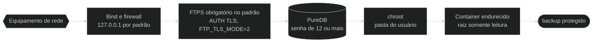
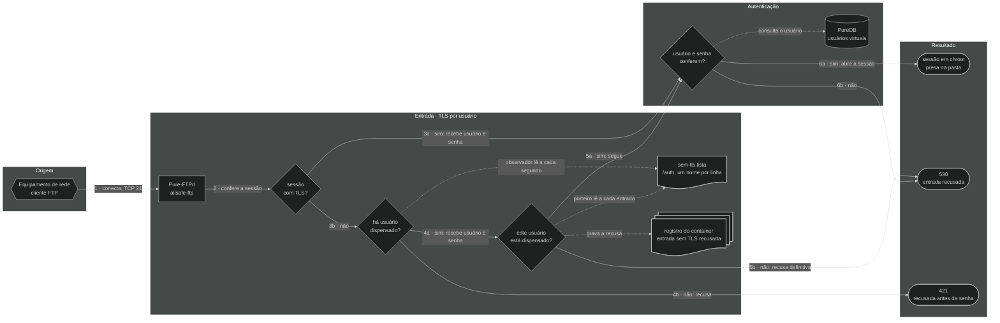
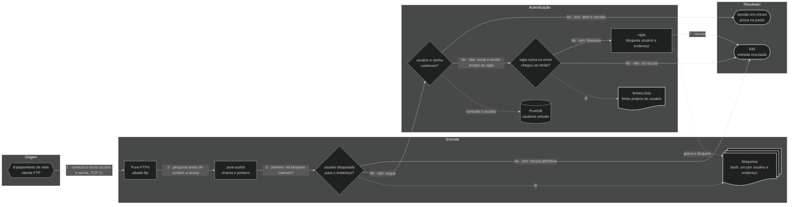

# 🔐 Segurança — allsafe-ftp-stack

↩ [README do projeto](../README.md) · [Índice da documentação](README.md)

## 💡 Em poucas palavras

O backup de um equipamento de rede traz senhas e a configuração inteira da rede, então o caminho até o servidor é protegido em camadas: a porta só escuta no IP escolhido, a conexão tem de ser criptografada (a exceção, para equipamento antigo, é ligada à mão e fica avisada), o endereço que erra a senha de um usuário vezes demais fica bloqueado para ele, cada usuário fica preso na própria pasta e o container roda com o mínimo de permissões. Se uma camada falhar, as outras continuam valendo. O painel web segue a mesma ideia: fica atrás de um nginx, só HTTPS, só rede interna, usuário e senha para cada administrador e sessão curta.

<!-- diagrama: diagramas/seguranca-diagrama.mmd -->


<sub>Nível 1 · Diagrama · [fonte](diagramas/)</sub>

**Sequência:** Equipamento de rede ➜ Bind e firewall ➜ FTPS obrigatório no padrão (`FTP_TLS_MODE=2`) ➜ PureDB (senha de 12 ou mais) ➜ chroot ➜ Container endurecido ➜ backup protegido

---

<details>
<summary>Sumário — clique para expandir</summary>

[Só em rede privada](#rede-privada) · [IP público](#ip-publico) · [Painel por proxy ou túnel](#painel-por-proxy) · [FTP sem TLS](#ftp-sem-tls) · [TLS por usuário](#tls-por-usuario) · [Bloqueio por tentativa](#bloqueio-por-tentativa) · [Bloqueio por endereço](#bloqueio-por-endereco) · [Perfis de usuário](#perfis) · [Boas práticas antes de produção](#boas-praticas) · [Modelo de ameaça](#modelo-de-ameaca) · [Superfície exposta](#superficie-exposta) · [Proteções do painel](#painel) · [Testes executados](#testes-executados) · [Sem senha, senha aleatória, exaustão e acesso direto ao cadastro](#sem-senha-e-exaustao) · [Custo das senhas do FTP](#custo-das-senhas) · [Contato de segurança e robôs de busca](#contato-de-seguranca) · [Conformidade com as RFCs](#conformidade-rfc) · [Endurecimento do `compose.yaml`](#hardening-do-compose-yaml-linha-a-linha) · [Gestão de segredos](#gestao-de-segredos)

</details>

---

<a name="rede-privada"></a>

## 🧱 Só em rede privada, atrás de firewall

> ⚠️ **De fábrica, esta stack não vai para a internet.** FTP é um protocolo antigo, o que passa por ele aqui são configurações inteiras de rede, e o painel web administra os usuários. O uso previsto é **em rede interna**, com IP privado, atrás de firewall. Publicar é opcional e é escolha de quem instala, por dois caminhos independentes, cada um com o seu alerta: aceitar [IP público](#ip-publico) no FTP e no painel, ou publicar [só o painel por proxy ou túnel](#painel-por-proxy), sem expor o FTP.

| Regra | O que fazer |
|---|---|
| IP privado | `FTP_BIND_IP`, `FTP_PASSIVE_IP` e `PAINEL_BIND_IP` só em `10.0.0.0/8`, `172.16.0.0/12`, `192.168.0.0/16` ou `127.0.0.1`. `0.0.0.0` é sempre recusado; IP público, só com a [opção própria](#ip-publico) |
| Firewall do host | Liberar a porta de controle e a faixa passiva **só** para as redes internas que enviam backup, e a porta do painel **só** para as máquinas de quem administra; o resto é descartado |
| Redes do painel | `PAINEL_REDES_PERMITIDAS` reduzida à rede de administração; por padrão, a lista só aceita rede privada |
| Firewall de borda | Nenhum redirecionamento de porta da internet para este host |
| Acesso de fora | Se alguém de fora precisar chegar, é por VPN até a rede interna, não abrindo a porta |

<details>
<summary>Detalhe técnico — firewall com Docker</summary>

O Docker publica as portas por regras próprias de NAT, **antes** das cadeias `INPUT` do host: uma regra comum de `ufw` ou de `INPUT` não bloqueia porta publicada por container. A cadeia certa é a `DOCKER-USER`, e a porta de destino tem de ser conferida pela conexão original, porque ali o destino já foi trocado para a porta do container.

Exemplo com `iptables`, liberando só a rede de gerência `10.10.0.0/24` na interface `eth0` (troque pelos valores reais):

```bash
iptables -I DOCKER-USER -i eth0 -p tcp -m conntrack --ctdir ORIGINAL --ctorigdstport 21 ! -s 10.10.0.0/24 -j DROP
iptables -I DOCKER-USER -i eth0 -p tcp -m conntrack --ctdir ORIGINAL --ctorigdstport 30000:30049 ! -s 10.10.0.0/24 -j DROP
iptables -I DOCKER-USER -i eth0 -p tcp -m conntrack --ctdir ORIGINAL --ctorigdstport 8443 ! -s 10.10.0.0/24 -j DROP
```

**Resultado esperado:** de uma máquina fora de `10.10.0.0/24`, as portas `21/tcp` e `8443/tcp` não respondem; de dentro, o login por FTPS e o painel funcionam.

> O exemplo **não foi aplicado nem testado neste projeto**: o firewall do host é de quem opera o servidor. Teste em janela de manutenção e torne a regra persistente com a ferramenta da sua distribuição.

Além do firewall, o `deploy.sh` e os containers **recusam por código**, por padrão, bind, IP anunciado e rede permitida fora de IP privado: veja [Rede e portas](configuracao.md#rede-e-portas) e [Painel web](configuracao.md#painel).

</details>

---

<a name="ip-publico"></a>

## 🌐 IP público: opcional, por escolha de quem instala, com firewall

> ⚠️ **Alerta: ligar esta opção põe o FTP e o painel na internet.** Servidor exposto é varrido e recebe tentativa de senha o tempo todo, e por esta stack passam configurações inteiras de rede. O padrão, `REDE_PERMITIR_IP_PUBLICO=nao`, recusa qualquer endereço público. Ligar é opcional: a decisão é de quem instala o serviço, e a stack não impede, só avisa. A recomendação é ligar apenas quando não houver como chegar por rede interna ou por VPN, e **só com firewall no servidor**. A escolha e o risco são de quem ligou a opção. Para publicar só o painel, sem o FTP, use o [proxy ou túnel](#painel-por-proxy).

A opção existe para o servidor que só tem endereço público, como uma VPS, e para o equipamento que chega por um endereço fora das faixas privadas, como o do CGNAT (`100.64.0.0/10`).

**Antes de ligar, nesta ordem:**

1. **Firewall no servidor**, na cadeia `DOCKER-USER`, liberando a porta de controle, a faixa passiva e a porta do painel **só** para os endereços dos equipamentos e de quem administra. O exemplo está em [rede privada](#rede-privada): troque a rede de gerência pelos endereços reais.
2. **TLS obrigatório:** `FTP_TLS_MODE` em `2` ou `3`. Com a opção ligada, `0` e `1` são recusados.
3. **Senhas geradas**, nunca escolhidas: as que o `deploy.sh` cria e as que o painel gera.
4. **`PAINEL_REDES_PERMITIDAS` reduzida** às redes de quem administra, uma a uma.
5. No `.env`, `REDE_PERMITIR_IP_PUBLICO=sim` e os endereços; depois, confira e aplique:

```bash
./deploy.sh --check-only
./deploy.sh
```

**Resultado esperado:** o `--check-only` termina com `OK: perfil '<perfil>', endereço público aceito, recursos do servidor e compose validados; nada foi alterado.`, seguido do `ALERTA: REDE_PERMITIR_IP_PUBLICO=sim: a stack aceita endereço público, por opção de quem instalou.` O `deploy.sh` sobe os três containers e fecha com o mesmo `ALERTA`, que também fica no registro de cada container e no painel, só para administrador: no sinal ao lado de **Segurança** no menu, no começo da aba Segurança e no rodapé, além da linha **Endereço público** da mesma aba. A tela de entrada não diz como a instalação foi publicada.

| Com a opção ligada | O que acontece |
|---|---|
| IP público em `FTP_BIND_IP`, `FTP_PASSIVE_IP`, `PAINEL_BIND_IP` e `PAINEL_CERT_CN` | Aceito, se for IPv4 de servidor (primeiro octeto de `1` a `223`) |
| Rede pública em `PAINEL_REDES_PERMITIDAS` | Aceita, com prefixo de `/8` a `/32` |
| `0.0.0.0`, multicast e endereços reservados | Recusados: o endereço é sempre escolhido, nunca "todos" |
| Rede mais larga que `/8`, como `0.0.0.0/0` | Recusada |
| `FTP_TLS_MODE` em `0` ou `1` | Recusado |
| Valor diferente de `nao` e de `sim` | Recusado antes de qualquer outra conferência |

<details>
<summary>Detalhe técnico — onde a opção é conferida</summary>

- A variável chega aos três containers pelo [`compose.yaml`](../compose.yaml) e é lida pelas mesmas funções de [`scripts/rede-privada.sh`](../scripts/rede-privada.sh) no [`deploy.sh`](../deploy.sh) e nos três entrypoints: `conferir_opcao_ip_publico`, `exigir_ip`, `exigir_rede` e `aviso_ip_publico`. O painel confere de novo em [`painel/config.py`](../painel/config.py).
- Valor fora de `nao` e de `sim` para tudo com `FALHA: REDE_PERMITIR_IP_PUBLICO deve ser 'nao' ou 'sim'`: nenhum valor é tratado como `sim` por aproximação.
- Com a opção ligada, o painel aceita ser aberto por qualquer endereço IPv4 digitado no lugar do nome; por nome, continua valendo só `localhost` e o `PAINEL_CERT_CN`.
- O limite de tentativas de senha, a sessão curta e os limites de pedidos do nginx continuam valendo, mas não substituem o firewall: reduzem a velocidade do ataque, não a exposição.
- As recusas e o alerta são conferidos pela [bateria de testes](scripts.md#testar); as mensagens estão em [Solução de problemas](solucao-de-problemas.md#o-container-nao-sobe).

</details>

---

<a name="painel-por-proxy"></a>

## 🔌 Só o painel publicado, por proxy ou túnel

> ⚠️ **Alerta: preencher `PAINEL_PROXY_CONFIAVEL` põe a tela de entrada do painel ao alcance de quem chega ao proxy ou ao túnel.** É opcional e é escolha de quem instala. Quem pode chegar à tela passa a ser decidido lá: restrinja o acesso no proxy ou no túnel. O FTP não passa por ele e continua só nos endereços da stack.

Serve para quem quer abrir o painel de fora sem expor o FTP: um nginx de borda, um túnel (como o da Cloudflare) ou outro proxy HTTPS recebe o acesso e repassa ao painel, que continua em IP privado. `REDE_PERMITIR_IP_PUBLICO` fica em `nao`.

Sem a opção, um proxy na frente já funciona, mas todo acesso chega com o endereço do proxy: o bloqueio por senha errada passa a valer para todos de uma vez, e a sessão, a auditoria e os limites de pedidos deixam de separar uma pessoa da outra. A opção resolve isso: o nginx da stack passa a usar o endereço que o proxy informa em `X-Forwarded-For`, e **só** quando a conexão vem de um endereço da lista.

**Passo a passo:**

1. Suba o proxy ou o túnel apontando para o painel (`https://<PAINEL_BIND_IP>:<PAINEL_PORT>`), repassando o `Host` como o navegador mandou e acrescentando o endereço de quem acessa ao `X-Forwarded-For`.
2. Descubra com que endereço ele chega ao nginx da stack: faça um acesso por ele e leia o primeiro campo da última linha do registro.

```bash
docker compose logs --tail 5 nginx
```

**Resultado esperado:** uma linha como `172.29.1.1 GET /entrar 200`. Proxy ou túnel no **mesmo servidor** chega com o primeiro endereço da `FTP_SUBNET` (`172.29.1.1`, no padrão); em outro servidor, com o IP privado dele.

3. No `.env`, ponha esse endereço em `PAINEL_PROXY_CONFIAVEL` e o nome público em `PAINEL_CERT_CN`; depois, confira e aplique:

```bash
./deploy.sh --check-only
./deploy.sh
```

**Resultado esperado:** os dois comandos fecham com `ALERTA: PAINEL_PROXY_CONFIAVEL=<endereço>: o painel está publicado por proxy ou túnel, por opção de quem instalou.` O mesmo alerta fica no registro dos containers do painel e do nginx e no painel, só para administrador: no sinal ao lado de **Segurança** no menu, no começo da aba Segurança e no rodapé, além da linha **Painel por proxy ou túnel** da mesma aba. Quem abre a tela de entrada pelo endereço público não lê como o painel foi publicado.

O aviso da tela pode ser ocultado por quem instala, com `PAINEL_AVISO_EXPOSICAO=nao` no `.env` e um `./deploy.sh`: o sinal do menu, o aviso do começo da aba Segurança e o texto do rodapé somem. As linhas da aba Segurança e o alerta do `deploy.sh` continuam.

4. Abra o painel pelo nome público, entre e confira na aba Atividade que a coluna **De onde** mostra o seu endereço, e não o do proxy.

| Com a opção preenchida | O que acontece |
|---|---|
| Conexão vinda de um endereço da lista | Vale o **último** endereço do `X-Forwarded-For`, o que o proxy acrescentou; o que o cliente escreveu antes é descartado |
| Conexão vinda de qualquer outro endereço | O cabeçalho é ignorado: vale o endereço da conexão |
| Cabeçalho ausente ou com valor que não é endereço | Vale o endereço da conexão, que é o do proxy |
| `PAINEL_REDES_PERMITIDAS` | Continua conferindo quem **abriu a conexão**: o proxy tem de estar nela, e quem acessa por ele não |
| Limite de tentativas de senha, sessão, auditoria e limites de pedidos | Passam a contar pelo endereço de quem acessa |
| Rede inteira (`10.0.0.0/8`), `0.0.0.0`, mais de 8 endereços, endereço fora de `PAINEL_REDES_PERMITIDAS` | Recusados: o proxy é sempre um endereço escolhido |
| Endereço público na lista | Recusado, a não ser com `REDE_PERMITIR_IP_PUBLICO=sim` |

**Cuidados de quem publica:**

- **Restrinja no proxy ou no túnel** quem chega à tela de entrada: lista de endereços, autenticação na borda ou os dois. O limite de tentativas e a sessão curta do painel reduzem a velocidade do ataque, não a exposição.
- **Confira o certificado do painel no proxy**, em vez de desligar a conferência: o painel usa certificado autoassinado, válido para o `PAINEL_CERT_CN`, e a parte pública dele fica em `DATA_DIR/painel/tls/painel-cert.pem`.
- **Com o proxy no mesmo servidor**, todo acesso feito de dentro do servidor chega pelo mesmo endereço e passa a ser tratado como vindo do proxy. Quem tem terminal no servidor já está dentro do limite de confiança da stack.
- **Reduza `PAINEL_REDES_PERMITIDAS`** à rede do proxy e à de quem administra por dentro.
- **Preencha o contato de segurança** (`SEGURANCA_CONTATO_EMAIL`): veja [Contato de segurança](#contato-de-seguranca).

<details>
<summary>Detalhe técnico — exemplos de borda e onde a opção é conferida</summary>

Exemplo de nginx de borda, no mesmo servidor, com o nome `painel.exemplo.com.br` (troque pelos valores reais):

```nginx
server {
    listen 443 ssl;
    server_name painel.exemplo.com.br;
    ssl_certificate     /etc/ssl/painel.exemplo.com.br/certificado.pem;
    ssl_certificate_key /etc/ssl/painel.exemplo.com.br/chave.pem;

    allow 203.0.113.10;          # quem pode chegar à tela de entrada
    deny  all;

    location / {
        proxy_pass https://127.0.0.1:8443;
        proxy_set_header Host $http_host;                               # o nome e a porta que o navegador usou
        proxy_set_header X-Forwarded-For $proxy_add_x_forwarded_for;    # acrescenta o endereço de quem acessa
        proxy_ssl_trusted_certificate /etc/ssl/painel-cert.pem;         # cópia de DATA_DIR/painel/tls/painel-cert.pem
        proxy_ssl_verify on;
        proxy_ssl_name painel.exemplo.com.br;
        proxy_ssl_server_name on;
    }
}
```

**Resultado esperado:** com `PAINEL_CERT_CN=painel.exemplo.com.br` e `PAINEL_PROXY_CONFIAVEL=172.29.1.1`, o painel abre pelo nome público, a entrada funciona e a auditoria registra o endereço de quem acessou.

> O exemplo foi exercitado neste projeto com um nginx de borda no mesmo servidor, em porta alta e com nome de teste: a entrada, a sessão e o endereço na auditoria foram conferidos, e um `X-Forwarded-For` escrito pelo cliente foi descartado. Com `Host $host`, que tira a porta, a entrada por porta diferente de `443` é recusada com `403`, porque a origem do envio deixa de bater; por isso o exemplo usa `$http_host`.

Túnel: aponte o serviço do túnel para `https://127.0.0.1:8443`, com o nome do servidor de origem igual ao `PAINEL_CERT_CN` e a cópia do `painel-cert.pem` como autoridade aceita, sem desligar a conferência de TLS. No túnel da Cloudflare, isso corresponde a `originServerName` e `caPool` em `originRequest`, e a restrição de quem acessa é feita na política de acesso da própria Cloudflare.

> A opção **não foi testada com um túnel real** neste projeto: o que está provado é o comportamento do nginx da stack e do painel diante de um proxy que repassa `Host` e `X-Forwarded-For`. O proxy da Cloudflare **sem** túnel chega por faixas públicas inteiras e fica fora desta opção, que só aceita endereço escolhido.

Onde a opção é conferida:

- A variável chega aos containers do painel e do nginx pelo [`compose.yaml`](../compose.yaml). A função `exigir_proxies`, de [`scripts/rede-privada.sh`](../scripts/rede-privada.sh), é chamada pelo [`deploy.sh`](../deploy.sh) e pelos dois entrypoints; o painel confere de novo em [`painel/config.py`](../painel/config.py).
- No [`nginx/nginx.conf.modelo`](../nginx/nginx.conf.modelo), a lista vira um bloco `geo`, e o endereço de quem acessa (`$cliente`) é o último do `X-Forwarded-For` só quando a conexão vem da lista. O módulo `realip` fica de fora de propósito: com ele, o `allow` e o `deny` passariam a valer sobre o endereço informado, e não sobre quem abriu a conexão.
- O nginx manda ao painel o endereço da conexão (`X-Real-IP`) e o de quem acessa (`X-Cliente-IP`), sempre regravados por ele. O painel só usa o segundo quando o primeiro está na lista ([`painel/atendimento.py`](../painel/atendimento.py)); os dois escritos pelo cliente não chegam ao painel.
- O endereço informado pode ser IPv4 ou IPv6. Os endereços da lista são IPv4.
- As recusas, o alerta e o endereço forjado são conferidos pela [bateria de testes](scripts.md#testar).

</details>

---

<a name="ftp-sem-tls"></a>

## ⚠️ FTP sem TLS: só para equipamento antigo

> ⚠️ **O padrão desta stack é TLS obrigatório (`FTP_TLS_MODE=2`). Os modos `0` e `1` desligam essa proteção.** Eles existem só porque há equipamento de rede antigo que não fala TLS e, sem isso, não conseguiria enviar o backup. Com eles, usuário, senha e arquivo passam em **texto puro**: quem estiver no caminho da rede lê tudo.

| Modo | O que acontece | O que fica exposto |
|---|---|---|
| `FTP_TLS_MODE=0` | O servidor **não oferece TLS**. Todo cliente entra em texto puro; quem exige TLS não consegue conectar | Usuário, senha e conteúdo de **todos** os backups, de todos os equipamentos |
| `FTP_TLS_MODE=1` | O TLS é **opcional**. Quem pede TLS usa; quem não pede entra em texto puro | Usuário, senha e backup de quem entra sem TLS. Nada obriga os demais a usar TLS: um equipamento mal configurado passa a enviar em texto puro sem ninguém notar |

O backup de um equipamento de rede costuma trazer senhas, comunidades SNMP e chaves. Com a senha do FTP capturada, o invasor também lê e sobrescreve os backups daquele usuário.

**Só use se todas as condições abaixo forem verdadeiras:**

1. O equipamento realmente não fala TLS: confirme no manual ou com o teste de [Solução de problemas](solucao-de-problemas.md#ftp-sem-tls).
2. O tráfego fica em **rede interna isolada** (rede de gerência), sem passar por rede de usuário, Wi-Fi, internet ou enlace de terceiro sem VPN.
3. O **firewall** libera a porta de controle e a faixa passiva **só para os IPs desses equipamentos**: [rede privada](#rede-privada).
4. Cada equipamento antigo tem **usuário e senha só dele**, não usados em nenhum outro lugar. O `chroot` limita o estrago à pasta daquele usuário.
5. Há data para voltar ao `2`: quando o equipamento for trocado ou atualizado, o modo volta e as senhas que passaram em texto puro são trocadas.

Há quatro caminhos para o equipamento que não fala TLS. Prefira de cima para baixo:

| Caminho | Quem entra sem TLS | O que os demais arriscam |
|---|---|---|
| Segunda instância só para os equipamentos antigos, com a principal em `2`: [Configuração](configuracao.md#pastas-e-nomes) | Só os usuários da segunda instância | Nada: a principal recusa a sessão sem TLS antes de a senha ser enviada |
| Dispensa por usuário, pelo painel: [TLS por usuário](#tls-por-usuario) | Só os usuários que um administrador dispensar | Enquanto houver alguém dispensado, um equipamento de usuário não dispensado, configurado sem TLS por engano, manda a senha em texto puro antes de ser recusado; a recusa fica no registro |
| `FTP_TLS_MODE=1` | Qualquer usuário cujo equipamento não peça TLS | Nada obriga ninguém a usar TLS |
| `FTP_TLS_MODE=0` | Todos | Não há TLS para ninguém |

A dispensa por usuário é o caminho mais simples quando são poucos equipamentos antigos: fica tudo em uma instalação só, com um painel só, e não pede alteração no `.env`.

Para ligar o modo `1` ou o `0`, edite `FTP_TLS_MODE` no `.env` e reaplique:

```bash
./deploy.sh
```

**Resultado esperado:** o resumo traz `FTP:    127.0.0.1:21, SEM TLS (texto puro), modo passivo 30000-30049` (ou `TLS explícito opcional (aceita texto puro)` no modo `1`) e termina com o aviso:

```text
AVISO: FTP_TLS_MODE=0: o FTP está SEM criptografia. Senhas e arquivos passam em texto puro e podem ser
       lidos por quem estiver na mesma rede. Use só para equipamento antigo sem suporte a TLS, em rede interna
       isolada, com o firewall liberando só esses equipamentos, e volte para FTP_TLS_MODE=2 assim que puder.
```

A stack não deixa o modo passar despercebido. Enquanto ele estiver ligado, o alerta aparece em:

| Onde | O que aparece |
|---|---|
| Fim do `./deploy.sh` e do `./deploy.sh --check-only` | O `AVISO` de três linhas acima |
| Resumo do `./deploy.sh` | `SEM TLS (texto puro)` ou `TLS explícito opcional (aceita texto puro)` na linha do FTP |
| Registro do container (`docker compose logs ftp`) | A cada subida: `AVISO: FTP_TLS_MODE=0, FTP sem TLS: senhas e arquivos trafegam em texto puro. Só para equipamento sem suporte a TLS, em rede interna isolada.` |
| Painel, telas Visão geral e Segurança | Faixa de alerta no começo da tela e o item `TLS do FTP` marcado com |

O aviso informa, não bloqueia: a decisão é de quem opera o servidor. O painel web **não** é afetado por esta variável e continua só em HTTPS.

<details>
<summary>Detalhe técnico — o que muda no Pure-FTPd</summary>

`FTP_TLS_MODE` é repassada à opção `-Y` do `pure-ftpd`. Com `-Y 0`, o servidor não anuncia `AUTH TLS` e o comando é recusado; com `-Y 1`, aceita as duas formas; com `-Y 2`, recusa a sessão em texto puro com `421-Sorry, cleartext sessions and weak ciphers are not accepted on this server.`; com `-Y 3`, exige também `PROT P` no canal de dados.

O certificado do FTP é gerado em qualquer modo, e as demais camadas continuam valendo: bind em IP privado, usuários virtuais, `chroot`, limites de sessão e container endurecido. O que se perde é o sigilo e a integridade do que trafega.

Um valor fora de `0` a `3` é recusado duas vezes: pelo [`deploy.sh`](../deploy.sh), antes de qualquer alteração, e pelo [`ftp/entrypoint.sh`](../ftp/entrypoint.sh), com `FALHA: FTP_TLS_MODE deve ser 0, 1, 2 ou 3`.

</details>

---

<a name="tls-por-usuario"></a>

## 🔓 TLS por usuário

O servidor exige TLS de todos, menos dos usuários que um administrador dispensar, um a um, no painel. Serve para o servidor em que um ou dois equipamentos antigos não falam TLS e os demais falam. A opção vem ligada (`FTP_TLS_EXCECOES=sim`) e, sem nenhum usuário dispensado, não muda nada: a sessão sem TLS é recusada antes de a senha ser enviada.

> ⚠️ **O usuário dispensado manda senha e arquivo em texto puro**, como nos modos `0` e `1`. Valem para ele as cinco condições de [FTP sem TLS](#ftp-sem-tls): equipamento que não fala TLS, rede interna isolada, firewall liberando só ele, usuário e senha só dele e data para acabar.

1. Usuário novo: no painel, abra Usuários ➜ **Novo usuário** e marque **Equipamento sem suporte a TLS** antes de criar.
2. Usuário que já existe: Usuários ➜ **Dispensar TLS** na linha dele, ou o cartão **TLS** da tela Editar, e confirme. Pelo terminal, o mesmo:

   ```bash
   ./manage-user.sh tls-dispensar <usuario>
   ```

**Resultado esperado:** a coluna **TLS** da aba Usuários mostra `sem TLS` na linha do usuário; em instantes ele entra sem TLS, sem reiniciar o container e sem derrubar quem está conectado; os demais, sem TLS, recebem `530` e continuam entrando com TLS.

Para voltar a exigir o TLS de um usuário: Usuários ➜ **Exigir TLS**, ou `./manage-user.sh tls-exigir <usuario>`, e troque a senha dele, que passou em texto puro. Para tirar a opção do painel: `FTP_TLS_EXCECOES=nao` no `.env` e `./deploy.sh`.

A dispensa só vale com `FTP_TLS_MODE=2` e sem `REDE_PERMITIR_IP_PUBLICO=sim`. Fora disso a instalação sobe normalmente, a opção fica **sem efeito** e ninguém é dispensado: o `./deploy.sh` e o painel dizem o motivo.

| Situação | O que acontece |
|---|---|
| Usuário dispensado, sem TLS | Entra, preso na pasta dele, como qualquer outro |
| Usuário dispensado, com TLS | Entra: a dispensa permite a entrada sem TLS, não proíbe o TLS |
| Nenhum usuário dispensado, sessão sem TLS | `421` na resposta ao nome do usuário: o servidor encerra a sessão antes de a senha ser enviada |
| Usuário não dispensado, sem TLS, com outro usuário dispensado | `530`, com a senha certa ou errada, e a recusa vai para o registro do container |
| Usuário removido e criado de novo com o mesmo nome | Não herda a dispensa: volta a ser obrigado a usar TLS |
| O processo que consulta a lista para de responder | O container do FTP encerra e o Docker o sobe de novo; enquanto isso, ninguém entra |
| Sessão sem TLS já aberta de quem voltou a ser obrigado | Continua até terminar; a entrada seguinte dele sem TLS é recusada |
| `FTP_TLS_EXCECOES=nao`, `FTP_TLS_MODE` diferente de `2` ou `REDE_PERMITIR_IP_PUBLICO=sim` | Ninguém é dispensado; a lista fica guardada e volta a valer quando a opção voltar a ter efeito |

> ⚠️ **Limite:** enquanto houver pelo menos um usuário dispensado, o servidor só sabe quem é o usuário depois de receber o nome, então aceita o começo da conversa sem TLS de qualquer um. Um equipamento de usuário **não dispensado** que esteja configurado sem TLS manda a senha em texto puro antes de receber o `530`. A entrada é recusada e o registro traz o usuário e a origem: troque essa senha e corrija o equipamento. Sem nenhum dispensado, a sessão sem TLS volta a ser recusada antes de a senha ser enviada.

Onde a dispensa aparece:

| Onde | O que aparece |
|---|---|
| Fim do `./deploy.sh` | Com alguém dispensado: `AVISO: TLS por usuário: <n> usuário(s) dispensado(s) na aba Usuários do painel entram SEM TLS, com senha e` e as linhas seguintes. Sem efeito: `TLS por usuário sem efeito: <motivo>. Ninguém é dispensado do TLS.`, também no `./deploy.sh --check-only` |
| Resumo do `./deploy.sh` | `equipamento sem suporte a TLS: o administrador dispensa o usuário dele na aba Usuários do painel`, abaixo da linha do FTP |
| Registro do container (`docker compose logs ftp`) | Na linha `FTP pronto`: `TLS por usuário: nenhum dispensado, sessão sem TLS recusada antes da senha` ou `com exceção por usuário (<n> dispensado(s) do TLS)`, esta com o `AVISO` de texto puro; a cada mudança de lado da lista, `TLS por usuário: a lista dos dispensados mudou`; a cada recusa, `porteiro: entrada sem TLS recusada: usuario=<nome> origem=<ip> (a senha enviada passou em texto puro: troque-a)` |
| Painel, aba Usuários | A coluna **TLS**, com `obrigatório` ou `sem TLS` em cada linha |
| Painel, abas Visão geral e Segurança | Com pelo menos um usuário dispensado, a faixa de alerta no começo da tela, com a quantidade e os nomes; na aba Segurança, o item `TLS do FTP` |
| Painel, aba Atividade | `Usuário dispensado do TLS` e `Usuário volta a exigir TLS`, com o administrador que fez |

<details>
<summary>Fluxograma da entrada com o TLS por usuário, com a sequência escrita — clique para expandir</summary>

<!-- diagrama: diagramas/tls-por-usuario-fluxograma.mmd -->


<sub>Nível 2 · Mapa · [fonte](diagramas/)</sub>

| Nº | De ➜ Para | O que acontece |
|---|---|---|
| 1 | Equipamento de rede ➜ Pure-FTPd | O equipamento conecta na porta `21/tcp`, com ou sem TLS |
| 2 | Pure-FTPd ➜ sessão com TLS? | O servidor confere se a sessão está criptografada |
| 3a | sessão com TLS? ➜ usuário e senha conferem? | Sim: recebe usuário e senha e segue para a conferência, qualquer que seja o usuário |
| 3b | sessão com TLS? ➜ há usuário dispensado? | Não: o que acontece depende de existir algum usuário dispensado |
| 4a | há usuário dispensado? ➜ este usuário está dispensado? | Sim: o servidor recebe usuário e senha sem TLS, e o porteiro (`allsafe-ftp-porteiro`) procura o nome na lista |
| 4b | há usuário dispensado? ➜ 421 | Não: recusa na resposta ao nome, antes de a senha ser enviada |
| 5a | este usuário está dispensado? ➜ usuário e senha conferem? | Sim: segue para a conferência da senha |
| 5b | este usuário está dispensado? ➜ 530 | Não: recusa definitiva, com a senha certa ou errada |
| 6a | usuário e senha conferem? ➜ sessão em chroot | Sim: a sessão abre, presa na pasta do usuário |
| 6b | usuário e senha conferem? ➜ 530 | Não: `530 Login authentication failed` |

**Apoio**

| Quem | Usa | Como |
|---|---|---|
| há usuário dispensado? | `sem-tls.lista` (`DATA_DIR/auth`) | o observador da partida do FTP lê a cada segundo |
| este usuário está dispensado? | `sem-tls.lista` (`DATA_DIR/auth`) | o porteiro lê a cada entrada |
| este usuário está dispensado? | registro do container | grava a recusa, com o usuário e a origem, sem a senha |
| usuário e senha conferem? | PureDB | consulta o usuário |

</details>

<details>
<summary>Detalhe técnico — como a dispensa é aplicada</summary>

- **Sempre no ar:** o [`ftp/entrypoint.sh`](../ftp/entrypoint.sh) sobe o `pure-authd -s /run/pure-authd.sock -r /usr/local/sbin/allsafe-ftp-porteiro` e o `pure-ftpd` com `-l extauth:/run/pure-authd.sock -l puredb:/auth/pureftpd.pdb`, com ou sem a dispensa, porque o mesmo porteiro aplica o [bloqueio por tentativa](#bloqueio-por-tentativa). Com a opção valendo, a marca `/run/allsafe/tls-por-usuario` liga a regra do TLS no porteiro.
- **Dois modos de entrada, conforme a lista:** sem nenhum dispensado, o `pure-ftpd` sobe com `-Y 2` e recusa a sessão sem TLS ele mesmo, antes da senha. Com pelo menos um, sobe com `-Y 1`, que aceita sessão com e sem TLS, e quem decide é o porteiro. Um observador no entrypoint relê a lista a cada segundo; quando ela passa de vazia a preenchida, ou o contrário, só o processo do `pure-ftpd` que escuta a porta é encerrado e outro sobe com o modo novo. O container não reinicia, e cada sessão em andamento é um processo próprio, que continua até terminar.
- **Custos da troca:** a porta fica fechada pelo instante entre um processo e o outro; o processo novo recomeça a contagem de sessões simultâneas (`FTP_MAX_CLIENTS` e `FTP_MAX_CLIENTS_PER_IP`), sem contar as que já estavam abertas; e a sessão sem TLS já aberta de quem voltou a ser obrigado segue até terminar.
- **O porteiro não confere senha:** o [`ftp/porteiro.sh`](../ftp/porteiro.sh) responde `auth_ok:0` ("não é comigo") quando a sessão tem TLS ou quando o nome está na lista, e o `pure-ftpd` segue para o PureDB, que confere a senha como sempre. Nos outros casos responde `auth_ok:-1`, a recusa definitiva. A senha chega a ele em variável de ambiente e não é lida, gravada nem registrada.
- **A lista:** `/auth/sem-tls.lista` (`DATA_DIR/auth` no host), `0600`, do `root`, um nome por linha. Só o `allsafe-ftp-user` grava, com a mesma trava do cadastro de usuários e por troca de nome do arquivo, para o porteiro nunca ler a lista pela metade. O porteiro a lê a cada entrada, e o observador, a cada segundo: a mudança vale em instantes, sem reiniciar o container.
- **Falha fechada:** sem o `pure-authd`, o `pure-ftpd` cairia direto no PureDB e aceitaria todos sem TLS. Por isso o entrypoint vigia os processos: se um sair, escreve `FALHA: o pure-authd saiu: o container encerra para ninguém entrar sem a conferência do porteiro` (ou `o vigia saiu`, `o pure-ftpd saiu`, `o observador da lista do TLS saiu`), encerra com código `1`, e o `restart: unless-stopped` sobe o container de novo, com todos. O healthcheck só responde saudável com o soquete do `pure-authd` aberto.
- **A recusa por TLS não conta como senha errada:** o porteiro deixa uma marca em `/run/allsafe/recusa/`, e o vigia do bloqueio por tentativa ignora a falha que vem logo depois dela. Equipamento configurado sem TLS não bloqueia o próprio usuário.
- **Quando a opção fica sem efeito:** com `FTP_TLS_MODE` diferente de `2` ou com `REDE_PERMITIR_IP_PUBLICO=sim`. A instalação sobe, ninguém é dispensado, e o [`deploy.sh`](../deploy.sh), o registro do container e o painel dizem o motivo. Só o valor fora de `nao` e de `sim` é recusado, pelo `deploy.sh` e pelos containers do FTP e do painel.
- **Quem altera a lista:** só um administrador, pelo painel, com token CSRF e origem conferidos, ou quem tem acesso ao Docker do servidor, pelo `manage-user.sh`. Para o usuário do FTP que entra no painel, a tela responde `404`. Com a opção desligada ou sem efeito, a tela também responde `404`.
- O painel confere a senha do usuário do FTP em TLS, pela rede interna da stack, com ou sem dispensa: ela não muda a [entrada dele no painel](painel.md#usuario-ftp).
- As recusas, a troca do modo de entrada com sessões abertas, a queda do `pure-authd` e os casos sem efeito são conferidos pela [bateria de testes](scripts.md#testar).

</details>

---

<a name="bloqueio-por-tentativa"></a>

## 🚫 Bloqueio por tentativa no FTP

Quando um mesmo endereço erra a senha de um usuário vezes demais, o FTP passa a recusar aquele usuário para aquele endereço, mesmo com a senha certa, até o prazo acabar. A stack sai da instalação com o bloqueio ligado: 5 senhas erradas, 15 minutos. O limite de cada usuário é ajustado pelo administrador no painel, tanto para a conta de um equipamento quanto para a de uma pessoa.

| O que ajustar | Onde | Valor | Padrão |
|---|---|---|---|
| Senhas erradas até o bloqueio, para todos | `FTP_BLOQUEIO_TENTATIVAS`, no `.env` | `0` a `100`; `0` desliga | `5` |
| Minutos de bloqueio, para todos | `FTP_BLOQUEIO_MINUTOS`, no `.env` | `1` a `1440` | `15` |
| Senhas erradas até o bloqueio, de um usuário | Painel, Usuários ➜ **Editar**, cartão **Limites** | `0` a `100`; `0`: o usuário nunca é bloqueado | Em branco: o da stack |
| Minutos de bloqueio, de um usuário | Painel, Usuários ➜ **Editar**, cartão **Limites** | `1` a `1440` | Em branco: o da stack |

1. Para mudar o padrão de todos, edite as duas variáveis no `.env` e reaplique:

   ```bash
   ./deploy.sh
   ```

2. Para um usuário, abra Usuários ➜ **Editar**, preencha **Senhas erradas no FTP até o bloqueio** e **Minutos de bloqueio** e grave. Pelo terminal, o mesmo:

   ```bash
   ./manage-user.sh limites <usuario> tentativas=3 minutos=30
   ```

3. Para ver quem está bloqueado, abra a aba Usuários, que marca a linha com **bloqueado**, ou rode:

   ```bash
   ./manage-user.sh bloqueios
   ```

4. Para desbloquear antes do prazo, corrija a senha no equipamento e clique em **Desbloquear**, no cartão **Bloqueios** da tela **Editar**. Pelo terminal, o mesmo, para todos os endereços do usuário ou para um só:

   ```bash
   ./manage-user.sh desbloquear <usuario>
   ./manage-user.sh desbloquear <usuario> <origem>
   ```

**Resultado esperado:** o `manage-user.sh bloqueios` responde uma linha por bloqueio, `usuario=<nome> origem=<ip> senhas_erradas=<n> desde=<data hora> ate=<data hora>`, ou `Nenhum bloqueio em vigor.`; o `desbloquear` responde `Usuario <nome> desbloqueado (<n> endereco(s)): vale na proxima entrada no FTP.`; a alteração do limite e o desbloqueio valem na entrada seguinte, sem reiniciar nada.

| Situação | O que acontece |
|---|---|
| Senha errada, abaixo do limite | `530`, e a tentativa é somada às outras do mesmo endereço para aquele usuário |
| Senha errada que completa o limite | `530`, e o usuário fica bloqueado para aquele endereço: a senha certa também recebe `530` até o fim do prazo |
| Entrada certa antes do limite | Entra, e a contagem daquele endereço para aquele usuário volta a zero |
| O mesmo usuário, de outro endereço | Entra: o bloqueio vale só para o endereço que errou |
| Outro usuário, do mesmo endereço | Entra: o bloqueio vale só para o usuário que teve a senha errada |
| O usuário bloqueado no FTP entra no painel | Entra: o painel tem o limite de tentativas dele, por endereço |
| Fim do prazo | O bloqueio sai sozinho, e a contagem recomeça do zero |
| Senha do usuário trocada | Os bloqueios dele saem |
| Limite próprio do usuário alterado | Os bloqueios dele saem; gravar os mesmos valores não muda nada |
| Usuário removido e criado de novo com o mesmo nome | Não herda o bloqueio nem o limite |
| O container do FTP reinicia ou é recriado | O bloqueio continua valendo até o prazo; a contagem que ainda não tinha chegado ao limite recomeça |
| Entrada fora do [horário do usuário](painel.md#limites) | Conta como senha errada: o servidor responde do mesmo jeito nos dois casos |
| Sessão sem TLS recusada, nome que não está no cadastro, tentativa feita durante o bloqueio | Não contam aqui. O nome que não está no cadastro conta no [bloqueio por endereço](#bloqueio-por-endereco) |
| Senha do usuário do FTP errada na tela do painel | Não conta aqui: conta no limite de tentativas do painel |

> ⚠️ **Mesmo endereço, mesmo usuário:** equipamentos que usam o mesmo usuário e chegam ao servidor pelo mesmo endereço, atrás de um roteador que troca o endereço de origem, são bloqueados juntos. Dê a cada equipamento o usuário dele: o erro de um não segura o outro.

> ⚠️ **Limite:** o bloqueio conta as senhas erradas de um endereço para um usuário. Quem tenta poucas senhas em muitos usuários, abaixo do limite de cada um, não é bloqueado por esta regra: quem o segura é o [bloqueio por endereço](#bloqueio-por-endereco), que soma os erros do endereço com qualquer nome. Valem também a espera de 3 a 6 segundos de cada recusa, o limite de sessões por endereço e o firewall do host, que deve liberar a porta `21/tcp` só para as origens de backup. O bloqueio freia a adivinhação; quem autentica continua sendo a senha.

Enquanto houver bloqueio, ele aparece em:

| Onde | O que aparece |
|---|---|
| Registro do container (`docker compose logs ftp`) | A cada subida, `vigia: pronto:` com o limite da stack; a cada senha errada, `vigia: entrada recusada: usuario=<nome> origem=<ip> senhas_erradas=<n> de <limite>`; no bloqueio, `vigia: entrada bloqueada: usuario=<nome> origem=<ip> senhas_erradas=<n> minutos=<m>`; a cada tentativa durante o bloqueio, `vigia: entrada recusada pelo bloqueio`; a cada arquivo enviado, baixado, renomeado ou apagado pelo FTP, `vigia: envio:`, `vigia: download:`, `vigia: renomeado:` e `vigia: apagado:`, com o usuário, o endereço e o arquivo |
| Painel, aba Usuários | A marca **bloqueado** na linha do usuário, com os endereços ao passar o mouse; a marca **limites** mostra o limite próprio |
| Painel, tela Editar | O cartão **Bloqueios**, com a origem, as senhas erradas, o início e o fim de cada bloqueio, e o botão **Desbloquear** |
| Painel, aba Segurança | O item `Bloqueio por tentativa no FTP`, com o limite da stack e os usuários bloqueados agora |
| Painel, aba Atividade | `Bloqueio do usuário no FTP removido` e `Limites do usuário alterados`, com o administrador que fez |

<details>
<summary>Fluxograma da entrada com o bloqueio por tentativa, com a sequência escrita — clique para expandir</summary>

<!-- diagrama: diagramas/bloqueio-por-tentativa-fluxograma.mmd -->


<sub>Nível 2 · Mapa · [fonte](diagramas/)</sub>

| Nº | De ➜ Para | O que acontece |
|---|---|---|
| 1 | Equipamento de rede ➜ Pure-FTPd | O equipamento conecta na porta `21/tcp` e envia usuário e senha |
| 2 | Pure-FTPd ➜ pure-authd | Antes de conferir a senha, o servidor pergunta ao `pure-authd` se a entrada pode seguir |
| 3 | pure-authd ➜ usuário bloqueado para o endereço? | O `pure-authd` chama o porteiro (`allsafe-ftp-porteiro`), que procura um bloqueio daquele usuário para aquele endereço, ainda dentro do prazo |
| 4a | usuário bloqueado para o endereço? ➜ 530 | Sim: recusa definitiva, com a senha certa ou errada |
| 4b | usuário bloqueado para o endereço? ➜ usuário e senha conferem? | Não: segue para a conferência da senha |
| 5a | usuário e senha conferem? ➜ sessão em chroot | Sim: a sessão abre, presa na pasta do usuário, e a contagem daquele endereço volta a zero |
| 5b | usuário e senha conferem? ➜ vigia soma os erros: chegou ao limite? | Não: o servidor registra a senha errada, e o vigia (`allsafe-ftp-vigia`) recebe o aviso, com o usuário e o endereço, soma as senhas erradas daquele endereço para aquele usuário, dentro do prazo, e compara com o limite |
| 6a | vigia soma os erros: chegou ao limite? ➜ vigia | Sim: o vigia grava o bloqueio do usuário para aquele endereço, que vale a partir da tentativa seguinte |
| 6b | vigia soma os erros: chegou ao limite? ➜ 530 | Não: a entrada é recusada com `530 Login authentication failed`, e a contagem fica guardada |
| 7 | vigia ➜ 530 | A entrada que atingiu o limite também é recusada |

**Apoio**

| Quem | Usa | Como |
|---|---|---|
| usuário bloqueado para o endereço? | bloqueios (`DATA_DIR/auth/bloqueios`) | lê a cada entrada |
| usuário e senha conferem? | PureDB | consulta o usuário |
| vigia soma os erros: chegou ao limite? | `limites.lista` (`DATA_DIR/auth`) | lê o limite próprio do usuário; sem ele, vale o da stack |
| vigia | bloqueios (`DATA_DIR/auth/bloqueios`) | grava o bloqueio, com o prazo |

</details>

<details>
<summary>Detalhe técnico — como o bloqueio é aplicado</summary>

- **Dois papéis:** o vigia conta e grava; o porteiro lê e recusa. O [`ftp/vigia.pl`](../ftp/vigia.pl), instalado como `/usr/local/sbin/allsafe-ftp-vigia`, escuta em `/dev/log` o que o `pure-ftpd` registra, porque o servidor só avisa da senha errada por ali. O [`ftp/porteiro.sh`](../ftp/porteiro.sh) é chamado pelo `pure-authd` a cada entrada, antes da conferência da senha. Nenhum dos dois recebe a senha para conferir: o aviso traz só o nome e o endereço, e o porteiro não lê a variável em que ela chega.
- **O bloqueio é um arquivo:** `/auth/bloqueios/<usuario>@<endereco>` (`DATA_DIR/auth/bloqueios` no host), `0600`, do `root`, em pasta `0700`, com uma linha: até quando vale, desde quando e quantas senhas erradas, em segundos desde 1970. É a única memória do bloqueio: por isso ele atravessa o reinício, e apagar o arquivo desbloqueia na entrada seguinte. O vigia grava por troca de nome do arquivo, para o porteiro nunca ler pela metade.
- **Arquivo inválido não bloqueia:** vale só o arquivo comum cuja primeira linha começa por um número de até 12 dígitos maior que a hora atual. Vencido, vazio, com texto ou link simbólico, não bloqueia, e o vigia o apaga na limpeza de minuto em minuto.
- **Janela de contagem:** as senhas erradas se somam enquanto a mais antiga tiver menos que os minutos de bloqueio do usuário. A contagem fica na memória do vigia, até 10.000 pares de usuário e endereço; os bloqueios gravados vão até 4.096. Acima desses tetos o vigia registra `AVISO` e segue.
- **Limite próprio:** `tentativas` e `minutos` ficam na linha do usuário em `/auth/limites.lista` (`0600`), gravados pelo `allsafe-ftp-user limites`, o mesmo comando do painel e do [`manage-user.sh`](../manage-user.sh). O vigia relê o cadastro e a lista quando o arquivo muda.
- **O que não conta:** a tentativa vinda da rede interna da stack, que é a conferência de senha feita pelo painel e tem o limite de tentativas dele; a recusa do porteiro por falta de TLS, que ele marca em `/run/allsafe/recusa/`; a tentativa feita durante o bloqueio; o nome que não está no cadastro e o nome fora da regra, que não viram arquivo nem contagem.
- **Rede interna:** são as redes ligadas direto ao container, lidas de `/proc/net/route` na subida, menos o endereço de saída, por onde chegam os clientes do próprio servidor, e mais `127.0.0.0/8`.
- **Falha fechada:** o entrypoint vigia o `pure-ftpd`, o `pure-authd` e o vigia. Se um sair, escreve `FALHA: o <processo> saiu: o container encerra para ninguém entrar sem a conferência do porteiro`, encerra com código `1`, e o `restart: unless-stopped` sobe o container de novo. O healthcheck só responde saudável com o soquete do `pure-authd` e o `/dev/log` abertos.
- **Quem desbloqueia e quem altera o limite:** só um administrador, pelo painel (`POST /usuarios/desbloquear` e `POST /usuarios/limites`), com token CSRF e origem conferidos, ou quem tem acesso ao Docker do servidor, pelo `manage-user.sh`. Para o usuário do FTP que entra no painel, as duas telas respondem `404`. O desbloqueio fica na auditoria como `bloqueio_removido`, com o administrador, o usuário e a quantidade de endereços.
- **Sem pacote novo:** o vigia usa só o `perl-base`, que já vem na imagem base, e o container continua com `read_only` e `cap_drop: ALL`.
- O bloqueio, o desbloqueio, o vencimento, o reinício e as tentativas de burlar são conferidos pela [bateria de testes](scripts.md#testar), em [`tests/etapas/24-bloqueio.sh`](../tests/etapas/24-bloqueio.sh).

</details>

---

<a name="bloqueio-por-endereco"></a>

## ⛔ Bloqueio por endereço

O endereço que erra usuário e senha vezes demais deixa de entrar no FTP e no painel, com qualquer conta e mesmo com a senha certa, até o prazo acabar ou um administrador liberar. A stack sai da instalação com o bloqueio ligado: o endereço que passa de 5 erros em 24 horas fica 120 dias bloqueado. Os erros se somam com qualquer nome de usuário, cadastrado ou não, no FTP com TLS ou sem, em modo passivo ou ativo, e na tela de entrada do painel.

| O que ajustar | Onde | Valor | Padrão |
|---|---|---|---|
| Erros de usuário e senha que um endereço pode ter | `BLOQUEIO_ENDERECO_ERROS`, no `.env` | `0` a `100`; `0` desliga | `5` |
| Horas em que os erros do endereço se somam | `BLOQUEIO_ENDERECO_HORAS`, no `.env` | `1` a `720` | `24` |
| Dias de bloqueio | `BLOQUEIO_ENDERECO_DIAS`, no `.env` | `1` a `3650` | `120` |
| Prazo de um endereço já bloqueado | Painel, Bloqueios ➜ **Mudar prazo** | `1` a `3650` dias, contados de agora | O da stack |

1. Para mudar a regra de todos, edite as três variáveis no `.env` e reaplique:

   ```bash
   ./deploy.sh
   ```

2. Para acompanhar, abra a aba **Bloqueios** do painel: cada endereço bloqueado aparece com quem bloqueou (o FTP, o painel ou o administrador), quantos erros, desde quando e até quando. Pelo terminal, o mesmo:

   ```bash
   ./manage-user.sh enderecos
   ```

3. Para liberar um endereço antes do prazo, corrija a senha no equipamento e clique em **Desbloquear**, na linha dele. Pelo terminal:

   ```bash
   ./manage-user.sh endereco-liberar <endereco>
   ```

4. Para bloquear por mais tempo, ou encurtar o bloqueio, clique em **Mudar prazo** e informe os dias, contados de agora. Pelo terminal:

   ```bash
   ./manage-user.sh endereco-bloquear <endereco> <dias>
   ```

5. Para bloquear um endereço que ainda não errou, use o mesmo comando, no servidor. Sem os dias, vale o prazo da stack:

   ```bash
   ./manage-user.sh endereco-bloquear <endereco>
   ```

**Resultado esperado:** o `enderecos` responde uma linha por endereço, `origem=<ip> por=<ftp|painel|manual> erros=<n> desde=<data hora> ate=<data hora>`, ou `Nenhum endereco bloqueado.`; o `endereco-bloquear` responde `Endereco <ip> bloqueado: <n> dia(s) a partir de agora, no FTP e no painel.`, ou `Prazo do endereco <ip> alterado: <n> dia(s) a partir de agora, no FTP e no painel.` quando ele já estava bloqueado; o `endereco-liberar` responde `Endereco <ip> liberado: vale no proximo pedido.` Tudo vale no pedido seguinte, sem reiniciar nada; na aba Bloqueios, o que foi feito no terminal aparece em até 5 segundos.

| Situação | O que acontece |
|---|---|
| Erro de usuário e senha, até o limite | `530` no FTP, ou a recusa da tela de entrada no painel, e o erro é somado aos outros do mesmo endereço, com qualquer nome de usuário |
| Erro que passa do limite: o sexto, no padrão | O endereço fica bloqueado por 120 dias, no FTP e no painel |
| O endereço bloqueado tenta o FTP | `530` com qualquer conta, com a senha certa ou errada, com TLS ou sem, em modo passivo ou ativo |
| O endereço bloqueado abre o painel | `403` em todo pedido, com o texto `endereço bloqueado por excesso de erros de usuário e senha`, mesmo com sessão aberta |
| Entrada certa antes do limite | Entra, e a contagem do endereço continua: quem tem uma conta não ganha tentativas com ela |
| Erros no FTP e erros no painel, do mesmo endereço | Cada serviço conta os dele; o bloqueio feito por um vale no outro |
| Outro endereço | Entra: o bloqueio vale só para o endereço que errou |
| Fim do prazo | O bloqueio sai sozinho |
| O administrador desbloqueia | O endereço volta a entrar no pedido seguinte, e a contagem dele recomeça |
| O administrador muda o prazo | O prazo novo substitui o anterior; quem bloqueou e com quantos erros continuam registrados |
| O container do FTP ou do painel reinicia | O bloqueio continua valendo; a contagem que ainda não tinha passado do limite recomeça |
| Sessão sem TLS recusada antes da senha, senha que o FTP não pôde conferir, tentativa feita durante um bloqueio | Não contam |
| Entrada no painel, com o padrão de 5 erros | O [limite de tentativas do painel](painel.md#protecoes) chega antes: na quinta falha, o endereço espera 15 minutos. Ele só é bloqueado por 120 dias se voltar a errar depois da espera, dentro das 24 horas |

> ⚠️ **Nunca são bloqueados sozinhos:** o próprio servidor, a rede interna da stack, o endereço de saída do container, por onde chegam os clientes do próprio servidor, e os proxies de `PAINEL_PROXY_CONFIAVEL`, atrás dos quais estão todos os visitantes. Para eles valem o [bloqueio por tentativa](#bloqueio-por-tentativa) do FTP e o limite de tentativas do painel. O endereço IPv6 também fica só com esses dois.

> ⚠️ **Vários equipamentos atrás do mesmo endereço:** equipamentos que saem por um roteador que troca o endereço de origem chegam ao servidor com um endereço só e são bloqueados juntos. Um deles com a senha errada, tentando de hora em hora, bloqueia todos por 120 dias. Nesse cenário, aumente `BLOQUEIO_ENDERECO_ERROS` ou diminua `BLOQUEIO_ENDERECO_HORAS`, e acompanhe a aba Bloqueios.

> ⚠️ **Administrador com o próprio endereço bloqueado:** o painel responde `403` também para ele. A saída é outro administrador, de outro endereço, ou o terminal do servidor: `./manage-user.sh endereco-liberar <endereco>`.

> ⚠️ **Limite:** o bloqueio vale para o endereço que o servidor enxerga. Onde o Docker não preserva a origem da conexão, todo cliente do FTP chega com o endereço de saída do container, que nunca é bloqueado: confira no registro (`docker compose logs ftp`) se o `origem=` das entradas é o endereço real de cada equipamento. Quem troca de endereço a cada tentativa também escapa da contagem: o firewall do host continua sendo a primeira barreira, liberando a porta `21/tcp` só para as origens de backup.

Enquanto houver bloqueio, ele aparece em:

| Onde | O que aparece |
|---|---|
| Painel, aba Bloqueios | A regra em vigor, o total e uma linha por endereço, com **Mudar prazo** e **Desbloquear**; com mais de dez endereços, a busca por trecho do endereço |
| Painel, aba Segurança | O item `Bloqueio por endereço`, com a regra e quantos endereços estão bloqueados agora |
| Painel, aba Atividade | `Endereço bloqueado por erros de usuário e senha`, `Prazo do bloqueio de endereço alterado` e `Endereço desbloqueado`, com o administrador que fez, e `Pedido de endereço bloqueado`, a cada pedido recusado |
| Registro do container (`docker compose logs ftp`) | A cada subida, `vigia: pronto: endereço com mais de 5 erros de usuário e senha em 24 h fica bloqueado por 120 dias, no FTP e no painel`; no bloqueio, `vigia: endereço bloqueado: origem=<ip> erros=<n> dias=<d>`; a cada tentativa durante o bloqueio, `vigia: entrada recusada pelo bloqueio do endereço: origem=<ip>` |
| Terminal do servidor | `./manage-user.sh enderecos` |

<details>
<summary>Fluxograma da entrada com o bloqueio por endereço, com a sequência escrita — clique para expandir</summary>

<!-- diagrama: diagramas/bloqueio-por-endereco-fluxograma.mmd -->
```mermaid
%%{init: {"theme": "dark"}}%%
flowchart LR
    subgraph ORIGEM["Origem"]
        origem@{ shape: hex, label: "Endereço de origem<br>equipamento ou navegador" }
    end
    subgraph ENTRADA["Entrada"]
        servico@{ shape: rect, label: "FTP ou painel<br>allsafe-ftp, allsafe-ftp-painel" }
        preso@{ shape: diam, label: "endereço<br>bloqueado?" }
        enderecos@{ shape: docs, label: "enderecos<br>/auth, um arquivo por endereço" }
    end
    subgraph AUTH["Autenticação"]
        login@{ shape: diam, label: "usuário e senha<br>conferem?" }
        passou@{ shape: diam, label: "soma os erros do endereço<br>passou do limite?" }
        bloqueia@{ shape: rect, label: "vigia ou painel<br>bloqueia o endereço" }
    end
    subgraph GESTAO["Gestão"]
        admin@{ shape: person, label: "Usuário<br>administrador" }
        aba@{ shape: rect, label: "aba Bloqueios<br>ou manage-user.sh" }
    end
    subgraph RESULTADO["Resultado"]
        entra@{ shape: stadium, label: "entra<br>sessão aberta" }
        recusa@{ shape: stadium, label: "recusado<br>530 no FTP, 403 no painel" }
    end

    origem -- "1 · envia usuário e senha" --> servico
    servico -- "2 · antes de conferir a senha" --> preso
    preso -- "3a · sim: recusa com qualquer conta" --> recusa
    preso -- "3b · não: segue" --> login
    login -- "4a · sim: entra" --> entra
    login -- "4b · não: soma um erro do endereço" --> passou
    passou -- "5a · sim: bloqueia" --> bloqueia
    passou -- "5b · não: só recusa" --> recusa
    bloqueia -- "6 · recusa" --> recusa
    admin -- "7 · acompanha, libera ou muda o prazo" --> aba
    preso -. "lê" .-> enderecos
    bloqueia -. "grava o bloqueio" .-> enderecos
    aba -. "lê, apaga ou regrava" .-> enderecos
```

<sub>Nível 2 · Mapa · [fonte](diagramas/)</sub>

| Nº | De ➜ Para | O que acontece |
|---|---|---|
| 1 | Endereço de origem ➜ FTP ou painel | O equipamento envia usuário e senha ao FTP, na porta `21/tcp`, ou o navegador envia à tela de entrada do painel |
| 2 | FTP ou painel ➜ endereço bloqueado? | Antes de conferir a senha, o porteiro do FTP e o atendimento do painel procuram um bloqueio daquele endereço, ainda dentro do prazo |
| 3a | endereço bloqueado? ➜ recusado | Sim: `530` no FTP e `403` no painel, com qualquer conta e com a senha certa ou errada |
| 3b | endereço bloqueado? ➜ usuário e senha conferem? | Não: segue para a conferência da senha |
| 4a | usuário e senha conferem? ➜ entra | Sim: a sessão abre. A contagem do endereço não volta a zero |
| 4b | usuário e senha conferem? ➜ soma os erros do endereço: passou do limite? | Não: o vigia, no FTP, ou o painel soma um erro àquele endereço, com qualquer nome de usuário, dentro das horas configuradas |
| 5a | soma os erros do endereço: passou do limite? ➜ vigia ou painel | Sim: o serviço que contou grava o bloqueio do endereço, com o prazo em dias |
| 5b | soma os erros do endereço: passou do limite? ➜ recusado | Não: a entrada é recusada e a contagem fica guardada |
| 6 | vigia ou painel ➜ recusado | A entrada que passou do limite também é recusada |
| 7 | Usuário ➜ aba Bloqueios ou manage-user.sh | O administrador acompanha a lista, libera um endereço ou muda o prazo dele |

**Apoio**

| Quem | Usa | Como |
|---|---|---|
| endereço bloqueado? | enderecos (`DATA_DIR/auth/enderecos`) | lê a cada entrada no FTP e a cada pedido ao painel |
| vigia ou painel | enderecos (`DATA_DIR/auth/enderecos`) | grava o bloqueio, com o prazo |
| aba Bloqueios ou manage-user.sh | enderecos (`DATA_DIR/auth/enderecos`) | lê a lista, apaga o arquivo do endereço liberado e regrava o prazo |

</details>

<details>
<summary>Detalhe técnico — como o bloqueio por endereço é aplicado</summary>

- **O bloqueio é um arquivo:** `/auth/enderecos/<endereco>` (`DATA_DIR/auth/enderecos` no host), `0600`, do `root`, em pasta `0700`, com uma linha: até quando vale, desde quando, quantos erros e quem bloqueou (`ftp`, `painel` ou `manual`). É a única memória do bloqueio: por isso ele atravessa o reinício e vale nos dois serviços, e apagar o arquivo libera o endereço no pedido seguinte. A gravação é por troca de nome do arquivo, para ninguém ler pela metade.
- **Quem conta:** no FTP, o [`ftp/vigia.pl`](../ftp/vigia.pl), a partir do que o `pure-ftpd` registra a cada falha de usuário e senha; no painel, o [`painel/enderecos.py`](../painel/enderecos.py), a cada entrada recusada depois de a senha ser conferida e a cada confirmação por senha recusada. Cada um guarda a contagem na própria memória, por endereço, só dos erros mais novos que as horas configuradas: até 10.000 endereços no vigia e 5.000 no painel.
- **Quem aplica:** no FTP, o [`ftp/porteiro.sh`](../ftp/porteiro.sh), chamado pelo `pure-authd` antes da conferência da senha, e é a primeira das três regras dele; no painel, o atendimento ([`painel/atendimento.py`](../painel/atendimento.py)), antes de qualquer rota, inclusive a de saúde.
- **Passa do limite:** bloqueia o erro seguinte ao limite. Com `5`, cinco erros não bloqueiam e o sexto bloqueia.
- **Arquivo inválido não bloqueia:** vale só o arquivo comum, com nome de endereço IPv4 escrito de um jeito só, cuja primeira linha começa por um número de até 12 dígitos maior que a hora atual. Vencido, vazio, com texto ou link simbólico, não bloqueia; o vigia apaga os vencidos de minuto em minuto. `127.0.0.0/8` nunca é lido como bloqueado.
- **Teto:** 10.000 endereços bloqueados. Acima disso, o vigia registra `AVISO` e o comando responde `Teto de 10000 enderecos bloqueados: libere algum antes`.
- **O que nunca é bloqueado sozinho, no FTP:** o endereço que não é IPv4, a rede interna da stack, que é a conferência de senha feita pelo painel, e o endereço de saída do container. **No painel:** o que não é IPv4, o loopback, os proxies de `PAINEL_PROXY_CONFIAVEL` e as redes ligadas direto ao container, lidas de `/proc/net/route`.
- **Bloqueio pelo terminal:** o `endereco-bloquear` aceita qualquer IPv4 fora de `127.0.0.0/8` e de `0.0.0.0/8`, inclusive os que nunca são bloqueados sozinhos: é decisão de quem tem o terminal do servidor.
- **Quem libera e quem muda o prazo:** só um administrador, pelo painel (`POST /bloqueios/liberar` e `POST /bloqueios/prazo`), com token CSRF e origem conferidos, ou quem tem acesso ao Docker do servidor, pelo `manage-user.sh`. Para o usuário do FTP que entra no painel, as telas dos bloqueios respondem `404`. Ficam na auditoria `endereco_bloqueado`, `endereco_prazo`, `endereco_desbloqueado` e `recusa_endereco`.
- **Desligado:** com `BLOQUEIO_ENDERECO_ERROS=0`, nada é bloqueado sozinho; o bloqueio feito pelo terminal continua valendo nos dois serviços.
- O bloqueio no FTP com e sem TLS, em modo passivo e ativo, no painel, de um serviço para o outro, a aba, o terminal, o que nunca é bloqueado e as recusas são conferidos pela [bateria de testes](scripts.md#testar), em [`tests/etapas/30-bloqueio-por-endereco.sh`](../tests/etapas/30-bloqueio-por-endereco.sh).

</details>

---
<a name="perfis"></a>

## 🧑‍💼 Perfis de usuário: o mínimo que cada conta precisa

Cada usuário do FTP tem um perfil, escolhido pelo administrador. Dê a cada conta o menor que resolve: o equipamento que só envia backup não precisa apagar nem baixar, e quem só consulta não precisa gravar.

| Perfil | Para quem | O que a conta não consegue |
|---|---|---|
| Completo | Quem administra a própria pasta | Sair da pasta dele |
| Envio | Equipamento que envia backup e confere o que enviou | Apagar, renomear e gravar por cima do que já chegou |
| Só envio | Equipamento que só envia backup | Listar, baixar, apagar, renomear e gravar por cima: ele não vê a pasta dos backups |
| Leitura | Quem só consulta e baixa | Gravar, criar pasta, renomear e apagar |

**O ganho:** a senha de um equipamento vazada não serve para apagar o histórico de backup (Envio), nem para ler a configuração dos equipamentos que está nos backups (Só envio), nem para gravar arquivo na pasta (Leitura). Como escolher e trocar: [Painel web](painel.md#perfis).

> ⚠️ **Limite do perfil Envio:** entre o fim do envio e a entrega do arquivo ao servidor passa um instante, de milissegundos, em que o arquivo ainda é do usuário. A pasta que o próprio Envio criou continua dele enquanto está vazia. O perfil protege o que já foi recebido; não substitui a [cópia de segurança](backup.md).

> ⚠️ **Limite do perfil Só envio:** quem tem a senha da conta ainda envia arquivo e ocupa espaço no disco. Entre o fim do envio e a entrega passa um instante em que o arquivo está na área de entrada da conta, onde ela o alcança. O envio interrompido é entregue como chegou.

<details>
<summary>Detalhe técnico — o que impõe o perfil</summary>

- **O sistema de arquivos, e não uma lista de comandos:** o perfil é o uid e o gid com que o `pure-ftpd` atende a sessão, depois do `chroot`: `ftpdata` (Completo), `ftpenvio`, do mesmo grupo (Envio), `ftpsoenvio`, de grupo próprio (Só envio), e `ftpleitura`, de outro grupo (Leitura). `DELE`, `RNFR`, `RNTO`, `STOR`, `APPE`, `MKD` e `RMD` caem na mesma conferência do kernel; não há comando esquecido.
- **Modo da pasta por quem a alcança:** `0750` só com Completo; com um Envio, o grupo grava e a pasta leva o bit de permanência (`1770`), de modo que cada um só troca o nome e apaga o que é dele; com um Leitura, os outros leem (`0755` ou `1775`). Os arquivos nascem `0644`: o grupo não grava neles.
- **Entrega:** o vigia do FTP passa ao `ftpdata` cada arquivo recebido em pasta com Envio ou Leitura. A pasta é aberta nível por nível a partir de `/data`, sem seguir link simbólico, e o dono é trocado no que foi aberto, não no nome; só entra arquivo comum, com um nome só e ainda do `ftpenvio`. Depois da entrega, o arquivo é do `ftpdata`, e o bit de permanência impede o Envio de apagá-lo ou trocá-lo de nome.
- **Área de entrada do Só envio:** o `chroot` da sessão é `/data/.entrada/<usuário>` (`0700` do `ftpsoenvio`), e não a pasta dos backups; `/data/.entrada` é `0700` do `root`. A sessão não tem nome por onde chegar à pasta de destino: `CWD`, `RETR`, `SIZE`, `LIST` e `MDTM` nela não têm o que responder. A cada envio, o vigia abre a origem e o destino nível por nível a partir de `/data`, sem seguir link simbólico, liga o arquivo no destino com `link()`, que não substitui o que existe, confere pelo número do arquivo que o que chegou ao destino é o que foi aberto, passa-o ao `ftpdata` e só então o tira da área. Só entra arquivo comum, com um nome só e ainda do `ftpsoenvio`. O painel não mostra a área na aba Arquivos, não a abre pelo endereço e não aceita pasta nem usuário com nome começando por ponto.
- **`/data` fechado:** `DATA_DIR/dados` é `0700` do `root` dentro do container. A leitura para os outros de uma pasta só vale para quem o `chroot` já prendeu dentro dela.
- **Partida:** com Envio, Só envio ou Leitura no cadastro, o entrypoint do `ftp` refaz os modos e entrega o que ficou sem entrega antes de aceitar sessão; se não conseguir, o container não sobe.
- **Troca de perfil:** só um administrador, pelo painel (`POST /usuarios/perfil`), com token CSRF e origem conferidos, ou quem tem acesso ao Docker do servidor, pelo `manage-user.sh`. Fica na auditoria como `perfil_trocado`, e a sessão do usuário no painel é encerrada.
- **Sem capacidade nova:** o container do `ftp` já tinha `CHOWN` e `FOWNER`; nenhum pacote entrou na imagem.
- Os perfis, os limites e as tentativas de burlar são conferidos pela [bateria de testes](scripts.md#testar), em [`tests/etapas/29-perfis.sh`](../tests/etapas/29-perfis.sh).

</details>

---

<a name="boas-praticas"></a>
<a name="o-que-endurecer-antes-de-producao"></a>

## 🏭 Boas práticas antes de produção

A instalação nasce fechada: FTP e painel em `127.0.0.1`, TLS obrigatório, senhas geradas e cópia de segurança cifrada. O que sobra para quem instala são quatro decisões, e a ordem delas é a do fluxograma: onde o FTP escuta, o que fazer com o equipamento que não fala TLS, por onde o painel é aberto e para onde vai a cópia. Cada resposta tem o caminho mais seguro e a opção de quem precisa de outro, sempre com aviso no `./deploy.sh`, no registro dos containers e no painel.

| Decisão | Recomendado | Quando não der |
|---|---|---|
| Onde o FTP escuta | IP privado dedicado, com o firewall do host liberando só as redes que enviam backup: [rede privada](#rede-privada) | Endereço público por opção, com TLS obrigatório para todos: [IP público](#ip-publico) |
| Equipamento sem TLS | Nenhum: `FTP_TLS_MODE` em `2`, ou em `3` para cifrar também o arquivo | Dispensar só o usuário daquele equipamento: [TLS por usuário](#tls-por-usuario) |
| Por onde o painel é aberto | Só da rede de administração, em `PAINEL_REDES_PERMITIDAS` | Só o painel publicado, por proxy ou túnel, com o FTP fechado: [painel por proxy](#painel-por-proxy) |
| Para onde vai a cópia | Cifrada, fora do servidor, com a chave privada guardada longe dela: [Backup e restauração](backup.md#chave) | Não há alternativa: cópia sem cifra não é gerada |

<details>
<summary>Fluxograma das boas práticas, com a sequência escrita — clique para expandir</summary>

<!-- diagrama: diagramas/boas-praticas-fluxograma.mmd -->
```mermaid
%%{init: {"theme": "dark"}}%%
flowchart LR
    subgraph INSTALA["Quem instala"]
        instalador@{ shape: person, label: "Usuário<br>quem instala" }
    end
    subgraph REDE["Rede do FTP"]
        rede@{ shape: diam, label: "FTP só em<br>rede privada?" }
        publico@{ shape: rect, label: "IP público por opção<br>REDE_PERMITIR_IP_PUBLICO=sim" }
        tls@{ shape: diam, label: "todo equipamento<br>fala TLS?" }
        dispensa@{ shape: rect, label: "TLS por usuário<br>dispensa só o antigo" }
    end
    subgraph PAINEL["Painel"]
        painel@{ shape: diam, label: "painel aberto<br>fora da rede?" }
        proxy@{ shape: rect, label: "proxy ou túnel<br>PAINEL_PROXY_CONFIAVEL" }
    end
    subgraph GUARDA["Segredos e cópia"]
        copia@{ shape: rect, label: "backup.sh<br>cópia cifrada" }
        segredos@{ shape: folder, label: ".secrets<br>senhas e chaves, 0600" }
        confere@{ shape: diam, label: "validate.sh<br>no ar, tudo OK?" }
    end
    subgraph RESULTADO["Resultado"]
        pronto@{ shape: stadium, label: "instalação protegida<br>pronta para uso" }
        corrige@{ shape: stadium, label: "corrigir<br>antes de usar" }
    end

    instalador -- "1 · escolhe FTP_BIND_IP" --> rede
    rede -- "2a · sim: IP privado e firewall" --> tls
    rede -- "2b · não: escolha de quem instala" --> publico
    tls -- "3a · sim: FTP_TLS_MODE 2 ou 3" --> painel
    tls -- "3b · não" --> dispensa
    dispensa -- "4 · os demais seguem com TLS" --> painel
    publico -- "5 · TLS obrigatório para todos" --> painel
    painel -- "6a · não: só a rede de administração" --> copia
    painel -- "6b · sim" --> proxy
    proxy -- "7 · FTP continua fechado" --> copia
    copia -- "8 · cópia levada para fora" --> confere
    confere -- "9a · sim" --> pronto
    confere -- "9b · não" --> corrige
    copia -. "cifra com a chave pública" .-> segredos
```

<sub>Nível 2 · Mapa · [fonte](diagramas/)</sub>

| Nº | De ➜ Para | O que acontece |
|---|---|---|
| 1 | Usuário ➜ FTP só em rede privada? | Quem instala escolhe o endereço em que o FTP escuta, em `FTP_BIND_IP`; sem escolha, fica em `127.0.0.1` |
| 2a | FTP só em rede privada? ➜ todo equipamento fala TLS? | Sim: IP privado dedicado e regra no firewall do host liberando só as redes que enviam backup |
| 2b | FTP só em rede privada? ➜ IP público por opção | Não: o endereço público só é aceito com `REDE_PERMITIR_IP_PUBLICO=sim`, escolha de quem instala |
| 3a | todo equipamento fala TLS? ➜ painel aberto fora da rede? | Sim: `FTP_TLS_MODE` em `2`, que protege a senha, ou em `3`, que protege também o arquivo |
| 3b | todo equipamento fala TLS? ➜ TLS por usuário | Não: o administrador dispensa do TLS só o usuário do equipamento antigo, pelo painel |
| 4 | TLS por usuário ➜ painel aberto fora da rede? | Os demais usuários continuam obrigados a usar TLS, e a sessão sem TLS de quem não foi dispensado é recusada |
| 5 | IP público por opção ➜ painel aberto fora da rede? | Com endereço público o TLS é obrigatório para todos: `FTP_TLS_MODE` em `0` ou `1` é recusado e a dispensa por usuário fica sem efeito. O firewall do servidor é de quem instala |
| 6a | painel aberto fora da rede? ➜ backup.sh | Não: o painel fica em IP privado e só atende as redes de `PAINEL_REDES_PERMITIDAS`, reduzida à rede de administração |
| 6b | painel aberto fora da rede? ➜ proxy ou túnel | Sim: só o painel é publicado, por um proxy ou túnel que roda no próprio servidor e é declarado em `PAINEL_PROXY_CONFIAVEL` |
| 7 | proxy ou túnel ➜ backup.sh | O FTP continua em rede privada, e o painel passa a contar a senha errada e a sessão pelo endereço do cliente que o proxy informa |
| 8 | backup.sh ➜ validate.sh | A cópia de segurança é levada para fora do servidor, e a chave privada que a abre fica guardada longe dela. Por fim, `./scripts/validate.sh --runtime` confere a instalação no ar |
| 9a | validate.sh ➜ instalação protegida | Sim: os três serviços respondem `running, healthy` e a instalação pode receber os equipamentos |
| 9b | validate.sh ➜ corrigir antes de usar | Não: a mensagem diz o que falta; o caminho de cada uma está em [Solução de problemas](solucao-de-problemas.md) |

**Apoio**

| Quem | Usa | Como |
|---|---|---|
| backup.sh | .secrets (`SECRETS_DIR`) | cifra com a chave pública; nada sem cifra chega ao disco |

</details>

O passo a passo, na ordem em que é feito:

1. **Certificado real** no lugar do autoassinado: [Operação](operacao.md#certificado-real-de-producao).
2. `FTP_BIND_IP` com o IP **privado** dedicado e **regra no firewall** do host liberando só as origens de backup: [rede privada](#rede-privada).
3. **Painel:** trocar a senha inicial ([Segredos](segredos.md#senha-do-painel)), reduzir `PAINEL_REDES_PERMITIDAS` à rede de administração e liberar a porta do painel no firewall só para ela. Em `PAINEL_BIND_IP=127.0.0.1` o painel só abre no próprio servidor.
4. Rever o [bloqueio por tentativa](#bloqueio-por-tentativa) do FTP: o padrão da stack e o limite próprio dos usuários que precisam de outro. Rever também o [bloqueio por endereço](#bloqueio-por-endereco): o limite de erros, as horas em que eles se somam e os dias de bloqueio.
5. Rever `FTP_MAX_CLIENTS` e a faixa passiva conforme o número real de equipamentos: [Perfis](perfis.md). Depois de mudar o porte, ou de atualizar uma instalação anterior à `0.19.1`, trocar a senha dos usuários que a aba Segurança lista em `Custo das senhas do FTP`: [Custo das senhas do FTP](#custo-das-senhas).
6. Cópia de segurança agendada e levada para fora do servidor, e a chave que a abre guardada em um cofre, separada das cópias: [Backup e restauração](backup.md#chave).
7. Conferir que `FTP_TLS_MODE` está em `2` ou `3`. Se um equipamento antigo não falar TLS, siga antes [FTP sem TLS](#ftp-sem-tls) e prefira dispensar só o usuário dele: [TLS por usuário](#tls-por-usuario).
8. Avaliar `FTP_TLS_MODE=3`, que obriga a criptografia também do arquivo: [Configuração](configuracao.md#tls).
9. Considerar SFTP (`allsafe-sftp-stack`) onde o equipamento suportar: canal único, sem faixa passiva.

**Resultado esperado:** `./deploy.sh --size <perfil> --check-only` responde `OK` com os valores de produção e, de fora da rede de gerência, as portas `21/tcp` e a do painel não respondem.

---

<a name="modelo-de-ameaca"></a>

## 🎯 Modelo de ameaça

| Nº | Ameaça | Mitigação nesta stack |
|---|---|---|
| 1 | Captura de credenciais em trânsito | FTPS **obrigatório** no padrão (`FTP_TLS_MODE=2`): sem TLS não há login, então usuário e senha sempre trafegam criptografados. Os modos `0` e `1` abrem mão desta proteção para todos, e a dispensa por usuário, só para os usuários dispensados: [FTP sem TLS](#ftp-sem-tls) |
| 2 | Exposição acidental na internet | Bind em `127.0.0.1` por padrão; produção usa **um IP privado dedicado**, com firewall no host e sem redirecionamento de porta da borda |
| 3 | Fuga do diretório do usuário (_path traversal_) | `chroot` de todos (`-A`); cada usuário preso na pasta do cadastro, `/data/<usuario>` ou a pasta escolhida na criação |
| 4 | Uso de contas do sistema para login | Usuários **virtuais** em PureDB e `-u 10000` (UID mínimo). Sem anônimo (`-E`) |
| 5 | Escalonamento a partir do container | `read_only`, `cap_drop: ALL`, `no-new-privileges`, `tmpfs` com `noexec` |
| 6 | Abuso de recursos ou negação de serviço local | `-c` e `-C` (limites de sessão), `pids_limit`, `mem_limit` sem swap, `cpus`, `ulimits` e o custo da senha do FTP proporcional ao porte |
| 7 | Vazamento de segredo pelo Git ou pela imagem | Senha em `.secrets/*.txt` (ignorado pelo Git) e `.dockerignore`; nunca em `ENV` da imagem. Veja [Segredos](segredos.md) |
| 8 | Enumeração por DNS reverso ou _fingerprint_ | `-H` (sem resolução reversa) |
| 9 | Adivinhação do usuário e da senha do painel | Senha inicial de 48 caracteres, guardada só como hash `scrypt`; a recusa é a mesma para usuário que não existe e para senha errada; cinco erros em 15 minutos bloqueiam o endereço (`429`); antes disso, o nginx limita os pedidos por endereço |
| 10 | Ação forjada no painel (CSRF, _clickjacking_) | Token CSRF por sessão, conferência do `Origin`, cookie `SameSite=Strict`, `frame-ancestors 'none'` e `X-Frame-Options: DENY` |
| 11 | Roubo da sessão do painel | Só HTTPS, fechado no nginx (TLS 1.2 ou 1.3); cookie `__Host-` com `Secure` e `HttpOnly`; sessão presa ao endereço do cliente, 15 minutos sem uso e teto de 8 horas |
| 12 | Painel exposto fora da rede interna | Bind só em IP privado; lista de redes permitidas aplicada pelo nginx e conferida de novo pelo painel; conferência do `Host`; o `deploy.sh` e os containers recusam valor público, a não ser com `REDE_PERMITIR_IP_PUBLICO=sim`. Publicar só o painel por [proxy ou túnel](#painel-por-proxy) é opção de quem instala, com alerta |
| 13 | Painel comprometido atingir o host | Sem socket do Docker, raiz somente leitura, três capabilities, só a biblioteca padrão do Python e nenhum JavaScript |
| 14 | Enxurrada de pedidos ou pedido malformado no painel | O nginx recebe primeiro: 20 pedidos por segundo por endereço (rajada de 40), 16 conexões por endereço, pedido de até 16 KiB e prazos de 15 s. O que passa disso recebe `429`, `413` ou `400` sem chegar ao painel |
| 15 | Falha no servidor web exposto | O painel não publica porta nem escuta na rede: só o nginx fica exposto, e ele roda sem root, sem nenhuma capability, com raiz somente leitura, enxergando só `DATA_DIR/nginx` em leitura e gravando só na pasta de estado dele, que o painel lê sem confiar, sem a senha e sem o hash |
| 16 | Leitura de arquivo fora das pastas dos usuários pela aba Arquivos (_path traversal_, link simbólico) | Caminho conferido parte por parte e aberto em relação à pasta dos dados, só para leitura e sem seguir link simbólico; `..`, caminho absoluto e byte nulo recebem `400`. O banco de usuários, os certificados e o arquivo de administradores ficam em outras pastas, fora do alcance da aba |
| 17 | Arquivo enviado por um equipamento ser executado no navegador de quem administra | Todo download sai como `application/octet-stream` com `Content-Disposition: attachment`, `nosniff` e a `Content-Security-Policy` sem script: o navegador salva, não abre |
| 18 | Pasta de usuário ou pasta nova apontar para fora da pasta dos dados | A pasta tem regra fechada (até 4 níveis, sem `..`, sem barra no início, sem nível começando por ponto), é conferida nível por nível e recusada se passar por link simbólico ou por arquivo; a pasta nova é criada em relação à pasta já aberta, sem seguir link. O painel só cria pasta vazia: não envia, não renomeia e não apaga |
| 19 | Um equipamento alcançar o backup de outro por pasta dividida | O padrão é uma pasta por usuário. Pasta igual, ou uma dentro da outra, só existe por escolha de quem administra, com alerta no cadastro, a marca **dividida** na lista e a linha `Aviso:` no `manage-user.sh` |
| 20 | Usuário do FTP alcançar a administração do painel, os arquivos de outro usuário ou uma ação fora do perfil | A sessão dele tem a tabela de rotas do perfil, só com a tela Meus arquivos, o download, a saída e as ações que o perfil tem: tela e formulário de administração, e ação de outro perfil, respondem `404` e ficam na auditoria (`recusa_papel`). Apagar pede a senha do FTP dele. A raiz dele é a pasta do cadastro, e o caminho pedido passa pelas mesmas conferências da aba Arquivos. A sessão acaba quando a senha ou a pasta dele muda, quando ele é removido e quando um administrador passa a ter o mesmo nome |
| 21 | Adivinhação da senha de um usuário do FTP pela tela do painel | Quem confere a senha é o servidor FTP, que atrasa cada recusa de 3 a 6 segundos; cinco erros em 15 minutos bloqueiam o endereço (`429`); só entra quem está nas redes permitidas do painel; nome que também é de administrador só vale com a senha de administrador. `PAINEL_ACESSO_USUARIOS_FTP=nao` desliga esta entrada |
| 22 | Entrada sem TLS de quem não foi dispensado | Sem nenhum usuário dispensado, o servidor recusa a sessão sem TLS antes da senha. Com algum, a decisão vem antes da conferência da senha: sem TLS só segue o nome que está na lista gravada pelo administrador, e os demais recebem `530` com a senha certa ou errada, com a recusa no registro. Se o processo que consulta a lista parar, o container do FTP encerra em vez de aceitar todos. A dispensa só vale sobre `FTP_TLS_MODE=2`, nunca com endereço público aceito, e só um administrador altera a lista: [TLS por usuário](#tls-por-usuario) |
| 23 | Leitura do cadastro das senhas sem passar pela entrada (pela web, pelo FTP, por outro container, pelo host) | O cadastro do FTP e o dos administradores guardam só hash (`argon2id` e `scrypt`), em pastas do `root` com modo `0750` e `0700`, fora das pastas dos usuários e fora do que o nginx enxerga; nenhuma rota do painel entrega esses arquivos e nenhuma tela mostra hash; o `chroot` não deixa o usuário do FTP chegar a eles: [o que a bateria tenta](#sem-senha-e-exaustao) |
| 24 | Rajada de senhas erradas no FTP para segurar a entrada de quem tem a senha | Custo do hash proporcional ao porte (`pure-pw -C FTP_MAX_CLIENTS`), limite de sessões por endereço e espera de 3 a 6 segundos em cada recusa: [Custo das senhas do FTP](#custo-das-senhas) |
| 25 | Apagar ou renomear, pelo painel, o que está fora das pastas dos dados, ou apagar backup com um navegador esquecido aberto ou por pedido forjado | O caminho passa pelas mesmas conferências da leitura (`400` para `..`, caminho absoluto e byte nulo; `403` por dentro de link simbólico) e a ação é feita em relação à pasta já aberta. O apagamento não segue link: o link sai, o destino fica. Renomear não muda o item de pasta nem substitui outro. Apagar pede a caixa de confirmação e a senha atual do administrador, além da sessão, do token do formulário e do `Origin`; a senha errada conta para o bloqueio do endereço. A pasta de um usuário do FTP só sai junto com ele. O usuário do FTP não tem essas rotas (`404`) |
| 26 | Adivinhação da senha de um usuário pelo FTP, ou senhas erradas de propósito para tirar a entrada dele | [Bloqueio por tentativa](#bloqueio-por-tentativa): 5 senhas erradas do mesmo endereço em 15 minutos bloqueiam o usuário para aquele endereço, com limite próprio por usuário no painel. O bloqueio vale só para o endereço que errou: o equipamento que chega de outro endereço continua entrando. Nome que não está no cadastro não vira contagem nem arquivo, e o bloqueio inválido ou vencido não bloqueia. Se o processo que conta ou o que recusa parar, o container do FTP encerra em vez de seguir sem o bloqueio |
| 27 | Leitura de uma cópia de segurança que saiu do servidor (mídia perdida, outra máquina, pasta de rede) | A cópia é cifrada pelo `scripts/backup.sh` com a chave pública de `.secrets/`, e nada sem cifra chega ao disco; só a chave privada a abre. Cada bloco é autenticado: cópia alterada ou cortada não restaura, e a recusa vem antes de qualquer mudança na stack: [Backup e restauração](backup.md#chave) |
| 28 | Endereço do cliente forjado por cabeçalho, para escapar do bloqueio por tentativa ou tomar a sessão de outro | `X-Forwarded-For` é ignorado de fábrica; com `PAINEL_PROXY_CONFIAVEL`, só vale o último endereço, e só em conexão vinda do proxy escolhido. `X-Real-IP` e `X-Cliente-IP` são sempre regravados pelo nginx |
| 29 | Adivinhação de senha com muitos nomes de usuário, no FTP ou no painel, abaixo do limite de cada conta | [Bloqueio por endereço](#bloqueio-por-endereco): o endereço que passa de 5 erros de usuário e senha em 24 horas, com qualquer nome, fica 120 dias sem entrar no FTP e no painel. O bloqueio é um arquivo por endereço, em pasta `0700` do `root`; só o administrador libera ou muda o prazo, com sessão e token do formulário. O próprio servidor, a rede interna e os proxies aceitos nunca são bloqueados sozinhos |

> ⚠️ **Limite da ameaça nº 1:** no modo `2`, o conteúdo do arquivo só é criptografado se o cliente pedir proteção do canal de dados (`PROT P`). Um equipamento que negocia TLS no login e envia os dados sem proteção é aceito. Só o modo `3` recusa esse caso. A troca do padrão está registrada no plano do projeto.

> ⚠️ **Limite da ameaça nº 22:** enquanto houver usuário dispensado, o equipamento de um usuário não dispensado que esteja configurado sem TLS manda a senha em texto puro antes de ser recusado. A stack recusa a entrada e registra o usuário e a origem; a senha tem de ser trocada.

> ⚠️ **Limite da ameaça nº 26:** o bloqueio é por usuário e por endereço. Poucas senhas em muitos usuários, abaixo do limite de cada um, não são bloqueadas pela stack: o firewall do host deve liberar a porta `21/tcp` só para as origens de backup.

**Fora de escopo:** proteção de rede (faça ACL no host ou na borda) e antivírus de conteúdo.

---

<a name="superficie-exposta"></a>

## 🌐 Superfície exposta

| Porta | Quem deve alcançar |
|---|---|
| `FTP_PORT` (controle) | Só as sub-redes de gerência dos equipamentos que fazem backup |
| Faixa passiva (dados): `30000-30049` no `small`, até `31599` no `extended` | As mesmas origens da porta de controle |
| `PAINEL_PORT` (painel, HTTPS, publicada pelo nginx) | Só as máquinas de quem administra a stack |

Todo o resto fica interno aos containers. O painel não publica porta: quem atende na `PAINEL_PORT` é o nginx. Na `PAINEL_PORT`, o que responde sem usuário e senha é só a tela de entrada, o estilo, a logo e o ícone, o `/saude`, o `/robots.txt` e, quando configurado, o `/.well-known/security.txt`: [Contato de segurança e robôs de busca](#contato-de-seguranca). A gestão dos usuários é pelo [painel](painel.md) ou por linha de comando, com [`manage-user.sh`](../manage-user.sh).

---

<a name="painel"></a>

## 🖥️ Proteções do painel

| Proteção | Como funciona |
|---|---|
| nginx na frente | Só o nginx publica a porta do painel. Ele fecha o HTTPS, confere a rede e a taxa de pedidos e repassa ao painel por um soquete interno; o painel não escuta em porta de rede |
| Só rede interna | O nginx recusa o cliente fora de `PAINEL_REDES_PERMITIDAS` com `403`, antes de chegar ao painel; o painel confere de novo e recusa com `400` o pedido com `Host` que não seja IP privado, `localhost` ou o `PAINEL_CERT_CN` (com `REDE_PERMITIR_IP_PUBLICO=sim`, qualquer endereço IPv4) |
| Só HTTPS | TLS 1.2 ou 1.3, em HTTP/2 para o navegador que pede e em HTTP/1.1 para os outros. HTTP puro na porta do painel recebe `400` (`pedido não aceito`), sem nenhuma tela, e HTTP/2 sem TLS não é atendido |
| Limite de pedidos | 20 pedidos por segundo por endereço, com rajada de 40, e 16 conexões por endereço; acima disso, `429`. Pedido maior que 16 KiB recebe `413`. Endereço ou cabeçalho maior que 5 KiB, ou conjunto de cabeçalhos maior que 20 KiB, é recusado: em HTTP/1.1 com `414` ou `400`; em HTTP/2, onde o limite vale para o campo ainda comprimido, o nginx encerra a conexão, e nenhum campo acima de 8192 bytes passa. Os limites de pedidos são os mesmos em HTTP/2 e em HTTP/1.1: em HTTP/2, cada pedido aberto conta como uma conexão, e uma conexão leva no máximo 16 pedidos ao mesmo tempo |
| Página nunca comprimida | O nginx comprime um arquivo só, o `estilo.css`, que é fixo, igual para todos e sem segredo. As páginas do painel saem sempre inteiras, mesmo quando o navegador aceita compressão: elas trazem o token do formulário, e página com segredo comprimida deixa adivinhar o segredo pelo tamanho da resposta (ataque BREACH) |
| Usuário e senha por administrador | Cada administrador entra com o próprio nome; a senha fica só como hash `scrypt`, em `DATA_DIR/painel/administradores` (`0600`, do `root`); o container nunca vê a senha inicial em texto |
| Entrada que não revela nomes | Usuário que não existe e senha errada recebem a mesma resposta, depois da mesma conta; o nome digitado não vai para a auditoria nem para os logs |
| Limite de tentativas | Cinco erros em 15 minutos, somando entrada recusada, de administrador ou de usuário do FTP, e senha atual recusada, bloqueiam o endereço do cliente, mesmo para a senha certa. O endereço é o da conexão; com o painel [por proxy ou túnel](#painel-por-proxy), o que o proxy escolhido informa |
| Usuário do FTP só na pasta dele | Com `PAINEL_ACESSO_USUARIOS_FTP=sim`, o usuário do FTP entra com o nome e a senha do FTP, conferidos pelo próprio servidor FTP na rede interna da stack, em TLS e com o certificado conferido. Ele só alcança a pasta do cadastro e, nela, o que o perfil dele deixa: Leitura navega e baixa, Envio também cria pasta, Completo também troca o nome e apaga, com a senha do FTP. Não ganha nada que já não tenha por FTP, e o envio de arquivo continua só por FTP. Com `FTP_TLS_MODE=0`, essa conferência vai em texto puro, sem sair da rede interna da stack |
| Alteração de administrador confirmada | Criar, trocar senha, trocar nome e remover pedem a senha atual de quem está na sessão; as sessões do administrador alterado são encerradas; ninguém remove a própria conta |
| Sessão curta | 15 minutos sem uso (`PAINEL_SESSAO_MINUTOS`) e teto de 8 horas; a atualização automática da aba Servidor não conta como uso; presa ao endereço do cliente; encerrada em **Sair** e quando o painel reinicia |
| Formulário protegido | Token CSRF por sessão e conferência do `Origin` em todo envio; `Referrer-Policy: same-origin` para o navegador informar a origem só ao próprio painel |
| Idioma sem atalho | A troca de idioma só acontece por `POST`, com o token da sessão ou, antes da entrada, o do formulário de entrada; o cookie `__Host-idioma` só leva `pt` ou `en`, não vale como sessão e valor fora disso é ignorado; depois da troca, o navegador só volta para tela do próprio painel |
| Página fechada | Sem JavaScript, sem conteúdo de terceiros, sem ser embutida em outra página (`Content-Security-Policy`) |
| Arquivos sem envio | A aba Arquivos lê, cria pasta vazia, renomeia e apaga, só dentro de `DATA_DIR/dados`, e não recebe arquivo: caminho que tenta sair da pasta recebe `400`, link simbólico não é seguido (`403`) e o arquivo sai sempre como anexo, nunca aberto no navegador. No máximo 8 downloads ao mesmo tempo, 2 por usuário do FTP ou o limite próprio dele, para as telas continuarem respondendo |
| Apagamento confirmado e contido | Apagar arquivo, pasta ou a pasta junto com o usuário pede a caixa de confirmação e a senha atual de quem está na sessão. A pasta é esvaziada pelo descritor dela, sem seguir link simbólico; um pedido apaga até 50.000 itens ou trabalha 20 segundos, e só um apagamento corre por vez, para as telas continuarem respondendo. Pasta de usuário do FTP, ou com a de um usuário dentro, não é renomeada nem apagada pela aba Arquivos (`409`); a remoção do usuário com a pasta é recusada quando outro usuário a alcança |
| Auditoria | Cada entrada, saída, download de arquivo, troca de nome, apagamento e mudança de usuário ou de administrador vai para `DATA_DIR/painel/auditoria.log`, com quem fez, administrador ou usuário do FTP, e sem senha |
| Usuário inicial sem volta automática | O `FTP_USER` é criado uma vez, na instalação. Removido pelo painel, o serviço `ftp` não o recria: um login que o administrador tirou não reaparece com a senha do arquivo do segredo |
| Troca de pasta contida | A pasta nova passa pelas mesmas regras da criação: fica dentro de `DATA_DIR/dados`, link simbólico e arquivo no caminho são recusados (`400`), e nenhum arquivo é movido nem apagado. Só o administrador troca, com sessão e token do formulário |
| Limites por usuário | Sessões no FTP, taxa de download, taxa de envio, horário, downloads pelo painel e bloqueio por tentativa no FTP, por usuário, na tela **Editar**. Só o administrador grava, com sessão e token do formulário; valor fora da regra é recusado com `400` e nada é gravado; o painel e o comando conferem cada valor, e o comando grava como `root`, em arquivos `0600`. Quem aplica os limites do FTP é o próprio `pure-ftpd`, e o do bloqueio, o vigia do serviço `ftp`. Limite do FTP trocado encerra a sessão do usuário no painel |
| Desbloqueio só pelo administrador | Tirar o [bloqueio por tentativa](#bloqueio-por-tentativa) de um usuário pede sessão de administrador e token do formulário; fica na auditoria, com quem fez. O usuário do FTP não vê nem tira o próprio bloqueio (`404`) |
| Bloqueio por endereço | O endereço com [bloqueio por endereço](#bloqueio-por-endereco) valendo recebe `403` em todo pedido, antes de qualquer rota e mesmo com sessão aberta. A entrada recusada e a confirmação por senha recusada contam como erro do endereço. A aba Bloqueios, a mudança de prazo e o desbloqueio pedem sessão de administrador e token do formulário, ficam na auditoria com quem fez, e respondem `404` ao usuário do FTP |

O que cada proteção significa na prática e o fluxograma da decisão: [Painel web](painel.md#protecoes).

> Tudo acima foi conferido nos portões de validação das versões `0.3.0` (painel), `0.5.0` (nginx na frente), `0.13.0` (administradores), `0.14.0` (aba Arquivos), `0.15.0` (pastas), `0.16.0` (entrada do usuário do FTP), `0.17.0` (TLS por usuário), `0.18.0` (logo e ícone entregues pelo nginx), `0.19.0` (`robots.txt` e `security.txt`), `0.19.1` (sem senha, senha aleatória, exaustão e acesso direto ao cadastro), `0.23.0` (edição de usuário), `0.24.0` (renomear e apagar pelo painel), `0.25.0` (limites por usuário), `0.26.0` (bloqueio por tentativa no FTP), `0.26.1` (HTTP/2 e compressão do estilo) e `0.28.0` (TLS por usuário pelo painel), em instância de teste. O firewall do host continua sendo de quem opera o servidor.

---

<a name="testes-executados"></a>

## 🔬 Testes executados

Nenhuma versão é publicada sem a bateria inteira aprovada. Ela roda em um clone limpo do código, sobe uma instância de teste separada, em `127.0.0.2`, com senhas geradas na hora, e a remove ao terminar: a instalação em uso não é tocada. Um desvio em qualquer caso reprova a versão.

| Bateria | Casos | O que responde |
|---|---|---|
| Funcional | 65 | A instalação faz o que promete: instalar em um comando, enviar e baixar, usuários pelo terminal e pelo painel, reinício sem perda, cópia e restauração |
| Segurança | 114 | O que deveria ser recusado é recusado: cada caso tenta uma coisa que não pode acontecer e confere a recusa |
| Rede | 14 | Só o que foi configurado fica aberto: portas, endereço de escuta, modo passivo, sub-rede e redes aceitas pelo painel |

**O que a bateria de segurança tenta**, por alvo. O número é o do caso, o mesmo que aparece na saída do `./tests/testar.sh`:

| Alvo | O que é tentado | Casos |
|---|---|---|
| Entrada no FTP | Entrar sem TLS, como anônimo, com senha errada, vazia ou sorteada, mandar comando antes do login, derrubar o `pure-authd` para ver se a entrada abre | 1, 2, 5, 7, 64 a 66, 70, 71, 89 |
| Confinamento no FTP | Sair da pasta pelo `chroot`, ler a pasta de outro usuário, mudar permissão por `SITE CHMOD`, escapar da pasta escolhida | 3, 4, 6, 59 |
| Bloqueio por tentativa | Burlar o bloqueio, desbloquear ou mudar limite sem sessão, sem token ou com valor fora da regra | 85, 86 |
| Bloqueio por endereço | Seguir entrando no FTP depois do sexto erro, com TLS e sem, em modo passivo e ativo, e com a senha certa; entrar no painel com o endereço bloqueado pelo FTP e no FTP com o bloqueado pelo painel; bloquear o endereço de saída do container, a rede interna e o proxy aceito; abrir a aba, mudar o prazo e desbloquear sem sessão, sem token, com a sessão de um usuário do FTP e com valor fora da regra; subir com as variáveis fora da faixa | 106 a 112 |
| Perfis de usuário | Apagar, renomear e gravar por cima com o perfil Envio; gravar, criar pasta e apagar com o perfil Leitura; conferir o modo das pastas depois de trocar perfil, trocar pasta e remover usuário; trocar perfil sem sessão, sem token, com a sessão de um usuário do FTP e com valor fora da lista; pelo painel, criar pasta com o perfil Leitura, renomear e apagar com os perfis Leitura e Envio, apagar com a senha errada e sair da própria pasta com o perfil Completo; com o perfil Só envio, listar, baixar, pedir o tamanho, apagar e renomear, chegar à pasta de destino pelo caminho inteiro e por `..`, deixar na área de entrada arquivo de outro dono e link simbólico, e, pelo painel, abrir pasta, baixar, criar pasta, renomear e apagar com a sessão dele, abrir a área de entrada pela aba Arquivos e criar pasta ou usuário apontando para ela | 99 a 105 |
| Rede e exposição | Subir com o FTP em todas as interfaces ou em IP público, anunciar IP público, abrir o painel para rede pública, ligar a opção de IP público com valor inválido, sem TLS ou em "todos" | 16 a 21, 40 a 45 |
| Painel por proxy ou túnel | Forjar o endereço do cliente por cabeçalho, com e sem proxy declarado; contar senha errada e sessão pelo endereço de quem não é o cliente; ler na tela de entrada como o painel foi publicado; ocultar o aviso de exposição | 93 a 96 |
| Aba Servidor | Abrir sem sessão ou com a sessão de um usuário do FTP; trocar o arquivo da rede e o dos recursos do nginx por texto com marcação e por link para o cadastro do FTP; manter a sessão aberta só com a atualização automática | 97, 98 |
| Entrada e sessão do painel | Abrir rota sem sessão ou com cookie inventado, senha errada e sorteada até o bloqueio, descobrir se um administrador existe, alterar conta sem a senha atual, usar sessão já encerrada, remover a própria conta | 22 a 24, 28, 37, 46 a 49, 51, 69, 72 |
| Pedido forjado | Enviar sem token CSRF, com `Origin` de fora, com `Origin: null` e com `Host` inesperado | 25 a 27, 38 |
| Idioma das telas | Trocar o idioma sem token, com token inventado ou de outra sessão, de outra origem, por `GET` e para idioma que não existe; trocar o idioma de outra conta; usar o cookie de idioma como sessão ou com marcação no valor; fazer a volta da troca levar a outro site ou a tela de outro papel | 113, 114 |
| Transporte | Falar HTTP sem TLS, negociar TLS antigo, conferir os cabeçalhos de segurança, repetir os limites em HTTP/2 e com compressão | 29 a 31, 87 |
| Entrada maliciosa | Nome de usuário com comando embutido, senha fraca, corpo grande demais, pedido malformado, limite fora da regra | 32 a 34, 75, 84 |
| Arquivos pelo painel | Sair da pasta dos dados pelo caminho, por link simbólico e pelo nome da pasta; baixar, criar, trocar, renomear e apagar sem sessão, sem token e sem senha; abrir arquivo no navegador em vez de baixar | 52 a 55, 57, 58, 81 a 83 |
| Usuário do FTP no painel | Alcançar a administração, sair da própria pasta, abrir brecha pela entrada, passar dos próprios limites | 60 a 63 |
| Exaustão | Rajada de pedidos e de conexões, conexão lenta ou parada, downloads ao mesmo tempo além do limite | 56, 73, 74, 76 |
| Segredos e cadastro | Achar senha na imagem, no Git, no `.env`, em variável de ambiente ou na auditoria; ler o segredo de outro serviço; ler o cadastro pela web, pelo FTP, por outro container e pelo host; conferir permissões, hash e custo das senhas | 9 a 15, 36, 39, 50, 77 a 80 |
| Containers | Conferir o endurecimento de cada um e a ausência do socket do Docker | 8, 35 |
| Arquivos abertos sem senha | Pedir qualquer coisa além dos seis arquivos da marca, do `robots.txt` e do `security.txt`; alcançar a pasta pessoal | 67, 68, 88 |
| Cópia de segurança | Achar dado sem cifra na cópia, abrir com chave errada ou cópia adulterada, conferir as chaves | 90 a 92 |

Além da bateria, cada versão passa por:

- **Conferência sem subir nada:** `./scripts/validate.sh` confere a sintaxe dos scripts, os módulos do painel, o Compose de cada porte e os arquivos de licença, marca e política de segurança.
- **Revisão do código por classe de falha:** injeção, travessia de caminho, pedido forjado, sessão, segredo em lugar errado, exaustão e exposição de rede, uma a uma, com o que mudou na versão. O relatório fica no plano do projeto.
- **Painel por proxy, com proxy de verdade:** a publicação só do painel foi conferida com um nginx de borda e com um túnel de saída no mesmo servidor: o nome público abre a tela de entrada, o envio de outra origem é recusado e o endereço forjado em cabeçalho é ignorado.

**Para repetir:**

```bash
./tests/testar.sh
```

**Resultado esperado:** uma linha por caso e, no fim, `Bateria aprovada: nenhum desvio.`, com 65 casos funcionais, 114 de segurança e 14 de rede. A bateria leva cerca de 1 hora; as opções e o que é gravado estão em [Scripts](scripts.md#testar).

> ⚠️ **Limite — o que a bateria não alcança:** ela roda no próprio servidor, contra a instância de teste. O firewall do host, o proxy ou o túnel da borda e o equipamento que envia o backup são de quem instala e não entram nela: confira-os pelo [passo a passo de produção](#boas-praticas).

---

<a name="sem-senha-e-exaustao"></a>

## 🧪 Sem senha, senha aleatória, exaustão e acesso direto ao cadastro

Quatro perguntas que a bateria de segurança responde a cada versão, em instância de teste:

| Pergunta | O que a bateria tenta | O que acontece |
|---|---|---|
| Abre alguma coisa sem senha? | Todas as rotas do painel, sem cookie e com cookie de sessão inventado, e os comandos do FTP antes do login, com e sem TLS, com senha vazia e sem senha | O painel responde `303` para a tela de entrada, com corpo vazio, e nada é criado. O FTP responde `530` a todo comando. Sem senha só respondem a tela de entrada, o estilo, a logo e o ícone, o `/saude`, o `/robots.txt` e, quando configurado, o `/.well-known/security.txt` |
| Abre com senha aleatória? | Senhas sorteadas no FTP e no painel, com nome de administrador, de usuário do FTP e nome que não existe | Nenhuma entra. No painel, o quinto erro em 15 minutos bloqueia o endereço (`429`), inclusive para a senha certa, e a recusa bloqueada não gasta conferência de senha. No FTP, cada recusa custa de 3 a 6 segundos de espera e uma das sessões que o endereço pode abrir, e a quinta senha errada do mesmo endereço em 15 minutos [bloqueia o usuário](#bloqueio-por-tentativa) para ele |
| Dá para derrubar por exaustão? | Senhas erradas ao mesmo tempo até o limite de sessões do endereço, 300 pedidos em rajada, 300 conexões paradas, conexões que mandam o pedido pela metade, 60 conexões de FTP de uma vez, pedidos grandes e malformados | Os três containers continuam `healthy`, sem reinício. O nginx recusa o excesso com `429`, fecha a conexão parada em 15 segundos e devolve `413`, `414`, `400`, `431`, `405` ou `501` ao pedido fora da regra. O FTP aceita as sessões do limite por endereço e recusa as demais com `421`. Quem tem a senha certa continua entrando durante a rajada |
| Dá para ler o cadastro das senhas sem passar pela entrada? | Os arquivos do cadastro, dos segredos, do `.env`, do Git e da chave do TLS pedidos pela web, sem sessão e com sessão de administrador; os mesmos arquivos pedidos por FTP por um usuário com a senha certa; a leitura pelos outros containers e por um usuário comum do host | Pela web, `303`, `404` ou `400`, e nenhuma tela mostra hash. Pelo FTP, `550`: o usuário não sai da pasta dele. O nginx não enxerga o cadastro, o painel não publica porta, e as pastas do cadastro são do `root`, fechadas para os outros usuários do host |

**Resultado esperado:** `./tests/testar.sh` termina com `Bateria aprovada`, e o resultado da bateria de segurança traz os casos 69 a 80 aprovados, com o que foi medido em cada um. Os casos estão em [`tests/etapas/18-seguranca-ampliada.sh`](../tests/etapas/18-seguranca-ampliada.sh); os do bloqueio por tentativa, 85 e 86, em [`tests/etapas/24-bloqueio.sh`](../tests/etapas/24-bloqueio.sh).

<a name="custo-das-senhas"></a>

### Custo das senhas do FTP

A senha de cada usuário do FTP fica gravada como hash `argon2id`. Quanto mais caro o hash, mais tempo leva para testar senhas quem conseguir uma cópia do cadastro, e mais processador o servidor gasta a cada entrada. O `pure-pw` divide a memória da conta pelo número de sessões que o servidor aceita ao mesmo tempo, e a stack passa a ele o `FTP_MAX_CLIENTS` do porte:

| Porte | `FTP_MAX_CLIENTS` | Memória por conferência de senha |
|---|---|---|
| `small` | `50` | 1310 KiB |
| `medium` | `120` | 546 KiB |
| `large` | `300` | 218 KiB |
| `xlarge` | `600` | 109 KiB |
| `extended` | `1200` | 54 KiB |

A senha já gravada não muda de custo sozinha: o custo do porte vale quando ela é trocada. A aba Segurança do painel traz o item `Custo das senhas do FTP`, com os usuários que ainda estão com um custo maior que o atual. Para acertar, troque a senha de cada um na aba Usuários ou com `./manage-user.sh passwd`. A referência é o custo do porte atual, calculado de `FTP_MAX_CLIENTS`.

**Resultado esperado:** na aba Segurança, o item `Custo das senhas do FTP` com `Todas as senhas estão gravadas com o custo do porte atual`.

<details>
<summary>Detalhe técnico — a conta e o que foi medido</summary>

- **Conta:** `pure-pw useradd` e `pure-pw passwd` recebem `-C FTP_MAX_CLIENTS`. A memória do `argon2id` fica em `65536 / FTP_MAX_CLIENTS` KiB, e o número de passadas é escolhido pelo `pure-pw` a cada gravação, pelo tempo que o hash leva naquele momento: por isso ele varia de um usuário para outro. Na máquina de teste, a conferência ficou entre meio segundo e um segundo em todos os portes.
- **Sem a opção**, o `pure-pw` supõe 8 sessões: 8192 KiB e cerca de 3 segundos de processador por conferência. Era assim até a `0.19.0`. Na máquina de teste, 7 senhas erradas ao mesmo tempo, de um só endereço, seguravam por cerca de 50 segundos a entrada de quem tinha a senha certa; com o custo do porte `small`, cerca de 8 segundos.
- **Onde é aplicado:** no [`ftp/entrypoint.sh`](../ftp/entrypoint.sh), para o usuário inicial, e no [`ftp/usuario.sh`](../ftp/usuario.sh), para os usuários criados ou alterados pelo painel e pelo `manage-user.sh`. O serviço `painel` recebe o mesmo `FTP_MAX_CLIENTS` do serviço `ftp` e o repassa ao comando que grava a senha.
- **Aviso do painel:** a aba Segurança lê só o parâmetro de memória de cada linha do cadastro e compara com o do porte, `65536 / FTP_MAX_CLIENTS` KiB, com o mínimo de 8; o hash não sai do arquivo nem aparece na tela.

</details>

> ⚠️ **Limite — menos memória nos portes maiores:** quanto mais sessões o servidor aceita, menos memória cada hash usa, e mais barato fica testar senhas para quem tiver uma cópia do cadastro. O que protege é o cadastro fora de alcance (`0600`, do `root`) e a senha gerada, de 12 caracteres ou mais.

> ⚠️ **Limite — o nome que existe demora mais para ser recusado:** o `pure-ftpd` só confere a senha quando o nome está no cadastro. A espera sorteada antes da recusa, de 3 a 6 segundos, encobre boa parte da diferença, mas quem repete a medida muitas vezes pode chegar a saber se um nome existe. O FTP também não bloqueia endereço por tentativa: libere a porta, no firewall do host, só para os endereços dos equipamentos.

---

<a name="contato-de-seguranca"></a>

## 📮 Contato de segurança e robôs de busca

Dois endereços do painel seguem convenções da web e respondem sem usuário e senha, só para as redes de `PAINEL_REDES_PERMITIDAS`:

| Endereço | O que entrega | Quem entrega | Norma |
|---|---|---|---|
| `/robots.txt` | `User-agent: *` e `Disallow: /`: nada do painel é para indexar | nginx, arquivo [`web/robots.txt`](../web/robots.txt) | RFC 9309 |
| `/.well-known/security.txt` | O e-mail de `SEGURANCA_CONTATO_EMAIL`, a validade e o idioma; `404` com a variável vazia | painel, a cada pedido | RFC 9116 e RFC 8615 |

O `robots.txt` é um pedido, não uma barreira: quem protege o painel é a rede permitida, a senha e a sessão. Ele existe para o buscador que alcançar o endereço, em instalação com IP público, não guardar a tela de entrada; as telas saem também com `noindex, nofollow`.

O `security.txt` diz para quem avisar de uma falha. Como preencher: [Configuração](configuracao.md#contato-de-seguranca). Para quem avisar, o que mandar e quais versões recebem correção: [Política de segurança](../SECURITY.md).

> ⚠️ **Com `REDE_PERMITIR_IP_PUBLICO=sim`, preencha o contato.** Servidor na internet é varrido por pesquisador e por ferramenta automática; sem o arquivo, quem acha uma falha não tem para onde escrever. A aba Segurança do painel mostra o item em alerta enquanto a variável estiver vazia.

<details>
<summary>Detalhe técnico — o que os dois endereços não entregam</summary>

- **Só os dois nomes:** a lista de `/.well-known/`, outro nome dentro dela, `/security.txt` na raiz, o nome em maiúsculas, com sufixo ou com `..` não entregam arquivo: sem sessão, a resposta é a ida para `/entrar` ou `400`.
- **Só leitura:** `POST`, `PUT` e `DELETE` nos dois endereços são recusados, e o envio recusado ao `security.txt` fica na auditoria como origem recusada.
- **As mesmas conferências de sempre:** cliente fora das redes permitidas recebe `403` do nginx, e `Host` que o painel não aceita recebe `400`, antes de qualquer conteúdo.
- **Nada além do contato:** o `security.txt` tem três linhas, sem versão, nome da stack nem caminho; o valor da variável é conferido na instalação e na subida, e quebra de linha, `%`, `<` e `>` são recusados.
- **Sem cookie e sem cache guardado:** o `robots.txt` sai com os cabeçalhos de segurança do nginx e `Cache-Control: no-cache`; o `security.txt`, com os do painel e `Cache-Control: no-store`.
- **Fora da auditoria:** a leitura dos dois não entra em `auditoria.log`; o `robots.txt` nem chega ao painel.

</details>

---

<a name="conformidade-rfc"></a>

## 📚 Conformidade com as RFCs

As RFCs são as normas públicas dos protocolos da internet. A tabela diz o que a stack faz de cada uma. Na coluna Situação, `Atende` é o comportamento medido na instância de teste ou fixado no código e `Parcial` é a norma seguida com um limite conhecido.

| Norma | Assunto | O que a stack faz | Situação |
|---|---|---|---|
| RFC 959 | FTP | Pure-FTPd com usuários virtuais; entrada anônima desligada (`-E`) | Atende |
| RFC 2228 e RFC 4217 | FTP sobre TLS | `AUTH TLS`, `PBSZ` e `PROT` no canal de controle e no de dados; com `FTP_TLS_MODE=2`, o padrão, a entrada sem TLS é recusada | Atende |
| RFC 2389 | Lista de recursos do FTP | `FEAT` devolve os recursos do servidor | Atende |
| RFC 2428 | Modo passivo e ativo estendidos | `EPSV` e `EPRT`, além de `PASV` | Atende |
| RFC 3659 | Extensões do FTP | `MDTM`, `SIZE`, `REST STREAM`, `MLST`, `MLSD` e `TVFS` | Atende |
| RFC 2640 | Nomes de arquivo em UTF-8 no FTP | `UTF8` anunciado no `FEAT` | Atende |
| RFC 8446 e RFC 5246 | TLS 1.3 e TLS 1.2 | O FTP e o painel aceitam só essas duas versões | Atende |
| RFC 8996 | TLS 1.0 e 1.1 fora de uso | As duas versões são recusadas pelo FTP e pelo painel | Atende |
| RFC 5280 | Certificado X.509 | Certificados autoassinados com nome alternativo (`subjectAltName`), SHA-256 e 825 dias: RSA de 3072 bits no FTP, curva P-256 no painel | Atende |
| RFC 9110 | Semântica do HTTP | `GET`, `HEAD` e `POST` atendidos; `303` depois de cada formulário enviado; `411` para envio sem tamanho; `405` ou `501` para os outros métodos | Atende |
| RFC 9110, seção 9.1 | Métodos que todo servidor atende | A norma pede `GET` e `HEAD`: os dois são atendidos em todos os endereços, e o `HEAD` traz o código e os cabeçalhos do `GET`, sem o corpo | Atende |
| RFC 9112 | HTTP/1.1 | O nginx fala HTTP/1.1 com o painel e com o navegador que não pede HTTP/2; toda resposta do painel sai com `Content-Length` e `Connection: close` | Atende |
| RFC 9113 e RFC 7301 | HTTP/2 e escolha do protocolo no TLS (ALPN) | O nginx fala HTTP/2 com o navegador que oferece `h2` no aperto de mão do TLS, com até 16 pedidos abertos por conexão; quem oferece só `http/1.1` continua em HTTP/1.1, e HTTP/2 sem TLS não é atendido | Atende |
| RFC 6585 | Código `429` | Resposta para quem passa do limite de pedidos ou de tentativas de entrada | Atende |
| RFC 6797 | HTTPS obrigatório (HSTS) | `Strict-Transport-Security: max-age=31536000` em toda resposta; não existe porta HTTP, e HTTP puro na porta do painel recebe `400` | Atende |
| RFC 6265 | Cookie | Um só cookie, `__Host-sessao`, com `Secure`, `HttpOnly`, `Path=/` e sem `Domain`; o `SameSite=Strict` e o prefixo `__Host-` vêm da revisão da norma, ainda em rascunho | Atende |
| RFC 6454 | Origem do pedido | O `Origin` de todo envio tem de ser o endereço do próprio painel; sem `Origin`, vale o `Referer` | Atende |
| RFC 7034 | Página embutida em outra | `X-Frame-Options: DENY` | Atende |
| RFC 6266 e RFC 8187 | Nome do arquivo no download | `Content-Disposition: attachment`, com o nome em ASCII e em UTF-8 | Atende |
| RFC 9116 e RFC 8615 | Contato de segurança | `/.well-known/security.txt` com `Contact`, `Expires` e `Preferred-Languages` | Atende |
| RFC 9309 | Robôs de busca | `/robots.txt` com `User-agent: *` e `Disallow: /` | Atende |
| RFC 9106 | Hash de senha Argon2 | Senha do FTP em `argon2id`, com a memória do porte, abaixo da que a norma recomenda | Parcial |
| RFC 7914 | Hash de senha scrypt | Senha de administrador em `scrypt`, com `N=32768`, `r=8`, `p=1`, 32 MiB por conferência e sal de 16 bytes | Atende |
| RFC 1918 | Endereços privados | A stack só publica em `10.0.0.0/8`, `172.16.0.0/12`, `192.168.0.0/16` e `127.0.0.0/8`, salvo com `REDE_PERMITIR_IP_PUBLICO=sim` | Atende |
| RFC 5737 | Endereços de documentação | Os testes de IP público usam só as faixas reservadas para exemplo, que não pertencem a ninguém | Atende |

Onde cada ponto é explicado: [FTP sem TLS](#ftp-sem-tls), [Proteções do painel](#painel), [Custo das senhas do FTP](#custo-das-senhas), [Contato de segurança e robôs de busca](#contato-de-seguranca) e [Só em rede privada](#rede-privada).

> ⚠️ **Certificado autoassinado:** os dois certificados nascem na instalação e não vêm de uma autoridade certificadora. O cliente FTP e o navegador avisam na primeira conexão: confira a impressão digital, mostrada na aba Segurança do painel, antes de aceitar. O navegador só passa a obedecer ao HSTS depois que o certificado é aceito como confiável.

<details>
<summary>Detalhe técnico — o que foi medido e o que fica fora das RFCs</summary>

Medido em 2026-10-05, em instância de teste, na versão `0.20.1`; os métodos, na `0.20.2`:

- **`FEAT` do FTP, depois do `AUTH TLS`:** `UTF8`, `EPRT`, `IDLE`, `MDTM`, `SIZE`, `MFMT`, `REST STREAM`, `MLST`, `MLSD`, `PRET`, `AUTH TLS`, `PBSZ`, `PROT`, `TVFS`, `ESTA`, `PASV` e `EPSV`. A saudação traz `[privsep] [TLS]` e `No anonymous login`.
- **Versões de TLS:** `openssl s_client` com TLS 1.0 e com TLS 1.1 não fecha a conexão, no FTP nem no painel. Com TLS 1.2, o painel fechou com `ECDHE-ECDSA-AES256-GCM-SHA384` e o FTP com `ECDHE-RSA-CHACHA20-POLY1305`; com TLS 1.3, os dois com `TLS_AES_256_GCM_SHA384`.
- **Métodos:** nas telas do painel e no `security.txt`, `GET` e `HEAD` respondem `200`, o `HEAD` com o `Content-Length` do `GET` e nenhum corpo, e `OPTIONS`, `PUT`, `DELETE` e `PATCH` respondem `501`. No `robots.txt` e no `estilo.css`, entregues pelo nginx, `GET` e `HEAD` respondem `200` e os outros, `405`. `TRACE` responde `405` em todos. O `HEAD` de um arquivo, na aba Arquivos e na tela Meus arquivos, traz o tamanho e o nome e não conta como download.
- **`security.txt` e `robots.txt`:** os dois respondem `200` sem sessão; o primeiro sai como `text/plain; charset=utf-8`, com três linhas.
- **Argon2:** a RFC 9106 recomenda 64 MiB ou mais de memória por hash. O `pure-pw` usa de 54 KiB a 1310 KiB, conforme o porte, para o servidor aguentar muitas entradas ao mesmo tempo: a conta está em [Custo das senhas do FTP](#custo-das-senhas).

Cabeçalhos de segurança que não vêm de RFC, e sim das normas do navegador (W3C e WHATWG): `Content-Security-Policy`, `Permissions-Policy`, `Cross-Origin-Opener-Policy`, `Cross-Origin-Resource-Policy`, `Referrer-Policy` e `X-Content-Type-Options`. Todos saem em toda resposta do painel: [Proteções do painel](#painel).

</details>

---

<a name="hardening-do-compose-yaml-linha-a-linha"></a>

## 🧱 Endurecimento do `compose.yaml`

Os três containers sobem sem `privileged`, sem `docker.sock` e sem `network_mode: host`. O detalhe de cada linha do [`compose.yaml`](../compose.yaml) está abaixo.

<details>
<summary>Detalhe técnico — cada diretiva e o motivo</summary>

| Diretiva | Por quê |
|---|---|
| `read_only: true` | Raiz imutável; só os volumes e `tmpfs` são graváveis |
| `tmpfs: /run, /tmp` com `noexec,nosuid,nodev` | Áreas temporárias sem execução de binário nem `setuid` |
| `cap_drop: [ALL]` | Zera privilégios e devolve só o mínimo (tabela seguinte) |
| `security_opt: [no-new-privileges:true]` | Impede ganho de privilégio por `setuid` ou `setgid` depois do início |
| `pids_limit` | Barreira contra _fork bomb_ |
| `mem_limit` e `cpus` | Contém o consumo; evita afetar vizinhos no host |
| `memswap_limit` igual ao `mem_limit` | Sem swap: o limite de memória é o teto de verdade. Sem ela, o container poderia usar o dobro, em swap |
| `ulimits.nofile` | Teto de descritores de arquivo |
| `init: true` | `tini` como processo 1: recolhe processos zumbis e repassa os sinais |
| `stop_grace_period: 20s` | Deixa transferências em curso terminarem no `down` |
| `logging: local` (10 MB × 3) | Log rotacionado, sem encher o disco |
| `restart: unless-stopped` | Volta depois de reiniciar o host, respeita `stop` manual |

</details>

<details>
<summary>Detalhe técnico — <code>cap_add</code>: por que cada uma</summary>

O `pure-ftpd` sobe como `root`, aplica `chroot` e **troca** para um usuário sem privilégio por sessão. Isso exige:

| Capability | Uso |
|---|---|
| `SYS_CHROOT` | `chroot()` de cada sessão |
| `SETUID` e `SETGID` | Descer para o uid e gid do usuário virtual, que são os do [perfil](#perfis) dele |
| `CHOWN` e `FOWNER` | Ajustar dono e permissão dos diretórios criados (`-j`) e, com [perfil](#perfis) Envio, Só envio ou Leitura, das pastas dos usuários e dos arquivos recebidos |
| `DAC_OVERRIDE` e `DAC_READ_SEARCH` | Ler e gravar nos diretórios dos usuários independentemente do bit de permissão |
| `NET_BIND_SERVICE` | Exigida pelo `pure-ftpd` na partida, mesmo com o serviço em `2121` (porta não privilegiada): sem ela o servidor encerra e o container não sobe |
| `SYS_NICE` | Prioridade de I/O das transferências |
| `AUDIT_WRITE` | Registro de login (PAM e utmp) sem erro |

Nenhuma delas permite montar sistema de arquivos, carregar módulo, usar `ptrace` ou acessar `/dev`.

</details>

<details>
<summary>Detalhe técnico — o serviço <code>painel</code></summary>

O painel usa as mesmas diretivas do `ftp` (`read_only`, `tmpfs`, `cap_drop: [ALL]`, `no-new-privileges`, `init`, `logging`), com limites menores: `192M` de memória, `0.5` CPU e `64` processos. Só inicia depois de o `ftp` ficar `healthy`.

| Capability | Uso |
|---|---|
| `CHOWN` | Entregar ao `ftpdata` a pasta do usuário criado e ajustar o dono de `/painel` |
| `FOWNER` | Ajustar a permissão da pasta do usuário depois de entregue ao `ftpdata` |
| `DAC_OVERRIDE` | Ler o tamanho das pastas dos usuários e os arquivos da aba Arquivos, que pertencem ao `ftpdata` com modo `0750` ou o que os [perfis](#perfis) pedem, e renomear e apagar dentro delas |

O painel **não** tem `SYS_CHROOT`, `SETUID`, `SETGID` nem `NET_BIND_SERVICE`, e **não escuta em porta de rede**: atende por um soquete Unix, `/nginx/painel.sock`, que só o root do container e o grupo do nginx abrem (`0660`, dono `0:10001`). O endereço do cliente vem do nginx, em `X-Real-IP`; pedido que chegue ao soquete sem esse cabeçalho, com dois ou com valor que não é IP recebe `400`. Monta `DATA_DIR/dados` com escrita, porque é ele que cria a pasta de cada usuário novo e a pasta pedida na aba Arquivos; a aba abre tudo só para leitura, e a única rota que grava cria uma pasta vazia: nenhuma envia, renomeia ou apaga. Não monta `DATA_DIR/certs`: a chave privada do FTP fica fora do alcance dele. Para mostrar a impressão digital, lê `ftp-cert.pem`, a cópia **sem a chave** que o entrypoint do FTP grava em `DATA_DIR/auth`.

</details>

<details>
<summary>Detalhe técnico — o serviço <code>nginx</code></summary>

O nginx é o único container que publica a porta do painel, e por isso é o mais fechado dos três. Só inicia depois de o `painel` ficar `healthy`.

| Diretiva | Valor | Por quê |
|---|---|---|
| `user` | `10001:10001` | O processo nunca é root: o entrypoint para com `FALHA: o nginx desta stack não roda como root` se for |
| `cap_drop` | `ALL`, sem `cap_add` | Nenhuma capability. A porta interna é a `8443`, não privilegiada |
| `read_only` e `tmpfs` | raiz imutável; `/run/nginx` e `/tmp/nginx` em memória | A configuração é gerada a cada subida em `/run/nginx`, a partir de [`nginx/nginx.conf.modelo`](../nginx/nginx.conf.modelo) |
| Volume | `DATA_DIR/nginx` em `/nginx`, **somente leitura** | É tudo o que ele enxerga: o soquete do painel e a cópia do certificado |
| Pasta de estado | `DATA_DIR/nginx/estado` em `/estado`, `0700`, do usuário dele | A única pasta em que ele grava: uma linha de números com os recursos do container, para a aba Servidor. O painel a lê sem seguir link e só aceita doze números |
| Limites | `64M` de memória, `0.5` CPU, `32` processos | Um servidor web pequeno não precisa de mais |
| Ambiente | só `TZ` e `PAINEL_REDES_PERMITIDAS` | Não recebe senha, hash nem segredo do Compose |

O que a configuração fixa: TLS 1.2 e 1.3 com cifras ECDHE; HTTP/2 para quem pede, com até 16 pedidos abertos por conexão, e HTTP/1.1 para os outros; só as redes de `PAINEL_REDES_PERMITIDAS`, depois `deny all`; 20 pedidos por segundo por endereço, com rajada de 40; 16 conexões por endereço; pedido de até 16 KiB; endereço e cada cabeçalho de até 5 KiB, 20 KiB no conjunto (`large_client_header_buffers 4 5k`); prazos de 15 s; conexão parada mantida por 60 s; compressão só do `estilo.css`, com a cópia pronta na imagem; `server_tokens off`. O endereço do cliente segue para o painel em `X-Real-IP`, sempre sobrescrito pelo nginx; `X-Forwarded-For` e `Forwarded` vindos do cliente são apagados.

O nginx registra só o que ele mesmo recusa, no formato `ip método caminho código`, sem a consulta da URL e sem cabeçalho: nenhum cookie e nenhuma senha chegam ao registro.

</details>

---

<a name="gestao-de-segredos"></a>

## 🔑 Gestão de segredos

- Senha do usuário inicial: `.secrets/ftp-usuario-inicial-senha.txt`, `chmod 600`, entregue **só** ao serviço `ftp` como o segredo `/run/secrets/ftp_usuario_inicial_senha`, somente leitura. O `.env` não guarda senha. Veja [Segredos](segredos.md).
- Senhas do painel: só o hash `scrypt` de cada administrador, em `DATA_DIR/painel/administradores` (`0600`, do `root`). O hash da senha inicial, em `.secrets/painel-admin-inicial-senha-hash.txt`, é entregue **só** ao serviço `painel` como `/run/secrets/painel_admin_inicial_senha_hash` e serve para criar o primeiro administrador. A senha inicial em texto (`painel-admin-inicial-senha.txt`) fica no host, nunca é montada em container e deve ser apagada depois da troca.
- Chave da cópia de segurança: `.secrets/backup-chave-privada.txt` abre e `.secrets/backup-chave-publica.txt` cifra, as duas `0600`. Não são montadas nos serviços: só os containers descartáveis da cópia e da restauração as usam. Quem lê a privada no servidor abre as cópias feitas com ela: para tirar isso do servidor, guarde-a no cofre e apague-a dele. Veja [Backup e restauração](backup.md#chave).
- Chave do certificado do painel: gerada em `DATA_DIR/painel/tls` e copiada a cada subida para `DATA_DIR/nginx/tls`, que o nginx monta somente leitura (chave `0640`, grupo `10001`; pasta `0750`). Veja [Segredos](segredos.md).
- [`.gitignore`](../.gitignore): `.env` e `.secrets/*.txt` (mantém só `.secrets/.gitkeep`, para a pasta existir no clone).
- [`.dockerignore`](../.dockerignore): `.env`, `.env.example`, `.git`, `.gitignore`, `.secrets`, `doc`, `profiles`, `README.md`, `deploy.sh` e `manage-user.sh`. `*.pdf` também fica fora. Chegam ao build o `Dockerfile`, o `compose.yaml`, o `CHANGELOG.md`, o `VERSION` e as pastas `scripts/`, `painel/` e `nginx/`, e o `Dockerfile` copia só os scripts, o painel, a configuração do nginx e o `VERSION`; nada de segredo entra na imagem.
- O [`ftp/entrypoint.sh`](../ftp/entrypoint.sh) recusa senha em variável de ambiente e faz `unset` da variável interna da senha antes do `exec`. O [`painel/entrypoint.sh`](../painel/entrypoint.sh) recusa `PAINEL_PASSWORD` e `PAINEL_PASSWORD_HASH`.

---

⬅️ [Arquitetura](arquitetura.md) · 🏠 [Documentação](README.md) · ➡️ [Segredos](segredos.md)
